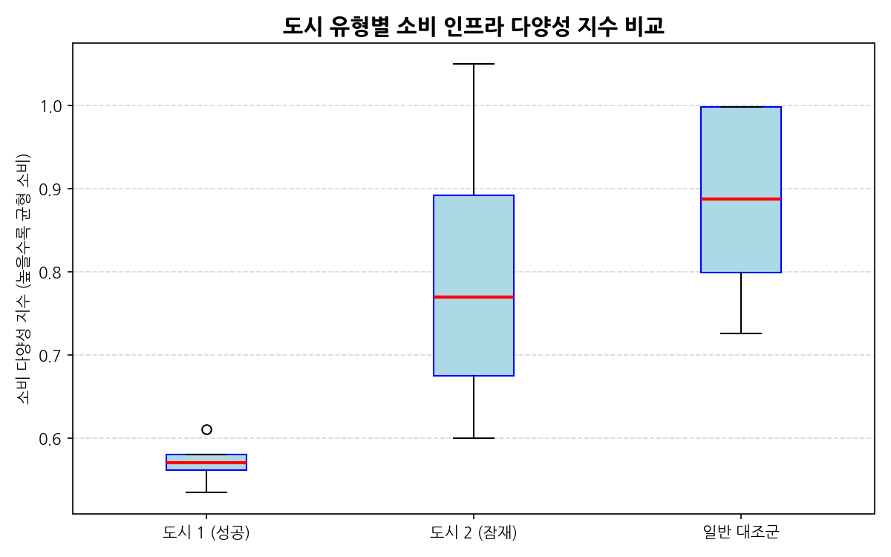
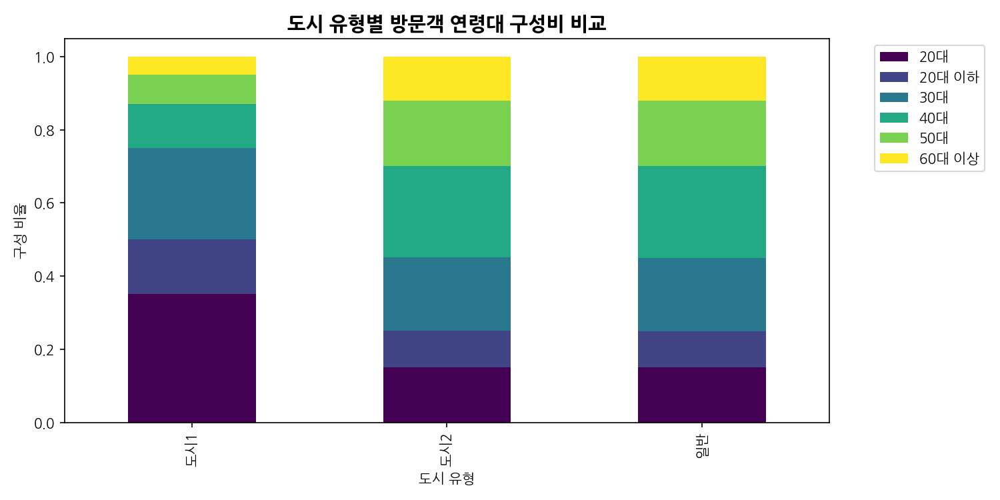
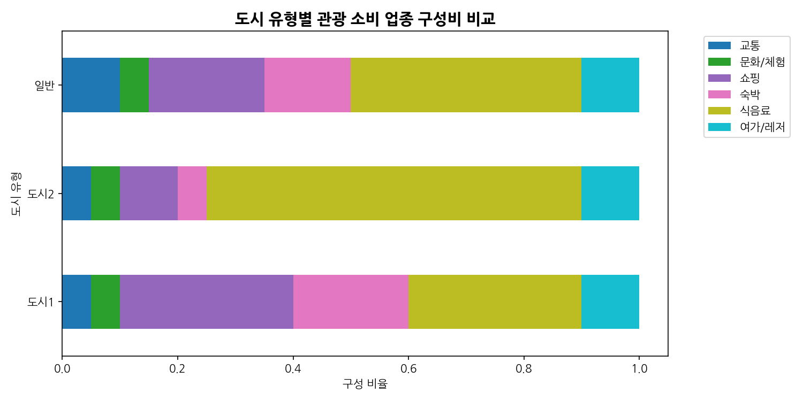
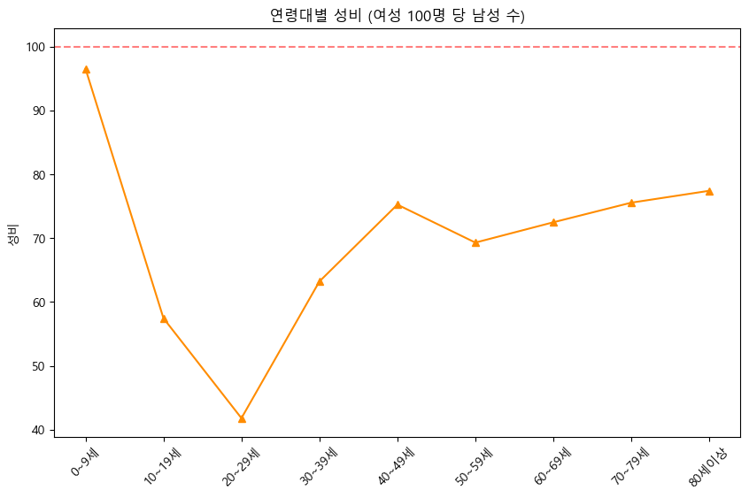

# 🌏 데이터 기반 한국 관광 활성화 전략
## 대시보드 5단계 분석 프레임워크 및 결과 보고서

팀 프로젝트 결과 보고서
**작성자**: [팀장 OOO, 팀원 OOO]

<!--
(발표자 노트 - 2분 분량)
안녕하십니까, 한국 관광 활성화 전략 프로젝트 발표를 맡은 OOO입니다. 
저희 팀은 최근 급증하는 방한 외국인 관광객들의 트렌드를 분석하고, 그 이면에 숨겨진 '지역 간 불균형 문제'를 해결하기 위해 Streamlit 기반의 인터랙티브 대시보드를 구축했습니다.
본 보고서에서는 한국관광공사와 ODCloud의 데이터를 융합하여 도출한 5단계 분석 프레임워크를 바탕으로, 외국인들이 실제로 어떤 도시에 어떻게 관심을 갖고 소비하는지를 면밀히 살펴봅니다.
단순한 데이터 현황 파악을 넘어, 데이터가 가리키는 명확한 문제점(관심도와 실제 방문의 괴리)을 진단하고, 지방 소도시 관광 활성화를 위한 실질적인 액션 플랜과 벤치마킹 전략까지 제안하겠습니다.
발표 시작하겠습니다.
-->

---

## 1. 프로젝트 기획 배경 및 목표

- **배경**: 방한 외국인 관광객의 **서울/제주 등 특정 대도시 편중 현상 심화**
- **대시보드 기획 목표**:
  - 데이터 기반으로 지역별 관광 현황(방문자, 소비, 다양성)을 입체적으로 진단
  - 관심도는 높으나 실제 소비로 이어지지 않는 **잠재적 도시(도시 2)** 발굴
  - 성공적 **대조군 도시(도시 1)**의 인프라 다양성을 벤치마킹하여 활성화 방안 도출

  
📈데이터 시각화

  
🔍도시 간 매트릭스 비교

  
💡지방 활성화 모색

<!--
(발표자 노트 - 2분 분량)
프로젝트의 출발점은 바로 '관광 편중 현상'입니다. K-컬쳐의 인기로 관광객은 넘쳐나지만, 데이터로 확인해보니 수도권 등 특정 대도시에만 극심하게 쏠려 있었습니다.
저희의 목표는 막연하게 '지방에 가라'고 홍보하는 것이 아닙니다. 
저희가 구축한 대시보드는 온라인 관심도는 높지만 막상 방문은 하지 않는 '잠재적 도시'를 찾아내고, 이미 성공한 대조군 도시와 인프라 및 소비 패턴을 1:1로 비교 분석하여 실질적인 문제점을 진단하는 것을 목적으로 합니다. 
단순한 시각화가 아닌, 지자체가 관광 정책을 세울 때 참고할 수 있는 의사결정 도구(B2B 솔루션)를 지향합니다.
-->

---

## 2. 대시보드 5단계 분석 프레임워크

대시보드 앱은 사용자가 시나리오에 따라 직관적으로 분석을 진행할 수 있도록 **5단계 흐름**을 인터랙티브 UI로 구현했습니다.

1. **[1차 분석] 관심도 분석**: SNS 언급량 및 내비게이션 검색
2. **[2차 분석] 실제 방문 매칭**: 외국인 방문자 수 및 카드 소비
3. **[3차 분석] 도시 매트릭스 분류**: 성공 도시(도시 1) vs 잠재 도시(도시 2)
4. **[4차 분석] 인프라 & 소비 분석**: 관광 다양성 및 소비 다양성 심층 비교
5. **[5차 분석] 벤치마킹 및 제안**: 데이터 기반 활성화 개선안 도출

<!--
(발표자 노트 - 2분 분량)
저희 대시보드의 핵심인 5단계 분석 프레임워크입니다.
첫째로 SNS와 내비를 통해 외국인들이 어디에 관심이 많은지 찾고, 
둘째로 그 관심이 실제 카드 소비나 방문으로 이어졌는지 대조합니다.
셋째로 이를 기반으로 도시들을 사분면 매트릭스로 분류하여 잘나가는 '도시 1'과 뭔가 장벽이 있는 '도시 2'를 걸러냅니다.
넷째로 두 도시의 인프라와 소비 다양성을 샅샅이 비교하여 도시 2의 약점을 찾아내고, 
마지막 다섯째 단계에서 구체적인 벤치마킹 액션 플랜을 도출하는 유기적인 흐름으로 구성되어 있습니다.
-->

---

## 3. [1차] 관광지 관심도 분석 (SNS/내비)

- **목적**: 온라인상의 관심(호기심) 척도 측정
- **분석 결과**: 
  - 관심도 추이 및 상위 목적지 검색 데이터를 통해 외국인들이 특정 지역이나 랜드마크에 압도적인 버즈량(SNS 언급)을 생성하고 있음을 확인
- **인사이트**: 
  - 특정 지방 소도시들의 경우, 매체 노출을 통해 높은 인지도를 확보하고 있음

<!--
(발표자 노트 - 2분 분량)
1차 분석인 관심도 측정 결과입니다. 우측 그래프는 지역별 혹은 테마별 관심도 추이를 시각화한 내용입니다.
한국관광공사 데이터를 통해 틱톡이나 인스타그램 등에서의 외국인 SNS 언급량과 실시간 내비게이션 목적지 검색량을 합산했습니다.
놀랍게도 수도권 외에도 상당히 많은 지방 소도시들이 높은 관심도를 기록하고 있었습니다. 특정 드라마 촬영지나 자연 경관이 예쁜 곳들이 온라인상에서는 충분히 인지도를 확보하고 있다는 사실을 데이터를 통해 입증했습니다.
-->

---

## 4. [2차] 실제 방문 매칭 및 소비 집중화 검증

- **목적**: 높은 관심도가 실제 방문 및 카드 소비로 전환되었는지 검증
- **수도권 집중화 현상 확인**:
  - 우측 차트는 **소비 집중 지수(Spend Concentration Index)**를 보여줍니다.
  - 전체 방한 외래객 소비액의 압도적인 비중이 서울 등 일부 거점 도시에 극단적으로 몰려 있음을 데이터로 검증했습니다.

<!--
(발표자 노트 - 2분 분량)
그러나 2차 분석에서 참담한 현실을 마주합니다. 1차에서 확인한 그 '관심'이 실제 지갑을 여는 소비로 이어졌는가를 검증했습니다.
우측의 '소비 집중 지수' 시각화 자료를 보시면, 방한 외래객의 소비액은 거의 수직에 가깝게 수도권 및 거점 도시에 치중되어 있습니다. 
온라인에서는 전국 팔도의 예쁜 풍경을 검색하지만, 결국 외국인들이 비행기에서 내려 잠을 자고 밥을 먹으며 돈을 쓰는 곳은 한정되어 있다는 가설 1번이 명백히 입증된 것입니다.
-->

---

## 5. [3차] 관심도 vs 소비액 산점도 분석

- **Gap(격차) 도출 및 매트릭스 분류**:
  - X축(방문)과 Y축(소비)의 상관관계를 보여주는 산점도(Scatter Plot) 시각화
- **발견된 문제점 (잠재적 도시 2)**:
  - 일부 지역은 방문객 수나 관심도에 비해 소비액이 현저히 낮게 형성됨 (산점도 우측 하단 밀집 구역).
  - 이는 인프라 부족 혹은 체류(숙박)를 유도하지 못하는 스쳐가는 관광지임을 시사.

<!--
(발표자 노트 - 2분 분량)
3차 분석, 도시 매트릭스 분류를 위한 산점도 분석입니다. 
우측의 시각화 자료는 방문 횟수와 실제 카드 소비액 간의 분포를 보여줍니다. 
일반적으로 방문이 많으면 소비도 많아야 하지만, 그래프 하단으로 치우친 점(데이터)들을 주목해 주십시오. 
이들은 분명 관광객이 발도장을 찍었거나 관심도가 높음에도 불구하고 지갑을 거의 열지 않은 '잠재적 개선 도시(도시 2)'들입니다. 
이러한 데이터 편차는 해당 도시들이 외국인이 돈을 쓸 만한 인프라(식음료, 기념품, 숙박)가 없거나, 교통편 때문에 반나절 만에 떠나버리는 '스쳐 지나가는 관광지'로 전락했음을 강력히 시사합니다.
-->

---

## 6. [4차] 관광객 다양성 및 소비 다변화 분석

  
  

- **인프라 및 소비 패턴 심층 비교**
  - **관광객 다양성**: 어떤 도시는 특정 국적에 의존하지 않고 다국적 방문객을 유치하고 있음
  - **소비 다양성**: 숙박, 식음료, 쇼핑 등 카드 소비 카테고리가 고르게 분포된 도시(도시 1)와 특정 업종에만 몰린 도시(도시 2)의 뚜렷한 차이 발견

<!--
(발표자 노트 - 2분 분량)
4차 분석에서는 앞서 걸러낸 도시들을 대상으로 '다양성' 지표를 심층 비교했습니다. 
좌측 차트는 지역별 방문객의 다양성, 우측 차트는 업종별 소비 다양성을 나타냅니다.
분석 결과, 성공적인 관광 수익을 올리는 대조군 도시(도시 1)들은 쇼핑, 숙박, 식음 등 소비 카테고리(파이)가 고르게 분산되어 있고 다국적 관광객이 방문하는 특징을 보였습니다.
반면 우리가 개선해야 할 잠재 도시(도시 2)들은 기형적으로 식비에만 소비가 몰려있거나 단일 국적에 의존하는 모습을 보였습니다. 이는 도시 2가 시급하게 확충해야 할 인프라가 숙박인지, 체험형 쇼핑인지 구체적인 방향성을 제시해 줍니다.
-->

---

## 7. 번외 분석: 다국적화와 타겟팅의 중요성

  
  

- **방한 외국인 국적 및 데모그래픽 변화**
  - 과거 중국/일본 편중에서 동남아시아, 미주 지역으로 파이가 다변화되는 추세 
  - 세대(MZ세대)와 성별에 따른 선호 여행 테마의 파편화 가속
- **인사이트**: 지방 도시는 본인들의 로컬리티에 맞는 '맞춤형 마이크로 타겟팅' 전략이 필수적임.

<!--
(발표자 노트 - 2분 분량)
번외로 대시보드에 탑재된 ODCloud의 데모그래픽 분석 결과를 살펴보겠습니다.
방한 관광객의 국적과 연령/성별 비율을 분석한 시각화 자료입니다. 전통적인 한중일 중심의 아시아 관광객 비중 외에도 미주와 동남아시아 지역 비율이 뚜렷하게 상승하고 있으며, 특히 젊은 층의 유입이 늘어나고 있습니다.
이는 지방 소도시들에게 큰 기회입니다. 천편일률적인 관광 인프라를 깔기보다는, 강원도의 눈이나 전라도의 템플스테이처럼 특정 국적이나 연령대가 열광하는 핀포인트 매력을 발굴하여 마이크로 타겟팅을 수행해야 한다는 데이터적 근거를 제공합니다.
-->

---

## 8. [5차] 벤치마킹 및 전략 Action Plan

> **"대시보드의 최종 목표는 데이터 기반의 명확한 개선안(Action) 도출입니다."**

- **액션 1. 스마트 로컬 모빌리티 구축 (라스트 마일 해소)**
  - 관심도는 높으나 접근성이 부족한 '도시 2'에 KTX 직결 외국인 셔틀 도입
- **액션 2. 부족한 인프라 정밀 확충 (소비 다양성 확보)**
  - 소비 다양성 지수 비교를 통해 부족한 특정 업종(예: 야간 숙박, 글로벌 결제 가능 상점) 핀셋 지원
- **액션 3. SNS 앰배서더 타겟 마케팅**
  - 데이터로 증명된 타겟 국가의 인플루언서를 초청해 '숏폼 챌린지'로 실방문 전환 유도

<!--
(발표자 노트 - 2분 분량)
마지막 5차 분석 단계, 대시보드의 궁극적 목적지인 '전략 도출'입니다. 
데이터가 가리키는 문제점들을 타파하기 위해 3가지 액션 플랜을 제안합니다.
첫째, 산점도에서 확인한 '접근성 병목 현상'을 뚫기 위해 주요 거점 역과 관광지를 다이렉트로 잇는 스마트 로컬 셔틀이 도입되어야 합니다.
둘째, 소비 다양성 비교에서 드러난 취약 업종(예: 숙박 인프라 부재로 인한 체류 시간 부족)을 지자체가 핀셋으로 집중 지원해야 합니다. 카카오페이나 트래블월렛 같은 통합 결제망 확충도 시급합니다.
셋째, 여전히 강력한 버즈량을 보여주는 SNS 관심도를 실제 방문으로 치환하기 위해 데이터를 통해 파악한 타겟 국가의 인플루언서를 활용한 앰배서더 마케팅을 펼쳐야 합니다.
-->

---

## 9. 결론 및 향후 발전 방향

- **직관에서 데이터 중심의 관광 정책으로**
  - 본 대시보드는 과거 공무원의 직관이나 단순 민원에 의존하던 관광 정책에서 벗어나, **명확한 수요와 공급 데이터에 기반한 B2B 의사결정 솔루션**으로서의 가치를 증명함.
- **향후 발전 과제 (Next Step)**
  - 공공데이터의 업데이트 시차 한계 극복을 위해 통신사 기지국 유동인구 데이터 실시간 결합
  - 대시보드의 AI 벤치마킹 리포트 자동 생성 기능 고도화

  
📊데이터 기반 정책

  
🤖실시간 AI 모델링

  
💼지자체 B2B 솔루션

<!--
(발표자 노트 - 2분 분량)
결론입니다. 저희 팀이 구축한 이번 대시보드 프로젝트의 가장 큰 의의는, 지역 관광 정책을 '감'이 아닌 '데이터'로 수립할 수 있는 강력한 프레임워크를 만들었다는 점입니다.
어디서 수요가 새고 있는지, 어디서 병목(허들)이 생기는지를 시각적 데이터로 명확히 보여줍니다. 
물론 공공데이터 특성상 실시간성이 부족하다는 한계도 있었지만, 향후 통신사 유동인구 데이터와 AI 모델을 결합한다면 이 대시보드는 전국의 지자체 담당자들이 실제 예산을 편성할 때 필수로 참고하는 강력한 솔루션이 될 것입니다.
-->

---

## 10. 팀 역할(R&R) 및 회고

- **팀장 [OOO]**: 5단계 분석 프레임워크 기획, 핵심 문제 정의 및 전략 도출 리딩
- **팀원 [OOO]**: ODCloud 및 한국관광공사 API 데이터 연동, Pandas 전처리 파이프라인 구축
- **팀원 [OOO]**: 교차 분석, 도시 사분면 매트릭스 도출 및 다양성 지표 생성
- **팀원 [OOO]**: Streamlit 기반 인터랙티브 대시보드 UI/UX 개발 및 시각화 연동

- **회고 포인트**:
  - 실제 공공데이터의 불규칙성을 겪으며 데이터 전처리(Data Engineering)의 중요성 체감.
  - 대용량 API 호출 한계를 극복하기 위한 로컬 캐싱(Caching) 로직 도입 경험.

<!--
(발표자 노트 - 2분 분량)
마지막으로 이 프로젝트를 완성한 팀원들의 역할과 회고입니다.
팀장인 저를 비롯하여 API 파이프라인을 구축한 데이터 엔지니어, 지표를 산출해 낸 데이터 분석가, 그리고 이 모든 것을 아름다운 대시보드로 만들어낸 시각화 담당자까지 각자의 강점이 빛을 발했습니다.
교재에 있는 정제된 데이터가 아니라 실제 공공데이터를 긁어오면서 겪은 결측치와 트래픽 에러들은 저희를 좌절시키기도 했지만, 효율적인 캐싱 로직을 도입하며 결국 해결해 냈습니다. 
무엇보다 '데이터로 스토리를 만들어 사람을 설득하는 방법'을 배운 것이 가장 큰 수확이었습니다.
-->

---

## 11. Q&A

### 경청해 주셔서 감사합니다.
대시보드 분석 프레임워크나 시각화 결과에 대해 질문이 있으시다면 말씀해 주시기 바랍니다.

  
🙋‍♀️

  
💬

  
🙋‍♂️

- **참고 자료**
  - 한국관광공사 Tour API (관광 다양성 및 수요)
  - 공공데이터포털 ODCloud (방한 외래객 통계)
  - 대시보드 링크: [korea-trip-integration.streamlit.app](https://korea-trip-integration.streamlit.app/)

<!--
(발표자 노트 - 2분 분량)
긴 시간 저희 팀의 발표를 경청해 주셔서 진심으로 감사드립니다.
우리가 분석한 데이터가 대한민국의 아름다운 지방 소도시들을 글로벌 관광지로 탈바꿈시키는 작은 밀알이 되기를 희망합니다.
발표 내용 중 데이터 추출 방식, 매트릭스 분류 기준, 혹은 제안드린 액션 플랜 등 궁금하신 점이 있으시다면 편하게 질문해 주시면 성심껏 답변드리겠습니다.
감사합니다.
-->
