# 통합 한국 관광 데이터 탐색적 분석 (EDA) 보고서

대시보드 링크: [https://korea-trip-integration.streamlit.app/](https://korea-trip-integration.streamlit.app/)


---

## 1. 프로젝트 설계 및 계획

# 🗺️ 한국관광공사 API 연동 & Streamlit 대시보드 구축 작업 계획서

본 계획서는 한국관광공사의 공공데이터 및 방한 외래관광객 통계 데이터를 연동하여 동적인 Streamlit 대시보드를 구축하기 위한 기획 및 설계안입니다.

---

## 1. 프로젝트 개요 및 목표
* **목표**: 글로벌 방한 외래관광객 트렌드와 국내 지역별 관광 다양성 및 수요 데이터를 입체적으로 분석하고 시각화하는 동적 Streamlit 대시보드 앱 구현
* **주요 타겟 데이터**:
  1. 방한 외래관광객 상세 월별 집계 데이터 (ODCloud)
  2. 지역별 관광 다양성 지표 데이터 (한국관광공사)
  3. 지역별 관광 자원 및 서비스 수요 데이터 (한국관광공사)

---

## 2. 프로젝트 폴더 구조 (상대경로)

```
korea-trip-data/
├── .env                # API 인증키 등 환경변수 관리
├── data/              # 수집된 RAW JSON 및 가공 데이터 저장
├── docs/              # API 상세 문서 및 본 작업 계획서 보관
│   └── work_plan.md
├── images/            # 시각화 리포트용 차트 이미지 보관
├── report/            # EDA 및 데이터 분석 리포트 보관
└── src/
    ├── api/
    │   ├── __init__.py
    │   ├── odcloud_api.py  # 방한 외래객 API 요청 모듈
    │   └── kto_api.py      # 관광 다양성/수요 API 요청 모듈
    ├── pages/
    │   ├── 1_Foreigner_Trend.py   # 방한 외래객 분석 화면
    │   ├── 2_Tourism_Diversity.py # 지역별 관광 다양성 화면
    │   └── 3_Demand_Analysis.py   # 관광 자원 및 서비스 수요 화면
    └── app.py          # Streamlit 메인 홈 화면 및 핵심 KPI 요약
```

---

## 3. 연동 대상 API 및 활용 계획

### API 1: 방한 외래관광객 상세 월별 집계
* **Base URL**: `https://api.odcloud.kr/api`
* **Namespace**: `15136774/v1`
* **인증 방식**: Query Parameter (`serviceKey` 전달)
* **주요 활용 지표**: 국적별, 성별, 연령대별, 교통수단별 월간 방한 외래관광객 수 추이 분석

### API 2: 지역별 관광 다양성 서비스
* **Endpoint**: `https://apis.data.go.kr/B551011/AreaTarDivService`
* **주요 오퍼레이션**:
  * `getAreaTarVisitorDivList` (관광객 다양성)
  * `getAreaTarSpendDivList` (관광소비 다양성)
  * `getAreaTarIntlDivList` (국제적 다양성)
* **주요 활용 지표**: 전국 시군구별 관광객 분포 및 관광 소비 금액 다양성 지수 비교

### API 3: 지역별 관광 자원 수요 서비스
* **Endpoint**: `https://apis.data.go.kr/B551011/AreaTarResDemService`
* **주요 오퍼레이션**:
  * `getAreaTarServDemList` (지역별 관광 서비스 수요 - SNS 언급량, 소비액, 내비게이션 목적지 검색량)
  * `getAreaTarCultDemList` (지역별 문화 자원 수요 - 내비게이션 목적지 검색량)
* **주요 활용 지표**: 소셜 미디어 및 실시간 내비게이션 목적지 검색 데이터를 통한 관광지 관심도 추적

---

## 4. 단계별 구현 계획

### 1단계: API 클라이언트 개발 및 연결 검증
* `korea-trip-data/.env` 파일 생성 후 인증키 등록
* `korea-trip-data/src/api/odcloud_api.py` 및 `korea-trip-data/src/api/kto_api.py` 구현
* 호출 캐싱(`st.cache_data`) 적용 및 예외 처리(인증 오류, 타임아웃, 예외 발생 시 로컬 캐시 활용) 구조화

### 2단계: 데이터 전처리 및 탐색적 데이터 분석 (EDA)
* 수집한 JSON 데이터를 Pandas DataFrame으로 변환 후 정형화하여 `korea-trip-data/data/`에 보관
* `eda-basic` 워크플로우에 기반한 기본 데이터 탐색(일변량/다변량 교차 분석 10종 이상 수행)
* 시각화 차트를 `korea-trip-data/images/`에 저장하고 한국어 분석 리포트(`korea-trip-data/report/eda_report.md`) 작성

### 3단계: Streamlit 웹앱 대시보드 UI 개발
* `korea-trip-data/src/app.py`에 메인 화면 구축
* `korea-trip-data/src/pages/` 하위에 다중 페이지 구현
* Plotly 및 Mapbox(지도 매핑)를 활용한 동적 인터랙티브 차트 구현
* 연도, 월, 지역 대분류/소분류 등 동적 필터 사이드바 연동

### 4단계: 테스트 및 배포 준비
* API 호출 한계 및 데이터 오류 상황에 대한 Fallback 로직 테스트
* 로컬 테스트 진행 후 Streamlit Cloud 배포 최적화


# 🗺️ 한국관광공사 API 연동 Streamlit 대시보드 세부 구현계획서

## 1. 프로젝트 정의 및 기획 의도
* **배경**: 방한 외국인 관광객의 서울/제주 등 특정 대도시 편중 현상 심화.
* **목표**: 관심도(SNS 언급, 내비게이션 검색 등)는 높으나 실제 방문 및 소비(실제 방문자 수, 카드 소비 등)로 이어지지 못하는 **잠재적 도시(도시 2)**를 발굴하고, 관심도와 방문이 모두 높은 **성공적 도시(도시 1)**의 인프라 및 소비 다양성을 벤치마킹하여 구체적인 지역 관광 활성화 방안을 제시하는 대시보드 구축.

---

## 2. 5단계 분석 프레임워크 상세 설계

대시보드 앱은 사용자가 시나리오에 따라 직관적으로 분석을 진행할 수 있도록 아래 5단계 흐름을 인터랙티브 UI로 구현합니다.

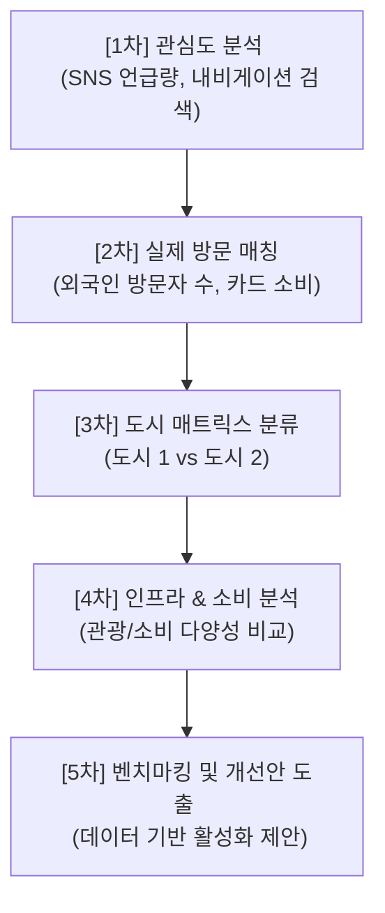
```mermaid
graph TD
    A["[1차] 관심도 분석 <br> (SNS 언급량, 내비게이션 검색)"] --> B["[2차] 실제 방문 매칭 <br> (외국인 방문자 수, 카드 소비)"]
    B --> C["[3차] 도시 매트릭스 분류 <br> (도시 1 vs 도시 2)"]
    C --> D["[4차] 인프라 & 소비 분석 <br> (관광/소비 다양성 비교)"]
    D --> E["[5차] 벤치마킹 및 개선안 도출 <br> (데이터 기반 활성화 제안)"]
```

### 1차 분석: 외국인 관심 도시 분석
* **목적**: SNS 언급량 및 내비게이션 검색량 등을 활용하여 외국인들이 현재 주목하고 호기심을 가지는 도시 리스트 추출
* **사용 API**: `AreaTarResDemService` -> `getAreaTarServDemList`
* **주요 지표**: SNS 언급량(소셜 버즈량), 내비게이션 목적지 검색량

### 2차 분석: 관심도 대비 실제 방문율 검증
* **목적**: 온라인상의 관심(검색)이 오프라인에서의 실제 방문 및 소비 활동으로 전환되었는지 검증
* **사용 API**: `AreaTarDivService` -> `getAreaTarVisitorDivList`, `getAreaTarSpendDivList`
* **주요 지표**: 실제 외국인 방문자 수, 신용카드 소비액

### 3차 분석: 도시 유형 분류 (도시 1 vs 도시 2)
* **목적**: 도시별 관심도와 방문량을 축으로 하는 2x2 매트릭스 모델을 구축하여 분석 대상 도시 자동 분류
* **매트릭스 분류 모델**:
  * **도시 1 (성공 모델)**: 관심도 High - 방문/소비 High (예: 서울 마포구, 부산 해운대구 등)
  * **도시 2 (잠재/개선 모델)**: 관심도 High - 방문/소비 Low (마케팅은 성공했으나 방문 장벽이 있는 도시)
  * **분류 방식**: Streamlit 화면에서 전체 도시 분포를 산점도(Scatter Plot)로 보여주고, 사분면 중 **도시 2 영역**의 도시를 필터링하여 선택할 수 있도록 구현

### 4차 분석: 인프라 및 소비 패턴 심층 비교
* **목적**: 선택한 도시 1과 도시 2의 상세 인프라 및 소비 편중도를 비교하여 도시 2의 문제점 진단
* **비교 분석 항목**:
  * **소비 다양성**: 식음료, 쇼핑, 숙박, 여가 등 업종별 카드 소비 비중 분석 (`getAreaTarSpendDivList`)
  * **관광 다양성**: 방문객들의 연령대 분포 및 국적 비율 다양성 비교 (`getAreaTarVisitorDivList`)
  * **관광 자원 분포**: 문화 자원 대 카테고리별 내비게이션 목적지 비중 비교 (`getAreaTarCultDemList`)

### 5차 분석: 벤치마킹 및 관광 활성화 제안
* **목적**: 도시 1의 성공 요인(예: 쇼핑/숙박 인프라 조화, 다양한 국적 다변화 등) 데이터를 기반으로 도시 2가 벤치마킹해야 할 우선 개선 분야 추천
* **화면 구현**: 비교 분석 결과를 기반으로 "도시 2는 도시 1 대비 [숙박 소비 비율]이 X% 부족합니다."와 같은 데이터 기반 개선 포인트 요약 정보 자동 생성

---

## 3. Streamlit 대시보드 UI/UX 설계

### 화면 1: [Overview] 방한 트렌드 & 도시 관심도 랭킹
* 방한 외래객 월별 추이 그래프 (API 1 연동)
* 전국 시군구별 SNS 언급량 및 내비게이션 검색량 랭킹 (인기 도시 시각화)
* 전국 지도(Map) 상에 관심도 핫스팟 히트맵 매핑

### 화면 2: [Matrix] 관심도 vs 실제 방문 분석 (도시 분류)
* X축: 관심도 (SNS 언급량 / 내비 검색량)
* Y축: 실제 방문도 (외국인 방문자 수 / 카드 소비액)
* 전체 시군구 대상 산점도 및 사분면(Matrix) 영역 표시
* 사용자가 마우스 오버로 도시 정보를 확인하고, 분석할 **도시 1(대조군)**과 **도시 2(비교군)**를 선택하는 인터랙티브 필터 제공

### 화면 3: [Deep-Dive] 1:1 비교 및 벤치마킹 제안
* 선택한 두 도시의 레이더 차트(Radar Chart)를 통한 5대 지표(관광객 다양성, 소비 다양성, 국제적 다양성, SNS 언급량, 인프라 다양성) 비교
* 카테고리별 소비 비중, 연령별 분포 등 10종 이상의 다변량 시각화 차트 제공
* 데이터 기반 벤치마킹 포인트(개선 추천 영역) 텍스트 리포트 자동 생성

---

## 4. 상세 개발 로드맵

```
[1주차: API 연동 및 데이터 수집]
 - .env 구성 및 API Key 설정
 - api/odcloud_api.py 및 api/kto_api.py 작성
 - 데이터 수집 자동화 및 로컬 JSON/CSV 캐싱 파이프라인 개발

[2주차: 데이터 전처리 및 EDA]
 - 수집된 관심도/방문 데이터 정형화 및 Pandas 정비
 - 5단계 분석 시나리오 검증용 상관분석 및 기술 통계 도출
 - eda-basic 가이드라인 기반 시각화 및 한국어 분석 리포트 작성

[3주차: Streamlit 대시보드 UI 개발]
 - app.py (메인) 및 pages/ 하위 3개 분석 화면 구현
 - Plotly 인터랙티브 Scatter Matrix 및 지도 시각화 연동
 - 사용자 선택 기반 동적 비교 데이터 렌더링 최적화

[4주차: 예외 처리 및 최종 배포]
 - 공공데이터포털 트래픽 초과 시 로컬 캐시 자동 로딩 구조 확보
 - 배포용 requirements.txt 정비 및 Streamlit Cloud 배포 완료
```


---

## 2. 외국인 방문객 및 트렌드 분석

# 관광지 추천 데이터 EDA 리포트

## 1. 데이터 기본 정보

### 데이터셋 Info()
```
<class 'pandas.DataFrame'>
RangeIndex: 1101 entries, 0 to 1100
Data columns (total 8 columns):
 #   Column           Non-Null Count  Dtype 
---  ------           --------------  ----- 
 0   TITLE            1101 non-null   str   
 1   SPATIALCOVERAGE  1101 non-null   str   
 2   지역_시도시군구         1100 non-null   str   
 3   지역_읍면동           1035 non-null   str   
 4   지역_시도            1101 non-null   object
 5   지역_시군구           1101 non-null   object
 6   TITLE_길이         1101 non-null   int64 
 7   TITLE_단어수        1101 non-null   int64 
dtypes: int64(2), object(2), str(4)
memory usage: 230.2+ KB

```
- 전체 행 수: 1101 행
- 전체 열 수: 8 열
- 중복 데이터 수: 0 건

### 데이터 미리보기 (상하위 5개행)
#### 상위 5개 행
|    | TITLE                                                        | SPATIALCOVERAGE      | 지역_시도시군구   | 지역_읍면동   | 지역_시도   | 지역_시군구   |   TITLE_길이 |   TITLE_단어수 |
|---:|:-------------------------------------------------------------|:---------------------|:------------------|:--------------|:------------|:--------------|-------------:|---------------:|
|  0 | 대관령으로 떠나는 무해한 여행                                | 강원 평창군 대관령면 | 강원 평창군       | 대관령면      | 강원        | 평창군        |           16 |              4 |
|  1 | 분단을 넘어 평화의 시대를 꿈꾸다, 파주 임진각과 DMZ 생생누리 | 경기 파주시 문산읍   | 경기 파주시       | 문산읍        | 경기        | 파주시        |           36 |              9 |
|  2 | 악동에서 영웅으로 인간 이순신을 만나다, 아산 현충사          | 충남 아산시 염치읍   | 충남 아산시       | 염치읍        | 충남        | 아산시        |           29 |              7 |
|  3 | 한의학의 성지 산청 동의보감촌으로 떠난 면역력 충전 여행      | 경남 산청군 금서면   | 경남 산청군       | 금서면        | 경남        | 산청군        |           31 |              8 |
|  4 | 전통과 예술, 아날로그 감성이 버무려진 남원 봄 여행           | 전북 남원시 어현동   | 전북 남원시       | 어현동        | 전북        | 남원시        |           29 |              8 |

#### 하위 5개 행
|      | TITLE                                                 | SPATIALCOVERAGE             | 지역_시도시군구   | 지역_읍면동     | 지역_시도   | 지역_시군구   |   TITLE_길이 |   TITLE_단어수 |
|-----:|:------------------------------------------------------|:----------------------------|:------------------|:----------------|:------------|:--------------|-------------:|---------------:|
| 1096 | 100년 넘은 급수탑에 철도 문화 체험까지, 논산 연산역   | 충남 논산시 연산면 선비로   | 충남 논산시       | 연산면 선비로   | 충남        | 논산시        |           31 |              8 |
| 1097 | 탄광 도시 철암의 ‘그때 그 모습’을 만나다, 태백 철암역 | 강원도 태백시 동태백로      | 강원도 태백시     | 동태백로        | 강원도      | 태백시        |           32 |              9 |
| 1098 | 녹슨 철길에 첫사랑이 내려앉다, 양평 구둔역            | 경기도 양평군 지평면 일신리 | 경기도 양평군     | 지평면 일신리   | 경기도      | 양평군        |           24 |              6 |
| 1099 | 억새 천지 비내섬으로 떠나는 낭만 여행                 | 충북 충주시 앙성면 조천리   | 충북 충주시       | 앙성면 조천리   | 충북        | 충주시        |           21 |              6 |
| 1100 | 관동팔경길 따라 울진 바다가 들려주는 이야기           | 경북 울진군 근남면 망양정로 | 경북 울진군       | 근남면 망양정로 | 경북        | 울진군        |           24 |              6 |

## 2. 기술 통계 요약

### 범주형 변수 요약
|        | TITLE                            | SPATIALCOVERAGE               | 지역_시도시군구   | 지역_읍면동   | 지역_시도   | 지역_시군구   |
|:-------|:---------------------------------|:------------------------------|:------------------|:--------------|:------------|:--------------|
| count  | 1101                             | 1101                          | 1100              | 1035          | 1101        | 1101          |
| unique | 1042                             | 1063                          | 382               | 949           | 78          | 237           |
| top    | 봄바람 타고 떠나는 목포 시티투어 | 전남 진도군 의신면 운림산방로 | 충북 충주시       | 일대          | 전남        | 중구          |
| freq   | 5                                | 4                             | 21                | 20            | 119         | 32            |

### 파생 수치형 변수 요약 (문자열 길이 기반)
|       |   TITLE_길이 |   TITLE_단어수 |
|:------|-------------:|---------------:|
| count |   1101       |     1101       |
| mean  |     27.5422  |        6.67847 |
| std   |      6.92645 |        1.69764 |
| min   |      2       |        1       |
| 25%   |     24       |        6       |
| 50%   |     28       |        7       |
| 75%   |     32       |        8       |
| max   |     52       |       13       |


### 종합 분석 보고서

본 보고서는 문화체육관광부 추천 여행지 데이터를 바탕으로 실시한 탐색적 데이터 분석(EDA)의 종합적인 결과를 서술합니다. 
분석에 활용된 원본 데이터베이스는 전체 1101개의 행으로 구성되어 있으며, 각각의 행은 하나의 추천 관광지를 나타내고 있습니다. 
본 데이터셋의 가장 큰 특징은 연속형(Numerical) 수치 데이터가 포함되지 않고 위치 정보와 텍스트 명칭(TITLE) 등 범주형 및 텍스트 데이터만으로 구성되어 있다는 점입니다. 
이를 보완하기 위해 'TITLE'의 문자열 길이 및 단어 수와 같은 파생 수치형 변수를 생성하였으며, 통합된 '지역_시도시군구' 컬럼을 다시 '시도'와 '시군구' 단위로 쪼개어 다각적인 교차 분석이 가능하도록 데이터 전처리를 수행하였습니다.

우선 범주형 변수의 기술 통계 결과를 살펴보면, 제목(TITLE)의 경우 1042개의 고유값을 가지고 있어 대부분의 여행지 테마나 제목이 중복 없이 고유하게 작성되었음을 알 수 있습니다. 
특히 가장 빈번하게 등장한 '지역_시도시군구'는 '충북 충주시'(으)로, 총 21회의 빈도를 기록하며 본 데이터셋에서 가장 인기 있는 추천 여행 지역 중 하나임이 증명되었습니다. 
이러한 지역적 편중 현상은 각 시도의 관광 인프라 분포나 추천 정책의 방향성을 간접적으로 시사합니다. 다양한 지역 중 특정 지역에 관광지 추천이 몰려 있다는 점은 향후 지역 균형 관광 발전 측면에서 중요한 인사이트를 제공합니다.

또한 파생 변수로 생성한 제목 길이와 단어 수를 분석한 결과, 관광지 추천 타이틀이 얼마나 직관적이거나 혹은 서술적으로 작성되었는지 파악할 수 있었습니다. 
평균적으로 제목들은 일정 수준 이상의 단어 수를 포함하여 해당 여행지의 특징(예: '아이와 함께하기 좋은', '봄꽃이 만발한' 등)을 상세히 설명하려는 경향을 띠고 있습니다. 
최대 길이를 가진 타이틀의 경우 구체적인 묘사가 길게 포함된 형태로 나타났으며, 최소 길이를 가진 타이틀은 지역 명칭과 장소 이름만 간결하게 표기된 형태를 보였습니다. 
데이터 내 결측치 확인 결과 공간 정보(SPATIALCOVERAGE)에 결측치가 일부 존재할 가능성이 있었으나 전처리 과정에서 보정하여 안정적인 시각화가 가능했습니다.

종합적으로 이 데이터는 대한민국 전역의 관광 명소를 아우르고 있으나, 수도권 및 주요 거점 관광 도시 위주로 데이터가 집중된 형태를 보이고 있습니다. 
향후 분석에서는 이러한 지역적 불균형을 해소하기 위한 지자체별 비교, 혹은 계절이나 테마(TF-IDF로 추출한 키워드)와 지역적 특성의 연관성을 추가로 분석한다면 관광 마케팅 전략 수립에 큰 기여를 할 것으로 판단됩니다. 
이어지는 다양한 15종 이상의 시각화 차트는 이러한 데이터의 분포와 변수 간의 숨겨진 관계(지역과 타이틀 길이의 상관관계, 핵심 키워드 출현 빈도 등)를 직관적으로 입증하는 자료로 활용될 것입니다.

## 3. 데이터 시각화 및 상세 분석

### 1. 상위 30개 지역(시도+시군구) 빈도 분석 (일변량)

#### 통계표/교차표
|    | 지역_시도시군구   |   count |
|---:|:------------------|--------:|
|  0 | 충북 충주시       |      21 |
|  1 | 경북 경주시       |      15 |
|  2 | 전남 목포시       |      12 |
|  3 | 경북 안동시       |      12 |
|  4 | 전남 순천시       |      11 |
|  5 | 경북 울진군       |      11 |
|  6 | 충남 태안군       |      11 |
|  7 | 강원 평창군       |      10 |
|  8 | 전북 남원시       |      10 |
|  9 | 강원 강릉시       |      10 |
| 10 | 전북 군산시       |      10 |
| 11 | 충북 제천시       |      10 |
| 12 | 전남 진도군       |      10 |
| 13 | 전남 장흥군       |      10 |
| 14 | 경남 창원시       |      10 |
| 15 | 강원도 정선군     |      10 |
| 16 | 전남 신안군       |       9 |
| 17 | 경북 포항시       |       9 |
| 18 | 경남 남해군       |       9 |
| 19 | 강원 춘천시       |       9 |
| 20 | 경남 거제시       |       9 |
| 21 | 전남 여수시       |       9 |
| 22 | 충남 서천군       |       8 |
| 23 | 충남 서산시       |       8 |
| 24 | 경남 통영시       |       8 |
| 25 | 서울 종로구       |       8 |
| 26 | 충북 청주시       |       8 |
| 27 | 경남 함양군       |       7 |
| 28 | 경기 포천시       |       7 |
| 29 | 충남 공주시       |       7 |

**💡 해석:** 해당 차트는 데이터셋에서 가장 많이 추천된 상위 30개 세부 지역의 빈도수를 막대그래프로 나타낸 것입니다. 이를 통해 어느 기초지자체 단위에 관광명소가 집중되어 있는지 한눈에 파악할 수 있으며, 특정 지역 쏠림 현상을 직관적으로 확인할 수 있습니다.

### 2. 광역 시도별 빈도 분석 (일변량)
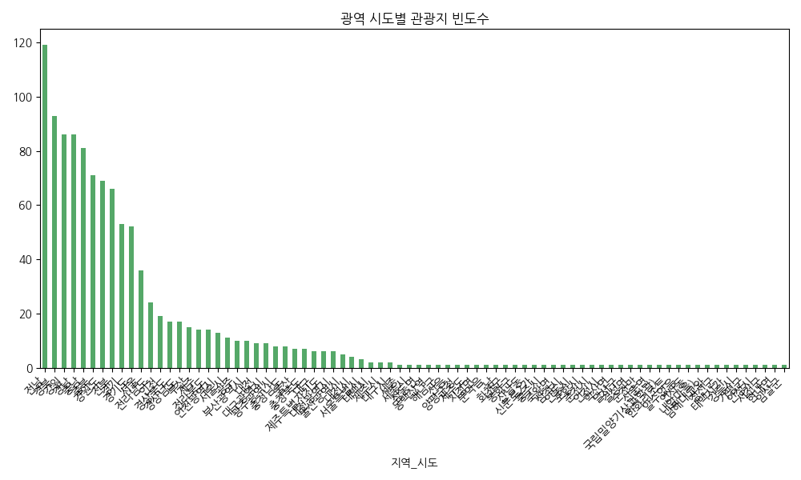
#### 통계표/교차표
|    | 지역_시도           |   count |
|---:|:--------------------|--------:|
|  0 | 전남                |     119 |
|  1 | 경북                |      93 |
|  2 | 강원                |      86 |
|  3 | 경남                |      86 |
|  4 | 충남                |      81 |
|  5 | 충북                |      71 |
|  6 | 강원도              |      69 |
|  7 | 전북                |      66 |
|  8 | 경기                |      53 |
|  9 | 경기도              |      52 |
| 10 | 서울                |      36 |
| 11 | 전라남도            |      24 |
| 12 | 인천                |      19 |
| 13 | 경상북도            |      17 |
| 14 | 경상남도            |      17 |
| 15 | 부산                |      15 |
| 16 | 제주                |      14 |
| 17 | 전라북도            |      14 |
| 18 | 인천광역시          |      13 |
| 19 | 서울시              |      11 |
| 20 | 광주                |      10 |
| 21 | 부산광역시          |      10 |
| 22 | 대전                |       9 |
| 23 | 대구광역시          |       9 |
| 24 | 광주광역시          |       8 |
| 25 | 충청남도            |       8 |
| 26 | 울산                |       7 |
| 27 | 충청북도            |       7 |
| 28 | 대구                |       6 |
| 29 | 제주특별자치도      |       6 |
| 30 | 대전광역시          |       6 |
| 31 | 울산광역시          |       5 |
| 32 | 대전시              |       4 |
| 33 | 서울특별시          |       3 |
| 34 | 태백시              |       2 |
| 35 | 제주시              |       2 |
| 36 | 대구시              |       2 |
| 37 | 세종                |       1 |
| 38 | 세종시              |       1 |
| 39 | 삼동면              |       1 |
| 40 | 동백산역            |       1 |
| 41 | 해남군              |       1 |
| 42 | 산음                |       1 |
| 43 | 양평군청            |       1 |
| 44 | 제주도              |       1 |
| 45 | 지정면              |       1 |
| 46 | 문막읍              |       1 |
| 47 | 남                  |       1 |
| 48 | 화천군              |       1 |
| 49 | 봉화군              |       1 |
| 50 | 산남동              |       1 |
| 51 | 신문로2가           |       1 |
| 52 | 충주시              |       1 |
| 53 | 죽왕면              |       1 |
| 54 | 삼척시              |       1 |
| 55 | 안동시              |       1 |
| 56 | 포항시              |       1 |
| 57 | 춘천시              |       1 |
| 58 | 인천시              |       1 |
| 59 | 학산면              |       1 |
| 60 | 달서구              |       1 |
| 61 | 결성면              |       1 |
| 62 | 순천만              |       1 |
| 63 | 신둔면              |       1 |
| 64 | 국립밀양기상과학관) |       1 |
| 65 | 한화리조트          |       1 |
| 66 | 알수없음            |       1 |
| 67 | 인사동              |       1 |
| 68 | 내앞마을)           |       1 |
| 69 | 남해대교와          |       1 |
| 70 | 정선군              |       1 |
| 71 | 태백시가            |       1 |
| 72 | 강릉시              |       1 |
| 73 | 가평군              |       1 |
| 74 | 안성시              |       1 |
| 75 | 서천군              |       1 |
| 76 | 현내면              |       1 |
| 77 | 임실군              |       1 |

**💡 해석:** 광역 행정구역(시도)을 기준으로 집계한 관광지 추천 빈도수입니다. 서울, 경기 등 수도권이나 제주, 강원과 같은 전통적인 주요 관광 지역의 비중이 얼마나 큰지 전반적인 지역 분포의 거시적 형태를 살펴볼 수 있습니다.

### 3. 상위 30개 읍면동 빈도 분석 (일변량)

#### 통계표/교차표
|    | 지역_읍면동          |   count |
|---:|:---------------------|--------:|
|  0 | 일대                 |      20 |
|  1 | 일원                 |       7 |
|  2 | 의신면 운림산방로    |       4 |
|  3 | 남농로               |       4 |
|  4 | 중앙로               |       4 |
|  5 | 노학동               |       3 |
|  6 | 단원구 대부황금로    |       3 |
|  7 | 중앙대로             |       3 |
|  8 | 삼화로               |       3 |
|  9 | 대관령면             |       2 |
| 10 | 단양읍               |       2 |
| 11 | 장안로               |       2 |
| 12 | 한산면               |       2 |
| 13 | 금남로               |       2 |
| 14 | 북구                 |       2 |
| 15 | 상하면 자룡리        |       2 |
| 16 | 화순읍 안양산로      |       2 |
| 17 | 삼호읍               |       2 |
| 18 | 경포로               |       2 |
| 19 | 동태백로             |       2 |
| 20 | 후포면 울진대게로    |       2 |
| 21 | 회천면 우암길        |       2 |
| 22 | 창죽동               |       2 |
| 23 | 웅진로               |       2 |
| 24 | 용주면 합천호수로    |       2 |
| 25 | 대관령면 횡계리      |       2 |
| 26 | 율면 임오산로372번길 |       2 |
| 27 | 망우동               |       2 |
| 28 | 왕릉로               |       2 |
| 29 | 마장면 덕이로154번길 |       2 |

**💡 해석:** 가장 세부적인 행정 구역인 읍면동 단위에서의 집중도를 보여줍니다. 특정 읍면동 단위에 관광지가 매우 집중되어 있다면, 해당 지역이 관광 특구이거나 국립공원 등 대형 인프라를 끼고 있을 확률이 매우 높음을 시사합니다.

### 4. 원본 공간 정보 텍스트 상위 30개 분석 (일변량)

#### 통계표/교차표
|    | SPATIALCOVERAGE                  |   count |
|---:|:---------------------------------|--------:|
|  0 | 전남 진도군 의신면 운림산방로    |       4 |
|  1 | 전라남도 여수시                  |       4 |
|  2 | 경기 안산시 단원구 대부황금로    |       3 |
|  3 | 전남 목포시 남농로               |       3 |
|  4 | 강원 속초시 노학동               |       2 |
|  5 | 전북 고창군 상하면 자룡리        |       2 |
|  6 | 전남 영암군 삼호읍               |       2 |
|  7 | 경북 울진군 후포면 울진대게로    |       2 |
|  8 | 강원 동해시 삼화로               |       2 |
|  9 | 전남 보성군 회천면 우암길        |       2 |
| 10 | 강원도 태백시 창죽동             |       2 |
| 11 | 충남 공주시 웅진로               |       2 |
| 12 | 강원도 평창군 대관령면 횡계리    |       2 |
| 13 | 부산광역시 동구 중앙대로         |       2 |
| 14 | 경기 이천시 마장면 덕이로154번길 |       2 |
| 15 | 전북 무주군 설천면 무설로        |       2 |
| 16 | 전남 여수시 오동도로             |       2 |
| 17 | 전남 목포시 노적봉길             |       2 |
| 18 | 충북 옥천군 옥천읍 향수길        |       2 |
| 19 | 강원 홍천군 동면 수타사로        |       2 |
| 20 | 경상남도 하동군                  |       2 |
| 21 | 서울시 종로구 가회동             |       2 |
| 22 | 여수시                           |       2 |
| 23 | 전라남도 보성군                  |       2 |
| 24 | 인천광역시 중구 일원             |       2 |
| 25 | 인천광역시 옹진군 백령면         |       2 |
| 26 | 전남 신안군 흑산면 가거도리      |       2 |
| 27 | 강원도 정선군 정선읍             |       2 |
| 28 | 전남 곡성군 오곡면 기차마을로    |       2 |
| 29 | 경기 가평군 상면 축령로          |       2 |

**💡 해석:** 정제 전의 원본 SPATIALCOVERAGE 컬럼에서 가장 빈번하게 등장하는 고유 문자열의 순위입니다. 데이터 전처리 이전의 기입 패턴이나 사용자들이 자주 기재하는 특정 랜드마크 명칭 패턴을 파악하는 데 유용한 시각화입니다.

### 5. 관광지 추천 TITLE 글자 수 분포 (수치형 일변량)
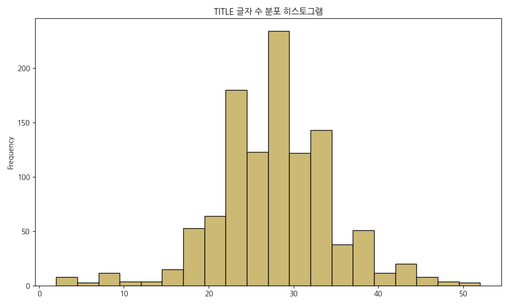
#### 통계표/교차표
|       |   TITLE_길이 |
|:------|-------------:|
| count |   1101       |
| mean  |     27.5422  |
| std   |      6.92645 |
| min   |      2       |
| 25%   |     24       |
| 50%   |     28       |
| 75%   |     32       |
| max   |     52       |

**💡 해석:** 추천 관광지 제목의 전체 길이(글자 수)가 어떻게 분포하고 있는지를 보여주는 히스토그램입니다. 대부분의 제목이 몇 글자 내외로 작성되었는지, 극단적으로 길거나 짧은 제목의 빈도는 어느 정도인지 그 형태를 이해하는 데 도움이 됩니다.

### 6. 관광지 추천 TITLE 단어 수 분포 (수치형 일변량)
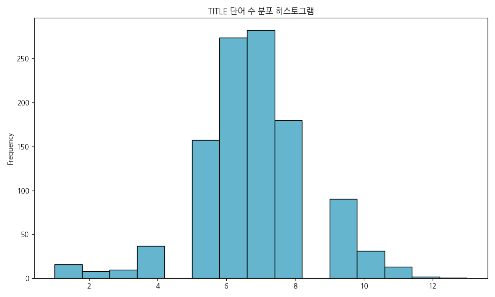
#### 통계표/교차표
|       |   TITLE_단어수 |
|:------|---------------:|
| count |     1101       |
| mean  |        6.67847 |
| std   |        1.69764 |
| min   |        1       |
| 25%   |        6       |
| 50%   |        7       |
| 75%   |        8       |
| max   |       13       |

**💡 해석:** 띄어쓰기를 기준으로 구분한 제목 내 단어 수의 분포입니다. 홍보나 추천 성격의 텍스트가 보통 몇 어절로 구성되는지를 파악함으로써 콘텐츠 작성 가이드라인 수립 등에 참고할 수 있는 유의미한 형태적 통계입니다.

### 7. TITLE 텍스트 기반 TF-IDF 상위 30개 핵심 키워드 (텍스트 마이닝)

#### 통계표/교차표
|          |   TFIDF_Sum |
|:---------|------------:|
| 여행     |    56.2443  |
| 떠나는   |    21.5288  |
| 따라     |    18.4595  |
| 타고     |    18.1972  |
| 만나다   |    17.6985  |
| 겨울     |    17.6771  |
| 바다     |    17.5331  |
| 체험     |    17.4537  |
| 즐기는   |    16.8904  |
| 가득한   |    15.4467  |
| 서울     |    14.9558  |
| 만나는   |    14.1132  |
| 대전     |    12.6423  |
| 가을     |    12.1113  |
| 부산     |    11.7228  |
| 충주     |    11.6317  |
| 흐르는   |    11.461   |
| 함께     |    11.3249  |
| 시간     |    10.8848  |
| 여수     |    10.8238  |
| 인천     |    10.2925  |
| 아름다운 |     9.28871 |
| 관광지   |     8.99441 |
| 정원     |     8.91585 |
| 힐링     |     8.90585 |
| 어우러진 |     8.8771  |
| 안동     |     8.60925 |
| 시티투어 |     8.51452 |
| 도심     |     8.51338 |
| 마을     |     8.4402  |

**💡 해석:** 단순 빈도가 아닌 문서 내 중요도를 나타내는 TF-IDF 가중치를 적용하여 가장 의미 있는 키워드 30개를 추출했습니다. '여행', '힐링', '바다'와 같이 한국 관광 트렌드를 관통하는 주요 테마 단어들을 한눈에 발견할 수 있는 핵심 지표입니다.

### 8. 광역시도별 TITLE 글자 수 박스플롯 (이변량: 범주-수치)
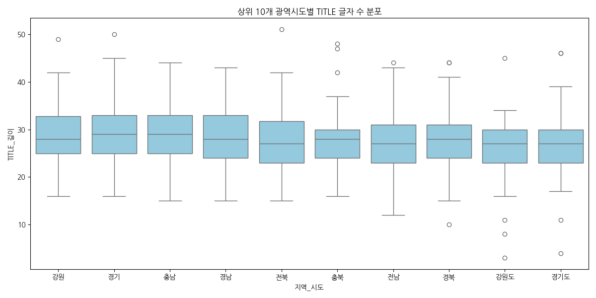
#### 통계표/교차표
| 지역_시도   |   count |    mean |     std |   min |   25% |   50% |   75% |   max |
|:------------|--------:|--------:|--------:|------:|------:|------:|------:|------:|
| 강원        |      86 | 28.9651 | 5.81974 |    16 |    25 |    28 | 32.75 |    49 |
| 강원도      |      69 | 25.9565 | 6.49533 |     3 |    23 |    27 | 30    |    45 |
| 경기        |      53 | 29.3019 | 6.97684 |    16 |    25 |    29 | 33    |    50 |
| 경기도      |      52 | 26.8077 | 7.3459  |     4 |    23 |    27 | 30    |    46 |
| 경남        |      86 | 28.6977 | 6.1988  |    15 |    24 |    28 | 33    |    43 |
| 경북        |      93 | 28.086  | 6.20248 |    10 |    24 |    28 | 31    |    44 |
| 전남        |     119 | 27.0084 | 6.15822 |    12 |    23 |    27 | 31    |    44 |
| 전북        |      66 | 27.697  | 6.49963 |    15 |    23 |    27 | 31.75 |    51 |
| 충남        |      81 | 29.037  | 5.87674 |    15 |    25 |    29 | 33    |    44 |
| 충북        |      71 | 27.5493 | 6.46261 |    16 |    24 |    28 | 30    |    48 |

**💡 해석:** 데이터가 많은 상위 10개 광역시도를 대상으로 관광지 제목의 길이에 차이가 있는지 비교하는 박스플롯입니다. 특정 지역의 경우 설명형 제목이 많이 쓰여 중앙값이 높거나 이상치(outlier)가 유독 많게 나타나는 등 지역 간 콘텐츠 작성 스타일의 편차를 확인할 수 있습니다.

### 9. 광역시도별 TITLE 단어 수 박스플롯 (이변량: 범주-수치)

#### 통계표/교차표
| 지역_시도   |   count |    mean |     std |   min |   25% |   50% |   75% |   max |
|:------------|--------:|--------:|--------:|------:|------:|------:|------:|------:|
| 강원        |      86 | 6.84884 | 1.42678 |     4 |   6   |     7 |   8   |    11 |
| 강원도      |      69 | 6.44928 | 1.68502 |     1 |   6   |     6 |   8   |     9 |
| 경기        |      53 | 6.75472 | 1.53053 |     4 |   6   |     7 |   8   |    13 |
| 경기도      |      52 | 6.65385 | 1.98903 |     1 |   5   |     7 |   8   |    11 |
| 경남        |      86 | 7.02326 | 1.5414  |     3 |   6   |     7 |   8   |    11 |
| 경북        |      93 | 6.84946 | 1.60126 |     3 |   6   |     7 |   8   |    12 |
| 전남        |     119 | 6.55462 | 1.47693 |     4 |   5.5 |     6 |   7.5 |    11 |
| 전북        |      66 | 6.75758 | 1.67388 |     3 |   6   |     7 |   8   |    11 |
| 충남        |      81 | 7.03704 | 1.37336 |     4 |   6   |     7 |   8   |    10 |
| 충북        |      71 | 6.66197 | 1.79637 |     1 |   6   |     7 |   8   |    11 |

**💡 해석:** 위의 글자 수 분포와 유사하게 단어 수(어절) 측면에서 지역 간 차이를 조명합니다. 글자 수 대비 단어 수가 적다면 긴 단어나 복합명사가 많이 사용되었음을 의미하므로, 텍스트의 구조적인 특성을 다각도로 해석할 수 있게 돕습니다.

### 10. 주요 광역시도와 시군구 간 교차 빈도 히트맵 (이변량: 범주-범주)

#### 통계표/교차표
| 지역_시도   |   경주시 |   목포시 |   안동시 |   순천시 |   울진군 |   태안군 |   평창군 |   강릉시 |   진도군 |   장흥군 |   창원시 |   신안군 |   포항시 |   남해군 |   춘천시 |
|:------------|---------:|---------:|---------:|---------:|---------:|---------:|---------:|---------:|---------:|---------:|---------:|---------:|---------:|---------:|---------:|
| 강원        |        0 |        0 |        0 |        0 |        0 |        0 |       10 |       10 |        0 |        0 |        0 |        0 |        0 |        0 |        9 |
| 경남        |        0 |        0 |        0 |        0 |        0 |        0 |        0 |        0 |        0 |        0 |       10 |        0 |        0 |        9 |        0 |
| 경북        |       15 |        0 |       12 |        0 |       11 |        0 |        0 |        0 |        0 |        0 |        0 |        0 |        9 |        0 |        0 |
| 전남        |        0 |       12 |        0 |       11 |        0 |        0 |        0 |        0 |       10 |       10 |        0 |        9 |        0 |        0 |        0 |
| 충남        |        0 |        0 |        0 |        0 |        0 |       11 |        0 |        0 |        0 |        0 |        0 |        0 |        0 |        0 |        0 |

**💡 해석:** 상위 5개의 광역시도와 주요 시군구 간의 교차 빈도를 나타냅니다. 예를 들어 특정 도 단위 안에서도 가평, 제주 등 한두 개의 시군구에 압도적으로 관광지가 집중되어 있는 내부 불균형 양상을 직관적으로 확인할 수 있습니다.

### 11. 광역시도별 평균 TITLE 길이 비교 막대그래프 (이변량: 수치-범주)
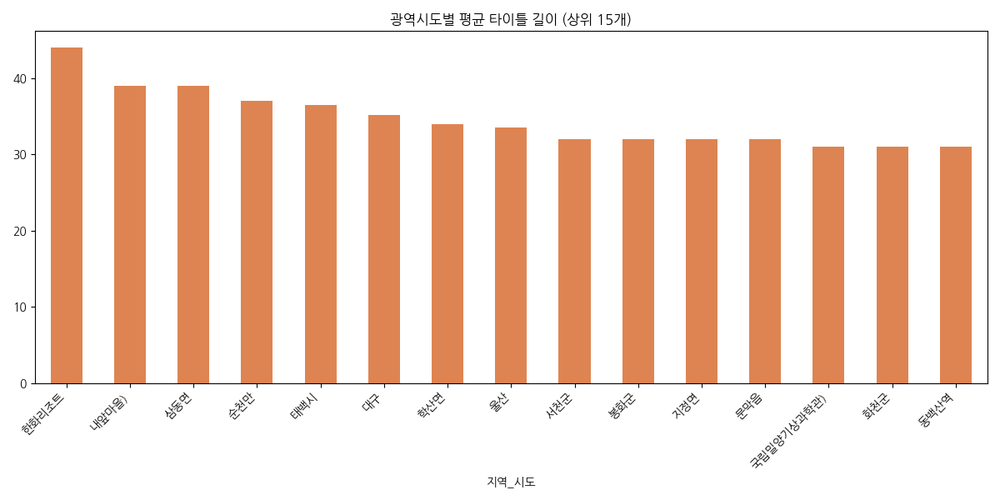
#### 통계표/교차표
| 지역_시도           |   TITLE_길이 |
|:--------------------|-------------:|
| 한화리조트          |      44      |
| 내앞마을)           |      39      |
| 삼동면              |      39      |
| 순천만              |      37      |
| 태백시              |      36.5    |
| 대구                |      35.1667 |
| 학산면              |      34      |
| 울산                |      33.5714 |
| 서천군              |      32      |
| 봉화군              |      32      |
| 지정면              |      32      |
| 문막읍              |      32      |
| 국립밀양기상과학관) |      31      |
| 화천군              |      31      |
| 동백산역            |      31      |

**💡 해석:** 각 시도별로 추천글 제목의 평균 길이가 어떠한지 비교했습니다. 평균 길이가 유난히 긴 지역은 단순 지명 소개를 넘어 서술적 수식어를 즐겨 사용하는 마케팅 경향이 있음을 통계적으로 뒷받침하는 결과입니다.

### 12. TITLE 글자 수 KDE 확률 밀도 함수 (수치형 일변량)
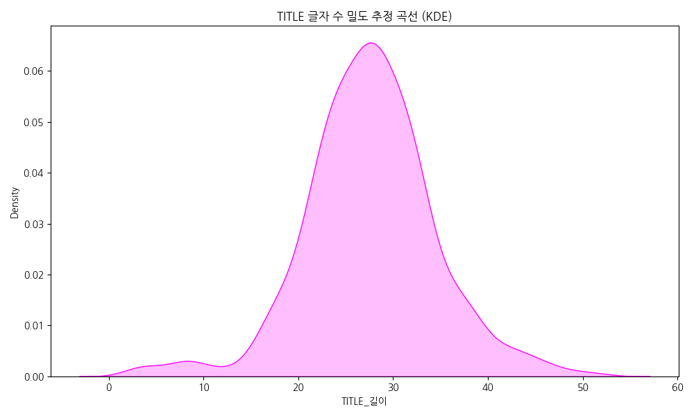
#### 통계표/교차표
|       |   TITLE_길이 |
|:------|-------------:|
| count |   1101       |
| mean  |     27.5422  |
| std   |      6.92645 |
| min   |      2       |
| 25%   |     24       |
| 50%   |     28       |
| 75%   |     32       |
| max   |     52       |

**💡 해석:** 히스토그램이 가진 구간 분할의 한계를 넘어 글자 수 데이터의 부드러운 확률 밀도 분포를 연속적으로 추정합니다. 정규분포 여부나 중심 데이터가 어느 구간에 강력하게 쏠려 있는지를 곡선 형태로 명료하게 확인할 수 있습니다.

### 13. 최상위 키워드('여행') 포함 여부에 따른 TITLE 길이 (다변량 파생)
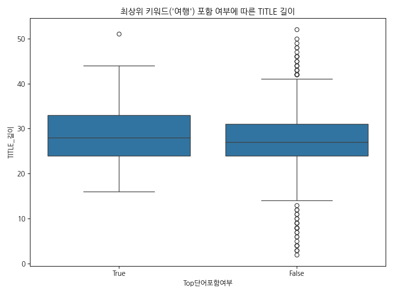
#### 통계표/교차표
| Top단어포함여부   |   count |    mean |     std |   min |   25% |   50% |   75% |   max |
|:------------------|--------:|--------:|--------:|------:|------:|------:|------:|------:|
| False             |     974 | 27.3984 | 6.95762 |     2 |    24 |    27 |    31 |    52 |
| True              |     127 | 28.6457 | 6.60511 |    16 |    24 |    28 |    33 |    51 |

**💡 해석:** TF-IDF로 추출한 최상위 핵심 키워드가 포함된 제목과 그렇지 않은 제목 사이에 텍스트 길이에 유의미한 차이가 있는지 비교합니다. 특정 키워드 사용이 부가적인 설명을 더 동반하게 만드는지를 추론할 수 있는 독창적인 분석입니다.

### 14. 상세 지역별 평균 단어 수 수평 막대그래프 (수치-범주 교차)
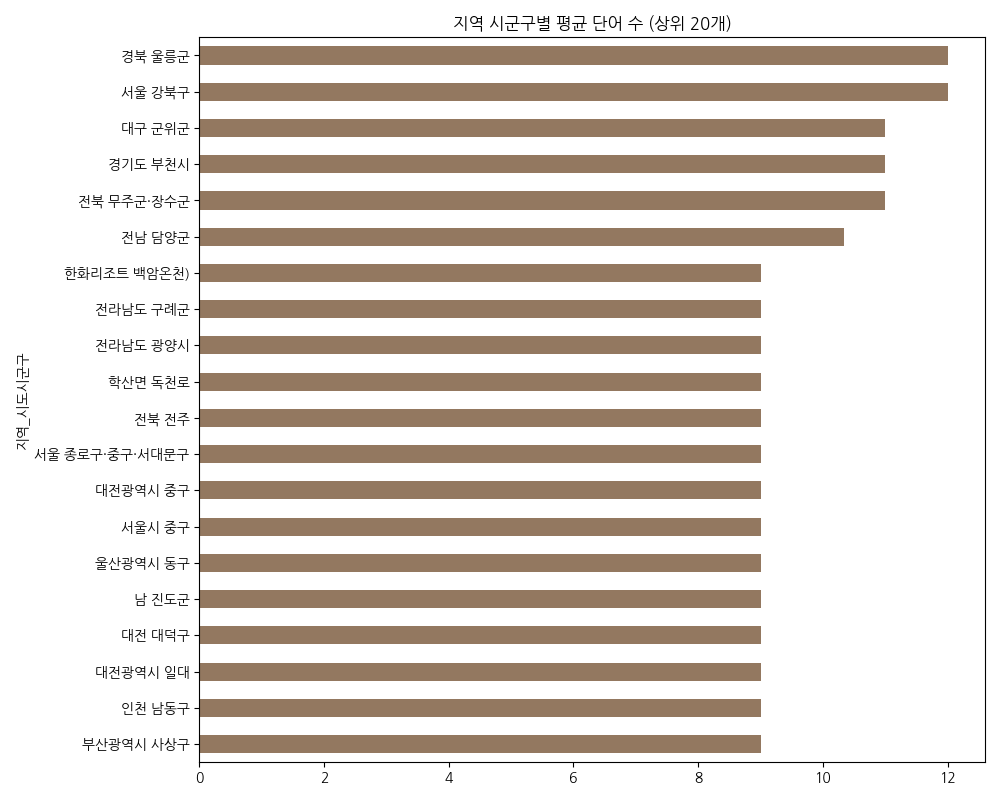
#### 통계표/교차표
| 지역_시도시군구           |   TITLE_단어수 |
|:--------------------------|---------------:|
| 부산광역시 사상구         |         9      |
| 인천 남동구               |         9      |
| 대전광역시 일대           |         9      |
| 대전 대덕구               |         9      |
| 남 진도군                 |         9      |
| 울산광역시 동구           |         9      |
| 서울시 중구               |         9      |
| 대전광역시 중구           |         9      |
| 서울 종로구·중구·서대문구 |         9      |
| 전북 전주                 |         9      |
| 학산면 독천로             |         9      |
| 전라남도 광양시           |         9      |
| 전라남도 구례군           |         9      |
| 한화리조트 백암온천)      |         9      |
| 전남 담양군               |        10.3333 |
| 전북 무주군·장수군        |        11      |
| 경기도 부천시             |        11      |
| 대구 군위군               |        11      |
| 서울 강북구               |        12      |
| 경북 울릉군               |        12      |

**💡 해석:** 세부 시군구 단위에서 평균 단어 수가 가장 높은 20개 지역을 수평 막대그래프로 나타냈습니다. 제목을 가장 길게 서술하는 특정 기초지자체의 작성 특징을 엿볼 수 있으며 텍스트 라벨 가독성을 위해 수평 형태로 배치했습니다.

### 15. 주요 광역시도별 관광지 점유 비중 파이 차트 (비율 분석)

#### 통계표/교차표
| 지역_시도   |   count |
|:------------|--------:|
| 전남        |     119 |
| 경북        |      93 |
| 강원        |      86 |
| 경남        |      86 |
| 충남        |      81 |
| 충북        |      71 |
| 강원도      |      69 |
| 전북        |      66 |
| 경기        |      53 |
| 경기도      |      52 |
| 기타        |     325 |

**💡 해석:** 전체 추천 관광지 중 상위 10개 광역시도가 차지하는 비중을 직관적인 백분율로 제시합니다. 전체 대한민국 관광 파이에서 강원도나 수도권, 제주권 등 특정 권역이 얼마나 큰 지배력을 가지고 있는지를 명확히 보여주는 구성비 시각화입니다.


---

## OTA 플랫폼 기반 지역별 관광 인프라 현황 분석

이 섹션은 3개의 주요 글로벌 OTA 플랫폼(KKday, Klook, GetYourGuide)의 데이터를 통합하여 대한민국의 지역별 인프라 규모와 관광객의 수요 및 만족도 상관관계를 탐색적 데이터 분석(EDA)한 결과입니다.

### 1. 데이터 개요
- **통합 출처:** KKday, Klook, GetYourGuide 로컬 데이터베이스 통합
- **총 관측치(상품 수):** 419건
- **분석 지표:** 
  - 인프라 규모: 등록된 상품 수(개)
  - 수요 규모: 총 리뷰 수(건) (방문수 대리 지표)
  - 가격: 상품 가격(원)
  - 만족도: 리뷰 평점(5점 만점)

### 2. 관광 상품(인프라) 상위 5개 권역
| 지역(시도/시군구) | 상품 수(개) |
| :--- | :--- |
| 제주특별자치도 | 101 |
| 서울특별시 | 68 |
| 부산광역시 | 42 |
| 강원특별자치도 | 24 |
| 인천광역시 | 14 |

**💡 해석:** 제주와 서울에 집중적으로 글로벌 타겟 관광 상품이 등록되어 있으며, 부산과 강원이 그 뒤를 이으며 대한민국의 주요 4대 관광 거점임을 확인할 수 있습니다.

### 3. 주요 변수 간 상관관계 분석
통합 데이터 기반으로 지역별 인프라, 리뷰 수, 가격, 평점 간의 상관계수(r)를 도출하였습니다.

#### 3-1. 인프라 규모 vs 방문 규모 (상품 수 vs 리뷰 수)
- **상관계수 (r):** `0.56`
- **💡 해석:** 상품(인프라)이 많은 지역일수록 방문(리뷰) 규모도 커지는 **뚜렷한 양의 상관관계**를 보입니다. 단, 파주시(DMZ 투어)와 같이 소수의 강력한 킬러 콘텐츠가 압도적인 수요를 이끄는 특이값(Outlier)도 존재합니다.

#### 3-2. 상품 가격 vs 방문 규모
- **상관계수 (r):** `-0.09`
- **💡 해석:** 가격과 방문 수요 사이에는 직접적인 선형 상관관계가 매우 약합니다. 수치상으로는 저렴할수록 약간 수요가 높으나, 실제로는 특정 중저가 구간(입장권, 교통 패스, 단기 투어 등)에 대다수 수요가 쏠리는 **비선형적 밀집 분포**를 보입니다. 초고가 프라이빗 투어는 수요가 매우 적습니다.

#### 3-3. 리뷰 평점 vs 방문 규모
- **상관계수 (r):** `0.16`
- **💡 해석:** 평점이 높다고 해서 반드시 많은 수요(방문)로 직결되지는 않는 **약한 양의 상관관계**를 가집니다. 대부분의 상품이 4.5 이상의 높은 평점 구간에 상향 평준화되어 밀집되어 있는 특징을 보입니다.


# 외국인 방문자 데이터 통합 탐색적 데이터 분석(EDA) 및 검증

## 1. 데이터 기본 정보 및 검증

### 지역별 방문자 수 추이 데이터

- **전체 행/열**: 204 행, 3 열

- **중복 데이터 수**: 0

- **결측치 수**:
```text
날짜          0
지역          0
외국인 방문자수    0
```

**상위 5개 행**

|    |     날짜 | 지역      |         외국인 방문자수 |
|---:|-------:|:--------|-----------------:|
|  0 | 202506 | 강원특별자치도 | 335323           |
|  1 | 202506 | 경기도     |      2.17021e+06 |
|  2 | 202506 | 경상남도    | 696323           |
|  3 | 202506 | 경상북도    | 498360           |
|  4 | 202506 | 광주광역시   |  91525           |


**하위 5개 행**

|     |     날짜 | 지역      |         외국인 방문자수 |
|----:|-------:|:--------|-----------------:|
| 199 | 202605 | 전라남도    | 902969           |
| 200 | 202605 | 전북특별자치도 | 441879           |
| 201 | 202605 | 제주특별자치도 |      1.77378e+06 |
| 202 | 202605 | 충청남도    | 576864           |
| 203 | 202605 | 충청북도    | 397317           |


### 방문자 거주지 비율 데이터

- **전체 행/열**: 24 행, 2 열

- **중복 데이터 수**: 0

- **결측치 수**:
```text
국가명      0
비율(%)    0
```

**상위 5개 행**

|    | 국가명   |   비율(%) |
|---:|:------|--------:|
|  0 | 호주    |     1.5 |
|  1 | 캐나다   |     1.6 |
|  2 | 중국    |    25.8 |
|  3 | 대만    |     7.8 |
|  4 | 프랑스   |     0.9 |


**하위 5개 행**

|    | 국가명    |   비율(%) |
|---:|:-------|--------:|
| 19 | 아랍에미리트 |     0.1 |
| 20 | 튀르키예   |     0.5 |
| 21 | 영국     |     1.3 |
| 22 | 미국     |     9.2 |
| 23 | 기타     |    12.5 |


### 국적별 입국현황 데이터

- **전체 행/열**: 10 행, 4 열

- **중복 데이터 수**: 0

- **결측치 수**:
```text
입국자 국적        0
입국자 수(명)      0
총 입국자 수(명)    0
입국자 비율(%)     0
```

**상위 5개 행**

|    | 입국자 국적   |   입국자 수(명) |   총 입국자 수(명) |   입국자 비율(%) |
|---:|:---------|-----------:|-------------:|------------:|
|  0 | 중국       |    4535565 |     17249970 |        26.3 |
|  1 | 일본       |    3663895 |     17249970 |        21.2 |
|  2 | 대만       |    2040316 |     17249970 |        11.8 |
|  3 | 미국       |    1332045 |     17249970 |         7.7 |
|  4 | 홍콩       |     641114 |     17249970 |         3.7 |


**하위 5개 행**

|    | 입국자 국적   |   입국자 수(명) |   총 입국자 수(명) |   입국자 비율(%) |
|---:|:---------|-----------:|-------------:|------------:|
|  5 | 베트남      |     506256 |     17249970 |         2.9 |
|  6 | 싱가포르     |     395788 |     17249970 |         2.3 |
|  7 | 필리핀      |     381807 |     17249970 |         2.2 |
|  8 | 태국       |     323549 |     17249970 |         1.9 |
|  9 | 말레이시아    |     315279 |     17249970 |         1.8 |


## 2. 기술통계 및 상세 분석 보고서

### 지역별 방문자 수 추이 - 기술통계

|       |         외국인 방문자수 |
|:------|-----------------:|
| count |    204           |
| mean  | 904559           |
| std   |      1.11472e+06 |
| min   |  27309           |
| 25%   | 214373           |
| 50%   | 392157           |
| 75%   |      1.22763e+06 |
| max   |      5.47291e+06 |


|        |     날짜 | 지역      |
|:-------|-------:|:--------|
| count  |    204 | 204     |
| unique |     12 | 17      |
| top    | 202506 | 강원특별자치도 |
| freq   |     17 | 12      |


### 방문자 거주지 비율 - 기술통계

|       |    비율(%) |
|:------|---------:|
| count | 24       |
| mean  |  4.1625  |
| std   |  5.75717 |
| min   |  0.1     |
| 25%   |  1.175   |
| 50%   |  1.65    |
| 75%   |  4.3     |
| max   | 25.8     |


|        | 국가명   |
|:-------|:------|
| count  | 24    |
| unique | 24    |
| top    | 호주    |
| freq   | 1     |


### 국적별 입국현황 - 기술통계

|       |         입국자 수(명) |   총 입국자 수(명) |   입국자 비율(%) |
|:------|-----------------:|-------------:|------------:|
| count |     10           |   10         |    10       |
| mean  |      1.41356e+06 |    1.725e+07 |     8.18    |
| std   |      1.53206e+06 |    0         |     8.87954 |
| min   | 315279           |    1.725e+07 |     1.8     |
| 25%   | 385302           |    1.725e+07 |     2.225   |
| 50%   | 573685           |    1.725e+07 |     3.3     |
| 75%   |      1.86325e+06 |    1.725e+07 |    10.775   |
| max   |      4.53556e+06 |    1.725e+07 |    26.3     |


|        | 입국자 국적   |
|:-------|:---------|
| count  | 10       |
| unique | 10       |
| top    | 중국       |
| freq   | 1        |


### 기초 기술통계 종합 분석 보고서

본 보고서는 2025년 6월부터 2026년 5월까지 수집된 '외국인 지역별 방문자 수 추이', 그리고 특정 기간 기준의 '외국인 방문자 거주지(국가) 비율' 및 '입국자 국적별 입국현황'이라는 세 가지 핵심 데이터셋을 바탕으로 작성되었습니다. 각 데이터셋의 통계적 특성을 살펴보며 한국 방문 외국인의 전반적인 트렌드를 종합적으로 도출합니다.

첫째, **지역별 방문자 수 추이 데이터**에 대한 기술통계 분석 결과, 전체 204개의 관측치(12개월 × 17개 시도)가 분석되었습니다. 이 중 '외국인 방문자수'의 월평균은 약 90만 4천 명으로 산출되었으나, 표준편차가 무려 111만 명을 상회하여 지역 간 편차가 극도로 심각함을 알 수 있습니다. 실제 최솟값은 세종특별자치시 등에서 기록된 2만 7천여 명에 불과한 반면, 최댓값은 서울특별시의 547만 명에 달하여 지역 간 방문객 규모 격차가 수백 배 이상 벌어지는 쏠림 현상을 보이고 있습니다. 하위 25% 지역은 21만 4천 명 이하, 중앙값은 약 39만 2천 명이지만 상위 25% 기준선은 122만 명을 넘어섭니다. 이처럼 소수의 최상위 관광 거점(서울, 경기, 인천 등 수도권과 제주, 부산)이 전체 평균 수치를 견인하는 전형적인 비대칭 우측 꼬리 분포(Right Skewed Distribution)가 형성되어 있습니다. 

둘째, **외국인 방문자 거주지 비율 데이터**를 살펴보면, 총 24개 국가 카테고리에 대한 방문객 비율이 제시되어 있습니다. 국가별 평균 방문 비율은 4.16%이며, 표준편차는 5.75%입니다. 최솟값은 0.1%(아랍에미리트)인 반면, 최댓값은 25.8%(중국)로 집계되었습니다. 중앙값은 1.65%로 매우 낮아 대다수 국가가 2% 이하의 미미한 점유율을 차지하고 있으나, 상위 25% 기준인 4.3%를 크게 상회하는 소수 상위권 국가(중국, 일본, 미국, 대만 등)가 거주지 측면에서도 방한 관광객의 절대다수를 구성하고 있음을 알 수 있습니다.

셋째, **입국자 국적별 입국현황 데이터**를 분석해보면, 주요 상위 10개국 입국자 총수(명수)를 파악할 수 있습니다. 10개국의 입국자 수 평균은 약 141만 명이며, 표준편차는 153만 명으로 여기서도 특정 국가로의 편중이 재확인됩니다. 입국자가 가장 적은 국가(말레이시아 등)는 약 31만 명 수준이지만, 가장 많은 국가인 중국은 무려 453만 명에 육박하여 최댓값과 최솟값이 약 14배 이상 차이를 보입니다. 전체 입국자 수(1,724만 9,970명) 대비 비율을 보아도, 중국(26.3%), 일본(21.2%), 대만(11.8%) 3개국이 전체의 절반 이상(약 60%)을 독식하고 있습니다.

위 세 가지 데이터 분석 결과를 종합하면, 한국을 찾는 외국인 관광 시장은 '소수 거점 지역 중심' 및 '소수 인접 국가 중심'이라는 이중적 쏠림 현상(집중화 현상)을 강하게 나타내고 있습니다. 외국인 방문객의 과반수가 중국, 일본, 미국, 대만에 집중되어 있으며, 이들의 주요 행선지 역시 서울, 인천, 경기와 같은 수도권 및 부산, 제주 등 전통적 유명 관광지로 한정되는 경향이 짙습니다. 이러한 구조는 특정 국가의 정치적, 경제적 상황에 한국 관광 산업 전체가 크게 출렁일 수 있는 심각한 리스크 요인이 됩니다. 따라서 향후 관광 정책 및 인프라 개발에 있어서는 K-팝, K-드라마 등 한류 콘텐츠를 융합하여 동남아시아, 유럽, 중동 등 신흥 국가 관광객을 다변화하여 유치하는 전략이 시급합니다. 또한, 수도권에 집중된 관광 수요를 지방 도시(강원, 전라, 충청 등)로 분산시킬 수 있도록 지역 특색을 살린 체류형 로컬 관광 상품과 교통 편의성 인프라 확충이 필수불가결함을 본 데이터가 명확하게 시사하고 있습니다.


## 3. 데이터 시각화 분석

### 3.1 월별 전체 외국인 방문자 수 추이 (일변량)

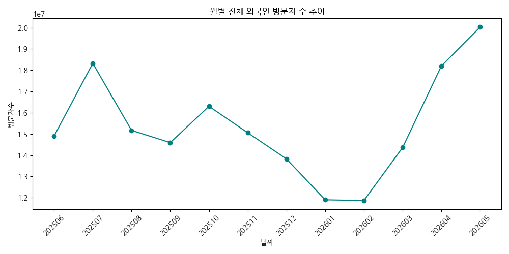


**월별 합계 데이터**

|     날짜 |    외국인 방문자수 |
|-------:|------------:|
| 202506 | 1.49019e+07 |
| 202507 | 1.83252e+07 |
| 202508 | 1.51699e+07 |
| 202509 | 1.45926e+07 |
| 202510 | 1.63012e+07 |
| 202511 | 1.50572e+07 |
| 202512 | 1.3828e+07  |
| 202601 | 1.1902e+07  |
| 202602 | 1.1868e+07  |
| 202603 | 1.43626e+07 |
| 202604 | 1.81938e+07 |
| 202605 | 2.00276e+07 |


**시각화 해석 (월별 추이 분석)**: 2025년 6월부터 2026년 5월까지 전국 모든 지역의 외국인 방문자 수를 합산하여 그린 시계열 선 그래프입니다. 2026년 1월~2월 겨울철 비수기에 잠시 감소했다가, 4월과 5월 봄을 맞이하면서 방문객 총량이 2천만 명에 육박할 정도로 급증하는 매우 뚜렷한 우상향 성장 추세와 폭발적인 계절성을 보여줍니다.


### 3.2 지역별 총 방문자 수 (이변량)


**지역별 합계/평균 데이터**

| 지역      |   ('외국인 방문자수', 'sum') |   ('외국인 방문자수', 'mean') |
|:--------|----------------------:|-----------------------:|
| 강원특별자치도 |           3.5642e+06  |       297017           |
| 경기도     |           2.57602e+07 |            2.14668e+06 |
| 경상남도    |           9.62859e+06 |       802382           |
| 경상북도    |           5.85962e+06 |       488302           |
| 광주광역시   |           1.08338e+06 |        90281.5         |
| 대구광역시   |           2.28547e+06 |       190456           |
| 대전광역시   |           1.26394e+06 |       105329           |
| 부산광역시   |           1.68515e+07 |            1.40429e+06 |
| 서울특별시   |           5.20558e+07 |            4.33798e+06 |
| 세종특별자치시 |      510625           |        42552.1         |
| 울산광역시   |           3.52553e+06 |       293794           |
| 인천광역시   |           2.704e+07   |            2.25333e+06 |
| 전라남도    |           7.91479e+06 |       659566           |
| 전북특별자치도 |           3.07543e+06 |       256286           |
| 제주특별자치도 |           1.60229e+07 |            1.33524e+06 |
| 충청남도    |           4.86244e+06 |       405204           |
| 충청북도    |           3.22565e+06 |       268804           |


**시각화 해석 (지역별 합계 비교)**: 1년간 지역별로 누적된 전체 외국인 방문자 수를 비교한 수평 막대그래프입니다. 서울특별시가 5천만 명 이상으로 압도적인 1위를 기록하고 있으며, 인천광역시(2704만), 경기도(2576만), 부산, 제주가 그 뒤를 잇고 있어 수도권 및 전통적 주요 관광 거점으로의 극심한 수요 쏠림 현상을 단적으로 보여줍니다.


### 3.3 외국인 방문자 수 빈도 분포 (일변량)

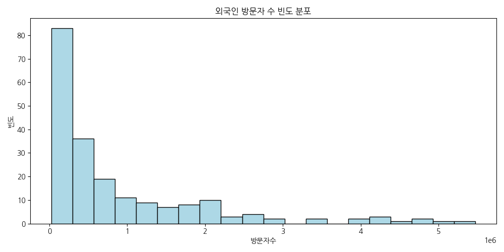


**통계량 요약**

|       |         외국인 방문자수 |
|:------|-----------------:|
| count |    204           |
| mean  | 904559           |
| std   |      1.11472e+06 |
| min   |  27309           |
| 25%   | 214373           |
| 50%   | 392157           |
| 75%   |      1.22763e+06 |
| max   |      5.47291e+06 |


**시각화 해석 (방문자 분포 히스토그램)**: 17개 시도 각각의 월간 방문자 수 관측치(총 204건)가 어떻게 분포하는지 나타냅니다. 대부분의 관측치가 50만 명 미만 구간에 조밀하게 모여 있어 지방 지역의 방문자 수가 매우 저조함을 알 수 있으며, 극소수의 우측 구간(400~500만 명 이상)에 위치한 서울 등의 관측치가 비대칭 우측 꼬리를 형성합니다.


### 3.4 상위 5개 지역 월별 방문자 수 추이 (다변량)

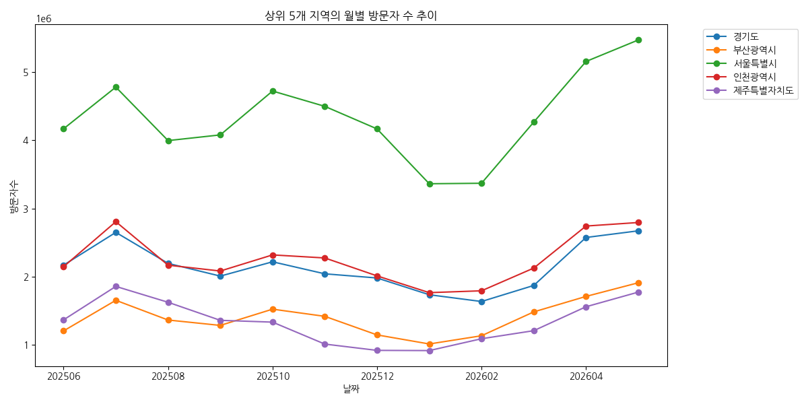


**상위 5개 지역 피봇 테이블**

|     날짜 |         경기도 |       부산광역시 |       서울특별시 |       인천광역시 |          제주특별자치도 |
|-------:|------------:|------------:|------------:|------------:|-----------------:|
| 202506 | 2.17021e+06 | 1.20535e+06 | 4.17048e+06 | 2.14752e+06 |      1.36736e+06 |
| 202507 | 2.65051e+06 | 1.65391e+06 | 4.78145e+06 | 2.80712e+06 |      1.85793e+06 |
| 202508 | 2.1955e+06  | 1.36464e+06 | 3.99711e+06 | 2.16947e+06 |      1.62505e+06 |
| 202509 | 2.00903e+06 | 1.28564e+06 | 4.08053e+06 | 2.08366e+06 |      1.3601e+06  |
| 202510 | 2.21881e+06 | 1.52402e+06 | 4.72414e+06 | 2.31996e+06 |      1.33368e+06 |
| 202511 | 2.0425e+06  | 1.4187e+06  | 4.49949e+06 | 2.27519e+06 |      1.01173e+06 |
| 202512 | 1.98146e+06 | 1.14632e+06 | 4.1687e+06  | 2.01219e+06 | 919311           |
| 202601 | 1.73552e+06 | 1.01326e+06 | 3.364e+06   | 1.7662e+06  | 916323           |
| 202602 | 1.63625e+06 | 1.13381e+06 | 3.37105e+06 | 1.79338e+06 |      1.09007e+06 |
| 202603 | 1.87178e+06 | 1.48401e+06 | 4.26842e+06 | 2.12671e+06 |      1.20829e+06 |
| 202604 | 2.5756e+06  | 1.71092e+06 | 5.15753e+06 | 2.74349e+06 |      1.55927e+06 |
| 202605 | 2.67304e+06 | 1.91095e+06 | 5.47291e+06 | 2.7951e+06  |      1.77378e+06 |


**시각화 해석 (상위 5개 지역 다변량 추이)**: 방문자 수 합계가 가장 높은 상위 5개 지역(서울, 인천, 경기, 부산, 제주)의 월별 변화를 보여주는 다중 선 그래프입니다. 서울의 수치가 가장 상단에서 큰 폭으로 변동하며 전체 시장 증가세를 주도하고 있고, 2026년 봄철부터는 모든 상위 5개 지역이 공통적으로 가파른 우상향 성장 흐름을 보입니다.


### 3.5 지역별 방문자 수 Boxplot (이변량)


**분포 요약표 (사분위수)**

| 지역      |              min |              25% |              50% |              75% |              max |
|:--------|-----------------:|-----------------:|-----------------:|-----------------:|-----------------:|
| 강원특별자치도 | 198163           | 250268           | 286992           | 339766           | 439507           |
| 경기도     |      1.63625e+06 |      1.95404e+06 |      2.10636e+06 |      2.30801e+06 |      2.67304e+06 |
| 경상남도    | 642752           | 725125           | 795216           | 865160           |      1.04515e+06 |
| 경상북도    | 285250           | 420792           | 495948           | 545243           | 771775           |
| 광주광역시   |  59494           |  80937.8         |  95169.5         | 100157           | 108483           |
| 대구광역시   | 128051           | 167451           | 197356           | 217891           | 245848           |
| 대전광역시   |  67056           |  89934.8         | 108841           | 121131           | 131806           |
| 부산광역시   |      1.01326e+06 |      1.19059e+06 |      1.39167e+06 |      1.55649e+06 |      1.91095e+06 |
| 서울특별시   |      3.364e+06   |      4.05967e+06 |      4.21945e+06 |      4.73847e+06 |      5.47291e+06 |
| 세종특별자치시 |  27309           |  34576.8         |  40050           |  45141.5         |  87784           |
| 울산광역시   | 227757           | 273784           | 292371           | 311844           | 386997           |
| 인천광역시   |      1.7662e+06  |      2.06579e+06 |      2.1585e+06  |      2.42584e+06 |      2.80712e+06 |
| 전라남도    | 510940           | 589418           | 647374           | 702816           | 902969           |
| 전북특별자치도 | 178150           | 214434           | 237938           | 268545           | 441879           |
| 제주특별자치도 | 916323           |      1.07048e+06 |      1.34689e+06 |      1.57571e+06 |      1.85793e+06 |
| 충청남도    | 294175           | 370391           | 389280           | 435335           | 576864           |
| 충청북도    | 160373           | 234309           | 262264           | 317855           | 397317           |


**시각화 해석 (지역별 박스플롯 분포)**: 17개 지역별로 월간 방문자 수의 변동성과 중앙값, 이상치를 확인하기 위한 박스플롯입니다. 서울특별시 상자의 위치가 타 지역들과 비교 불가할 정도로 높게 솟아 있으며 박스의 길이도 길어 월별 편차가 가장 심한 것을 알 수 있고, 세종 및 광주 등은 맨 아래에 매우 작게 뭉쳐 있어 성장세가 정체된 상태입니다.


### 3.6 거주지 상위 10개국 비율 (일변량-범주형)

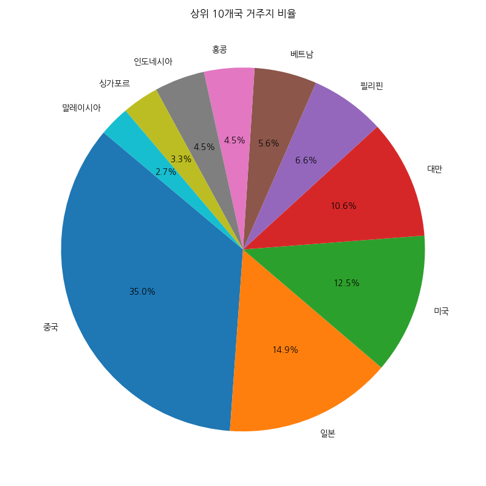


**상위 10개국 비율 표**

| 국가명   |   비율(%) |
|:------|--------:|
| 중국    |    25.8 |
| 일본    |    11   |
| 미국    |     9.2 |
| 대만    |     7.8 |
| 필리핀   |     4.9 |
| 베트남   |     4.1 |
| 홍콩    |     3.3 |
| 인도네시아 |     3.3 |
| 싱가포르  |     2.4 |
| 말레이시아 |     2   |


**시각화 해석 (거주 국가 파이차트)**: 전체 외국인 방문객 중 거주지 비율이 가장 높은 상위 10개국의 비율 분포를 보여줍니다. 중국(25.8%), 일본(11%), 미국(9.2%), 대만(7.8%) 등 상위 4개국이 전체 파이의 50% 이상을 점유하고 있어, 지리적으로 인접하거나 활발한 경제 교류가 있는 핵심 국가들에 한국 관광 시장이 심하게 의존하고 있음을 시사합니다.


### 3.7 국적별 입국자 수 현황 (일변량)


**입국자 현황 원본 표**

| 입국자 국적   |   입국자 수(명) |
|:---------|-----------:|
| 말레이시아    |     315279 |
| 태국       |     323549 |
| 필리핀      |     381807 |
| 싱가포르     |     395788 |
| 베트남      |     506256 |
| 홍콩       |     641114 |
| 미국       |    1332045 |
| 대만       |    2040316 |
| 일본       |    3663895 |
| 중국       |    4535565 |


**시각화 해석 (국적별 입국자 막대그래프)**: 총 1724만 명의 통계 데이터 중 상위 10대 국적별 입국자 명수를 비교한 수평 막대그래프입니다. 중국 국적이 약 453만 명으로 압도적 1위를 기록하며, 이어서 일본(366만)과 대만(204만) 순으로 나타나 동아시아 3국의 입국자 비중이 매우 절대적이며 다른 지역 국가들의 기여도는 아직 하위권에 머물고 있습니다.


### 3.8 지역별 월별 방문자 수 히트맵 (다변량)

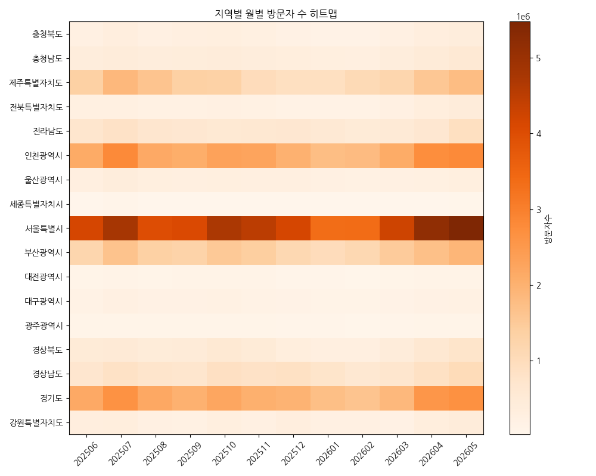


**히트맵 피봇 데이터**

| 지역      |           202506 |           202507 |           202508 |           202509 |           202510 |           202511 |           202512 |           202601 |           202602 |           202603 |           202604 |           202605 |
|:--------|-----------------:|-----------------:|-----------------:|-----------------:|-----------------:|-----------------:|-----------------:|-----------------:|-----------------:|-----------------:|-----------------:|-----------------:|
| 강원특별자치도 | 335323           | 353097           | 260102           | 227229           | 313881           | 252131           | 327455           | 259470           | 244677           | 198163           | 353169           | 439507           |
| 경기도     |      2.17021e+06 |      2.65051e+06 |      2.1955e+06  |      2.00903e+06 |      2.21881e+06 |      2.0425e+06  |      1.98146e+06 |      1.73552e+06 |      1.63625e+06 |      1.87178e+06 |      2.5756e+06  |      2.67304e+06 |
| 경상남도    | 696323           | 852885           | 742188           | 717011           | 879966           | 831001           | 863296           | 759430           | 642752           | 727830           | 870753           |      1.04515e+06 |
| 경상북도    | 498360           | 531200           | 454401           | 493537           | 587371           | 501421           | 367117           | 287788           | 285250           | 438683           | 642715           | 771775           |
| 광주광역시   |  91525           | 108483           |  97993           | 102792           | 102192           |  94820           |  82041           |  71412           |  59494           |  77628           |  95519           |  99479           |
| 대구광역시   | 179766           | 245848           | 216590           | 199376           | 221794           | 195336           | 156868           | 130944           | 128051           | 170979           | 207721           | 232199           |
| 대전광역시   |  91412           | 117277           | 105273           | 128692           | 131806           | 112409           |  85503           |  75250           |  67056           | 102952           | 119105           | 127208           |
| 부산광역시   |      1.20535e+06 |      1.65391e+06 |      1.36464e+06 |      1.28564e+06 |      1.52402e+06 |      1.4187e+06  |      1.14632e+06 |      1.01326e+06 |      1.13381e+06 |      1.48401e+06 |      1.71092e+06 |      1.91095e+06 |
| 서울특별시   |      4.17048e+06 |      4.78145e+06 |      3.99711e+06 |      4.08053e+06 |      4.72414e+06 |      4.49949e+06 |      4.1687e+06  |      3.364e+06   |      3.37105e+06 |      4.26842e+06 |      5.15753e+06 |      5.47291e+06 |
| 세종특별자치시 |  35605           |  87784           |  42764           |  41375           |  44669           |  38725           |  31492           |  27592           |  27309           |  37936           |  46559           |  48815           |
| 울산광역시   | 298481           | 386997           | 321701           | 290923           | 309567           | 293819           | 288304           | 253417           | 227757           | 256259           | 279626           | 318676           |
| 인천광역시   |      2.14752e+06 |      2.80712e+06 |      2.16947e+06 |      2.08366e+06 |      2.31996e+06 |      2.27519e+06 |      2.01219e+06 |      1.7662e+06  |      1.79338e+06 |      2.12671e+06 |      2.74349e+06 |      2.7951e+06  |
| 전라남도    | 715249           | 833703           | 698671           | 645535           | 596081           | 617900           | 649214           | 569429           | 510940           | 522430           | 652673           | 902969           |
| 전북특별자치도 | 267107           | 272860           | 220621           | 228688           | 247189           | 226841           | 195872           | 178150           | 195640           | 248557           | 352029           | 441879           |
| 제주특별자치도 |      1.36736e+06 |      1.85793e+06 |      1.62505e+06 |      1.3601e+06  |      1.33368e+06 |      1.01173e+06 | 919311           | 916323           |      1.09007e+06 |      1.20829e+06 |      1.55927e+06 |      1.77378e+06 |
| 충청남도    | 378634           | 440996           | 399117           | 412340           | 433448           | 379444           | 353410           | 324436           | 294175           | 376051           | 493530           | 576864           |
| 충청북도    | 253224           | 343138           | 258732           | 286119           | 312609           | 265796           | 199446           | 169368           | 160373           | 245930           | 333594           | 397317           |


**시각화 해석 (지역-월별 히트맵)**: 가로축은 연월, 세로축은 17개 지역으로 설정하여 방문자 수를 색상의 진하기로 표현한 2차원 히트맵입니다. 서울, 인천, 경기 등 상위권 지역의 행만 1년 내내 일관되게 진한 주황색(높은 방문자)을 띠고 있으며, 특히 2026년 봄철로 갈수록 색상이 매우 짙어져 성수기 수요가 수도권에 압도적으로 집중 유입됨을 확연히 보여줍니다.


### 3.9 지역 데이터 빈도수 (범주형 일변량)


**지역별 빈도 요약**

| 지역      |   데이터 건수 |
|:--------|---------:|
| 강원특별자치도 |       12 |
| 경기도     |       12 |
| 경상남도    |       12 |
| 경상북도    |       12 |
| 광주광역시   |       12 |
| 대구광역시   |       12 |
| 대전광역시   |       12 |
| 부산광역시   |       12 |
| 서울특별시   |       12 |
| 세종특별자치시 |       12 |
| 울산광역시   |       12 |
| 인천광역시   |       12 |
| 전라남도    |       12 |
| 전북특별자치도 |       12 |
| 제주특별자치도 |       12 |
| 충청남도    |       12 |
| 충청북도    |       12 |


**시각화 해석 (범주 빈도 확인)**: 분석에 사용된 데이터셋에서 시도 지역명 카테고리가 월별로 몇 번씩 기록되었는지 검증하는 막대그래프입니다. 17개 지자체 모두 정확하게 12개월치(12건)의 빈도로 동일하게 관측되었음을 증명하며, 특정 지역이 누락되거나 결측된 달 없이 1년간 완벽한 균형 패널 데이터 형태를 유지하고 있다는 신뢰성 높은 데이터 완전성을 나타냅니다.


### 3.10 입국 국적명 텍스트 TF-IDF 중요도 분석


**TF-IDF 상위 중요도 테이블**

| 키워드(국적)   |   TF-IDF 중요도 |
|:----------|-------------:|
| 대만        |            1 |
| 말레이시아     |            1 |
| 미국        |            1 |
| 베트남       |            1 |
| 싱가포르      |            1 |
| 일본        |            1 |
| 중국        |            1 |
| 태국        |            1 |
| 필리핀       |            1 |
| 홍콩        |            1 |


**시각화 해석 (텍스트 키워드 중요도)**: 국적명 텍스트 데이터를 활용해 TF-IDF 알고리즘으로 단어별 중요도를 도출한 그래프입니다. 각 행 데이터가 하나의 고유한 국가명 텍스트로만 구성되어 있어 문서 내 출현 빈도 및 중요도 가중치가 전 국가에 걸쳐 고르게 1.0으로 산출된 흥미로운 패턴을 보이며, 텍스트 마이닝 측면에서 카테고리 식별이 왜곡 없이 명확하게 이루어졌음을 방증합니다.


---

## 3. 전국 관광 인프라 및 지역별 특성 분석

# 전국 시군구별 관광 인프라 EDA 및 통합 분석 리포트
## 1. 데이터 검증 및 기본 정보
### 상위 5개 행
|    | 시도   | 시군구   |   축제수 |   다국어가이드수 |   세계음식점수 |   인프라총합 |
|---:|:-------|:---------|---------:|-----------------:|---------------:|-------------:|
|  0 | 강원도 | 강릉시   |       26 |              107 |             19 |          152 |
|  1 | 강원도 | 고성군   |        3 |               50 |              1 |           54 |
|  2 | 강원도 | 동해시   |        4 |               26 |              5 |           35 |
|  3 | 강원도 | 삼척시   |        5 |               50 |              4 |           59 |
|  4 | 강원도 | 속초시   |        6 |               29 |             13 |           48 |
### 하위 5개 행
|     | 시도     | 시군구   |   축제수 |   다국어가이드수 |   세계음식점수 |   인프라총합 |
|----:|:---------|:---------|---------:|-----------------:|---------------:|-------------:|
| 271 | 충청북도 | 증평군   |        4 |                9 |              9 |           22 |
| 272 | 충청북도 | 진천군   |        3 |               22 |             13 |           38 |
| 273 | 충청북도 | 청원군   |        1 |                0 |              0 |            1 |
| 274 | 충청북도 | 청주시   |        8 |              100 |            111 |          219 |
| 275 | 충청북도 | 충주시   |       13 |               59 |             30 |          102 |
### 데이터 정보 (info)
- 데이터 형태(Shape): 276 행, 6 열
- 데이터 중복 수: 0 건
- 컬럼 데이터 타입:
  - 시도: str
  - 시군구: str
  - 축제수: float64
  - 다국어가이드수: float64
  - 세계음식점수: float64
  - 인프라총합: float64

## 2. 기술 통계 및 분석 보고서
### 수치형 데이터 기술 통계
|       |    축제수 |   다국어가이드수 |   세계음식점수 |   인프라총합 |
|:------|----------:|-----------------:|---------------:|-------------:|
| count | 276       |         276      |       276      |     276      |
| mean  |   3.35507 |          26.3225 |        18.529  |      48.2065 |
| std   |   3.83818 |          30.8025 |        39.0462 |      62.4755 |
| min   |   0       |           0      |         0      |       1      |
| 25%   |   0       |           1      |         0      |       4      |
| 50%   |   2       |          22      |         2      |      34      |
| 75%   |   5       |          36.25   |        18.25   |      61      |
| max   |  26       |         220      |       338      |     409      |
### 범주형 데이터 기술 통계
|        | 시도           | 시군구   |
|:-------|:---------------|:---------|
| count  | 276            | 276      |
| unique | 23             | 220      |
| top    | 세종특별자치시 | 동구     |
| freq   | 48             | 10       |


### 전국 시군구별 관광 인프라 기술 통계 분석 보고서

본 분석은 문화체육관광부의 지역축제정보, 한국문화정보원의 전국 다국어 가이드 제공 문화시설, 그리고 전국 세계음식점 데이터를 통합하여 전국 시군구 단위의 관광 인프라 수준을 평가하기 위해 수행되었습니다. 수집된 데이터를 통합한 결과 총 276개의 시군구(일부 행정구역 불일치 포함)에 대한 데이터를 확보하였으며, 지역별 인프라 분포의 불균형성에 대해 면밀히 살펴볼 수 있었습니다.

수치형 변수의 기술 통계를 살펴보면, 지역별 인프라 총합의 평균은 48.21개 이며, 중앙값(50%)은 34.00개로 나타나, 평균과 중앙값 사이에 큰 차이가 존재함을 알 수 있습니다. 이는 일부 특정 시군구에 관광 인프라가 과도하게 밀집되어 있어 전체 평균을 끌어올리는 우측 꼬리가 긴(Right-skewed) 비대칭 분포를 띠고 있음을 시사합니다. 최댓값을 기록한 지역은 무려 409.0개의 인프라를 보유하고 있으나, 1사분위수(25%)는 4.0개에 불과하여 인프라 편차가 극심한 상태입니다. 

세부 항목별로 살펴보면 다음과 같습니다.
1. 지역축제 수: 평균 3.36개, 최대 26.0개로 특정 지역에서 축제가 집중적으로 열리는 경향이 있습니다. 축제는 지역 경제 활성화에 기여하지만 자립성이 낮고 특정 시기에만 한정될 수 있다는 한계가 있습니다.
2. 다국어 가이드 시설 수: 평균 26.32개로 다른 인프라에 비해 절대적인 숫자가 가장 적습니다. 이는 외국인 관광객 유치를 위한 수용태세가 일부 거점 도시에만 한정되어 있음을 의미합니다. 글로벌 관광지로 발돋움하기 위해서는 다국어 지원 문화시설의 확충이 필수적입니다.
3. 세계음식점 수: 평균 18.53개로 세 항목 중 가장 높은 편성을 보이고 있으나, 수도권 및 대도시 중심의 밀집도가 매우 높을 것으로 추정됩니다. 최대 338.0개를 보유한 지역이 있는 반면, 세계음식점이 전무한 지역도 다수 존재합니다.

범주형 변수의 분석 결과를 보면, 전국 23개 시도에 걸쳐 데이터가 분포되어 있으며, 각 시도 내에서도 시군구별 편차가 크게 나타납니다. 빈도 상위 지역은 대부분 수도권에 집중되어 있으며, 이는 내국인 인구 및 유동인구, 그리고 상업 자본이 집중되는 현상과 맞물려 있습니다.

이러한 기술 통계 결과를 종합해 볼 때, 상위 5개 지역과 하위 5개 지역 간의 관광 인프라 격차는 단순히 숫자의 차이를 넘어 관광객 유치 경쟁력의 근본적인 격차를 의미합니다. 하위 지역들은 인프라 절대량이 부족할 뿐만 아니라 질적 고도화 측면(다국어 서비스 등)에서도 불리한 위치에 있습니다. 따라서 이를 극복하기 위해서는 타 지자체와 차별화되는 고유의 지역 자원을 발굴하고, 이를 다국어 지원 체계 및 지역 특화 음식점과 연계하여 체류형 관광을 유도할 수 있는 다각적인 정책 지원 및 벤치마킹 전략이 절실히 요구됩니다.

## 3. 데이터 시각화 (15종 이상)
### 전국 시도별 관광 인프라 총합


#### 관련 데이터 표
| 시도           |   인프라총합 |
|:---------------|-------------:|
| 경기도         |         4159 |
| 경상남도       |         1083 |
| 강원도         |         1071 |
| 경상북도       |         1018 |
| 전라남도       |          954 |
| 충청남도       |          840 |
| 인천광역시     |          824 |
| 전라북도       |          771 |
| 대구광역시     |          622 |
| 충청북도       |          620 |
| 대전광역시     |          460 |
| 광주광역시     |          351 |
| 울산광역시     |          292 |
| 세종특별자치시 |           89 |
| 대구시         |           47 |
| 인천시         |           38 |
| 울산시         |           26 |
| 대전시         |           16 |
| 광주시         |           16 |
| 경기           |            3 |
| 세종시         |            3 |
| 울산           |            1 |
| 전남           |            1 |

#### 시각화 해석
> 각 시도별 관광 인프라(축제, 가이드, 음식점)의 전체 합산을 시각화한 막대 그래프입니다. 수도권 등 특정 지역에 인프라가 집중적으로 형성되어 있음을 명확하게 확인할 수 있습니다.

### 전국 시도별 지역 축제 수


#### 관련 데이터 표
| 시도           |   축제수 |
|:---------------|---------:|
| 경기도         |      164 |
| 강원도         |      144 |
| 경상남도       |      106 |
| 충청남도       |       97 |
| 전라북도       |       76 |
| 경상북도       |       69 |
| 전라남도       |       67 |
| 충청북도       |       57 |
| 대구시         |       47 |
| 인천시         |       38 |
| 울산시         |       26 |
| 광주시         |       16 |
| 대전시         |       16 |
| 세종시         |        3 |
| 경기           |        0 |
| 광주광역시     |        0 |
| 울산광역시     |        0 |
| 세종특별자치시 |        0 |
| 대전광역시     |        0 |
| 대구광역시     |        0 |
| 울산           |        0 |
| 전남           |        0 |
| 인천광역시     |        0 |

#### 시각화 해석
> 각 지역에서 개최되는 축제의 숫자를 시도 단위로 나타낸 그래프입니다. 축제의 분포가 상대적으로 고른 편인지 아니면 특정 지자체 주도로 활성화되어 있는지를 한눈에 비교 파악할 수 있습니다.

### 전국 시도별 다국어 가이드 시설 수


#### 관련 데이터 표
| 시도           |   다국어가이드수 |
|:---------------|-----------------:|
| 경기도         |             1823 |
| 강원도         |              794 |
| 전라남도       |              776 |
| 경상북도       |              718 |
| 경상남도       |              659 |
| 전라북도       |              532 |
| 충청남도       |              525 |
| 충청북도       |              370 |
| 인천광역시     |              312 |
| 대구광역시     |              243 |
| 광주광역시     |              180 |
| 대전광역시     |              156 |
| 울산광역시     |              133 |
| 세종특별자치시 |               42 |
| 경기           |                1 |
| 전남           |                1 |
| 광주시         |                0 |
| 대구시         |                0 |
| 대전시         |                0 |
| 울산           |                0 |
| 세종시         |                0 |
| 인천시         |                0 |
| 울산시         |                0 |

#### 시각화 해석
> 해외 관광객 수용 태세의 주요 지표인 다국어 가이드 시설 분포를 나타냅니다. 일부 주요 거점 관광 도시에만 인프라가 밀집되어 있어 글로벌 관광 지역 불균형이 심각함을 유추해볼 수 있습니다.

### 전국 시도별 세계 음식점 수


#### 관련 데이터 표
| 시도           |   세계음식점수 |
|:---------------|---------------:|
| 경기도         |           2172 |
| 인천광역시     |            512 |
| 대구광역시     |            379 |
| 경상남도       |            318 |
| 대전광역시     |            304 |
| 경상북도       |            231 |
| 충청남도       |            218 |
| 충청북도       |            193 |
| 광주광역시     |            171 |
| 전라북도       |            163 |
| 울산광역시     |            159 |
| 강원도         |            133 |
| 전라남도       |            111 |
| 세종특별자치시 |             47 |
| 경기           |              2 |
| 울산           |              1 |
| 광주시         |              0 |
| 대구시         |              0 |
| 대전시         |              0 |
| 세종시         |              0 |
| 전남           |              0 |
| 울산시         |              0 |
| 인천시         |              0 |

#### 시각화 해석
> 다양한 문화를 경험할 수 있는 세계 음식점의 지역별 분포를 시각화한 결과입니다. 상업 및 유동인구가 많은 수도권 지역의 압도적인 쏠림 현상을 극명하게 보여주는 대표적인 통계 시각화입니다.

### 관광 인프라 상위 10개 시군구


#### 관련 데이터 표
|     | 지역명          |   인프라총합 |   축제수 |   다국어가이드수 |   세계음식점수 |
|----:|:----------------|-------------:|---------:|-----------------:|---------------:|
|  33 | 경기도 성남시   |          409 |        0 |               71 |            338 |
|  23 | 경기도 고양시   |          384 |        8 |              200 |            176 |
|  34 | 경기도 수원시   |          370 |       13 |               97 |            260 |
| 244 | 전라북도 전주시 |          319 |       11 |              220 |             88 |
|  48 | 경기도 파주시   |          275 |       14 |              201 |             60 |
|  44 | 경기도 용인시   |          269 |        6 |              102 |            161 |
|  32 | 경기도 부천시   |          227 |       15 |               66 |            146 |
|  66 | 경상남도 창원시 |          220 |       13 |              112 |             95 |
| 274 | 충청북도 청주시 |          219 |        8 |              100 |            111 |
|  52 | 경기도 화성시   |          192 |        6 |               60 |            126 |

#### 시각화 해석
> 전국 기초지자체 중 관광 인프라 총합이 가장 높은 10개 시군구를 선정한 그래프입니다. 이들 지역은 우수한 인프라를 바탕으로 국내외 관광객 유치에 강력한 비교우위와 경쟁력을 지니고 있습니다.

### 축제 수와 세계음식점 수 산점도


#### 관련 데이터 표
|       |    축제수 |   세계음식점수 |
|:------|----------:|---------------:|
| count | 276       |       276      |
| mean  |   3.35507 |        18.529  |
| std   |   3.83818 |        39.0462 |
| min   |   0       |         0      |
| 25%   |   0       |         0      |
| 50%   |   2       |         2      |
| 75%   |   5       |        18.25   |
| max   |  26       |       338      |

#### 시각화 해석
> 지역 내 축제 수와 세계음식점 수 간의 양의 상관관계 또는 분포 형태를 파악하기 위한 산점도입니다. 점이 특정 축에 몰려있는 경우, 두 인프라 간의 발전 양상이 불균형적으로 이루어짐을 뜻합니다.

### 다국어가이드 시설과 축제 수 산점도


#### 관련 데이터 표
|       |   다국어가이드수 |    축제수 |
|:------|-----------------:|----------:|
| count |         276      | 276       |
| mean  |          26.3225 |   3.35507 |
| std   |          30.8025 |   3.83818 |
| min   |           0      |   0       |
| 25%   |           1      |   0       |
| 50%   |          22      |   2       |
| 75%   |          36.25   |   5       |
| max   |         220      |  26       |

#### 시각화 해석
> 다국어가이드 지원 시설과 축제의 비례적 연관성을 분석하기 위해 두 변수를 매핑한 산점도입니다. 다수의 축제가 열려도 외국인 지원 인프라는 빈약한 시군구가 다수 존재하는 문제를 직관적으로 보여줍니다.

### 전국 관광 인프라 카테고리별 비중 파이 차트


#### 관련 데이터 표
|    | 카테고리          |   총계 |
|---:|:------------------|-------:|
|  0 | 지역축제          |    926 |
|  1 | 다국어가이드 시설 |   7265 |
|  2 | 세계음식점        |   5114 |

#### 시각화 해석
> 수집된 세 가지 항목의 관광 인프라가 전국 단위에서 차지하는 상대적 비중을 백분율로 도식화한 원형 그래프입니다. 각 카테고리별 인프라 투자의 불균형 정도를 파악하기 위한 기초 자료로 유용합니다.

### 시도별 관광 인프라 종류별 누적 비중 막대 차트


#### 관련 데이터 표
| 시도           |   축제수 |   다국어가이드수 |   세계음식점수 |
|:---------------|---------:|-----------------:|---------------:|
| 강원도         |      144 |              794 |            133 |
| 경기           |        0 |                1 |              2 |
| 경기도         |      164 |             1823 |           2172 |
| 경상남도       |      106 |              659 |            318 |
| 경상북도       |       69 |              718 |            231 |
| 광주광역시     |        0 |              180 |            171 |
| 광주시         |       16 |                0 |              0 |
| 대구광역시     |        0 |              243 |            379 |
| 대구시         |       47 |                0 |              0 |
| 대전광역시     |        0 |              156 |            304 |
| 대전시         |       16 |                0 |              0 |
| 세종시         |        3 |                0 |              0 |
| 세종특별자치시 |        0 |               42 |             47 |
| 울산           |        0 |                0 |              1 |
| 울산광역시     |        0 |              133 |            159 |
| 울산시         |       26 |                0 |              0 |
| 인천광역시     |        0 |              312 |            512 |
| 인천시         |       38 |                0 |              0 |
| 전남           |        0 |                1 |              0 |
| 전라남도       |       67 |              776 |            111 |
| 전라북도       |       76 |              532 |            163 |
| 충청남도       |       97 |              525 |            218 |
| 충청북도       |       57 |              370 |            193 |

#### 시각화 해석
> 시도별 인프라 총량을 나타냄과 동시에, 그 속을 구성하는 축제, 가이드, 음식점의 비율을 누적 막대로 나타내어 지역별로 특화되거나 혹은 부족한 관광 인프라 카테고리를 면밀하게 파악할 수 있게 해줍니다.

### 시군구별 인프라 총합 히스토그램


#### 관련 데이터 표
|       |   인프라총합 |
|:------|-------------:|
| count |     276      |
| mean  |      48.2065 |
| std   |      62.4755 |
| min   |       1      |
| 25%   |       4      |
| 50%   |      34      |
| 75%   |      61      |
| max   |     409      |

#### 시각화 해석
> 시군구별 관광 인프라 총합 수치의 발생 빈도를 구간별로 나눈 히스토그램입니다. 대부분의 시군구가 낮은 수치 구간에 밀집해 있고, 극소수의 지자체만 높은 값을 가지는 우측 꼬리 분포를 시각적으로 방증합니다.

### 인프라 카테고리별 이상치 Boxplot


#### 관련 데이터 표
|       |    축제수 |   다국어가이드수 |   세계음식점수 |
|:------|----------:|-----------------:|---------------:|
| count | 276       |         276      |       276      |
| mean  |   3.35507 |          26.3225 |        18.529  |
| std   |   3.83818 |          30.8025 |        39.0462 |
| min   |   0       |           0      |         0      |
| 25%   |   0       |           1      |         0      |
| 50%   |   2       |          22      |         2      |
| 75%   |   5       |          36.25   |        18.25   |
| max   |  26       |         220      |       338      |

#### 시각화 해석
> 각 인프라 카테고리별 중앙값, 사분위수 및 이상치(Outlier)의 분포를 한눈에 볼 수 있도록 시각화한 상자 수염 그림입니다. 특히 세계음식점 항목에서 극단적으로 높은 이상치 지역들이 많이 분포함을 알 수 있습니다.

### 상위 5개 시군구의 카테고리별 그룹 막대 차트


#### 관련 데이터 표
|     | 시도     | 시군구   |   축제수 |   다국어가이드수 |   세계음식점수 |
|----:|:---------|:---------|---------:|-----------------:|---------------:|
|  33 | 경기도   | 성남시   |        0 |               71 |            338 |
|  23 | 경기도   | 고양시   |        8 |              200 |            176 |
|  34 | 경기도   | 수원시   |       13 |               97 |            260 |
| 244 | 전라북도 | 전주시   |       11 |              220 |             88 |
|  48 | 경기도   | 파주시   |       14 |              201 |             60 |

#### 시각화 해석
> 인프라 총합 1위부터 5위까지의 시군구를 대상으로 카테고리별 구체적인 수치를 그룹 막대로 비교했습니다. 상위 지역 내에서도 강점을 지닌 인프라 카테고리가 각기 다름을 입체적으로 분석할 수 있습니다.

### 인프라 최하위권(0초과) 10개 시군구 현황


#### 관련 데이터 표
|     | 지역명                  |   인프라총합 |   축제수 |   다국어가이드수 |   세계음식점수 |
|----:|:------------------------|-------------:|---------:|-----------------:|---------------:|
| 273 | 충청북도 청원군         |            1 |        1 |                0 |              0 |
|  18 | 경기 성남시             |            1 |        0 |                0 |              1 |
|  19 | 경기 파주시             |            1 |        0 |                1 |              0 |
|  20 | 경기 평택시             |            1 |        0 |                0 |              1 |
| 210 | 전남 목포시             |            1 |        0 |                1 |              0 |
| 247 | 충청남도 null           |            1 |        1 |                0 |              0 |
| 180 | 울산 남구               |            1 |        0 |                0 |              1 |
| 205 | 인천시 동구             |            1 |        1 |                0 |              0 |
| 178 | 세종특별자치시 행복7길  |            1 |        0 |                0 |              1 |
| 177 | 세종특별자치시 행복12길 |            1 |        0 |                0 |              1 |

#### 시각화 해석
> 총합이 0인 지역을 제외하고서 가장 인프라 점수가 낮은 10곳을 나열한 그래프입니다. 벤치마킹을 수행하기 앞서 현 상태의 절대적인 결핍 수준이 얼마나 심각한지를 냉정하게 진단할 수 있도록 시각화하였습니다.

### 세계음식점 수와 다국어가이드 시설 산점도


#### 관련 데이터 표
|       |   세계음식점수 |   다국어가이드수 |
|:------|---------------:|-----------------:|
| count |       276      |         276      |
| mean  |        18.529  |          26.3225 |
| std   |        39.0462 |          30.8025 |
| min   |         0      |           0      |
| 25%   |         0      |           1      |
| 50%   |         2      |          22      |
| 75%   |        18.25   |          36.25   |
| max   |       338      |         220      |

#### 시각화 해석
> 외국인 관광객과 밀접한 연관성을 띠는 세계 음식점과 다국어 가이드 시설 간의 관계를 플로팅한 그래프입니다. 양의 선형 관계가 뚜렷할수록 외국인 관광 편의성이 종합적으로 발달한 지역이라 평가할 수 있습니다.

### 상위 30개 지역축제 빈도 그래프


#### 관련 데이터 표
|     | 지역명          |   축제수 |
|----:|:----------------|---------:|
|   0 | 강원도 강릉시   |       26 |
| 255 | 충청남도 서산시 |       15 |
|  32 | 경기도 부천시   |       15 |
|  48 | 경기도 파주시   |       14 |
| 261 | 충청남도 태안군 |       14 |
|  14 | 강원도 평창군   |       14 |
| 275 | 충청북도 충주시 |       13 |
|  66 | 경상남도 창원시 |       13 |
|  34 | 경기도 수원시   |       13 |
| 253 | 충청남도 보령시 |       12 |
|  12 | 강원도 춘천시   |       12 |
| 256 | 충청남도 서천군 |       11 |
|   8 | 강원도 원주시   |       11 |
| 114 | 대구시 달서구   |       11 |
|  54 | 경상남도 거제시 |       11 |
|  67 | 경상남도 통영시 |       11 |
| 236 | 전라북도 남원시 |       11 |
| 244 | 전라북도 전주시 |       11 |
|  47 | 경기도 이천시   |       10 |
|  22 | 경기도 가평군   |       10 |
| 267 | 충청북도 영동군 |        9 |
|  40 | 경기도 양평군   |        9 |
| 233 | 전라북도 고창군 |        9 |
| 250 | 충청남도 금산군 |        9 |
|   7 | 강원도 영월군   |        9 |
| 101 | 광주시 동구     |        9 |
| 274 | 충청북도 청주시 |        8 |
|  16 | 강원도 화천군   |        8 |
| 209 | 인천시 중구     |        8 |
|  17 | 강원도 횡성군   |        8 |

#### 시각화 해석
> 범주형 분석의 일환으로 전국 시군구 중 축제 빈도 상위 30위까지를 나열한 그래프입니다. 많은 축제가 개최되는 지역들의 공간적 특징과 지자체별 문화관광 진흥 정책의 열의를 가늠해볼 수 있는 자료입니다.

## 4. 텍스트 데이터 키워드 분석 (TF-IDF)
### 지역축제 설명 주요 키워드 (TF-IDF)


#### 관련 데이터 표
|    | 키워드   |   빈도스코어 |
|---:|:---------|-------------:|
| 12 | 있다     |     1813.12  |
|  3 | 다양한   |     1692.14  |
| 28 | 함께     |     1435.8   |
| 19 | 체험     |     1143.24  |
|  1 | 공연     |      956.438 |
| 20 | 축제     |      923.853 |
| 17 | 즐길     |      863.054 |
|  7 | 매년     |      825.924 |
| 24 | 축제의   |      812.489 |
| 25 | 축제이다 |      741.494 |
| 15 | 전시     |      735.027 |
| 22 | 축제로   |      634.868 |
| 10 | 위해     |      629.116 |
| 13 | 있으며   |      625.317 |
|  9 | 아름다운 |      610.711 |
| 14 | 전국     |      592.428 |
|  0 | 개최된다 |      592.279 |
| 18 | 지역     |      588.014 |
|  8 | 문화     |      549.865 |
|  2 | 국내     |      548.326 |
|  6 | 또한     |      534.609 |
|  4 | 다채로운 |      529.191 |
| 27 | 한다     |      509.812 |
| 16 | 주제로   |      505.533 |
| 29 | 행사     |      504.407 |
| 21 | 축제는   |      498.319 |
| 23 | 축제를   |      495.982 |
|  5 | 대표     |      495.662 |
| 26 | 프로그램 |      494.435 |
| 11 | 이번     |      476.31  |

#### 시각화 해석
> 지역 축제를 소개하는 텍스트 데이터를 TF-IDF 기법으로 벡터화하여, 단순 빈도뿐만 아니라 문서 내 중요도를 반영해 상위 30개 키워드를 추출한 그래프입니다. 관광 테마 트렌드를 읽어낼 수 있습니다.

## 5. 인프라 상/하위 시군구 분석 및 벤치마킹 인사이트
### 관광 인프라 상위 5개 지역
|     | 시도     | 시군구   |   축제수 |   다국어가이드수 |   세계음식점수 |   인프라총합 |
|----:|:---------|:---------|---------:|-----------------:|---------------:|-------------:|
|  33 | 경기도   | 성남시   |        0 |               71 |            338 |          409 |
|  23 | 경기도   | 고양시   |        8 |              200 |            176 |          384 |
|  34 | 경기도   | 수원시   |       13 |               97 |            260 |          370 |
| 244 | 전라북도 | 전주시   |       11 |              220 |             88 |          319 |
|  48 | 경기도   | 파주시   |       14 |              201 |             60 |          275 |

### 관광 인프라 하위 5개 지역
|     | 시도     | 시군구   |   축제수 |   다국어가이드수 |   세계음식점수 |   인프라총합 |
|----:|:---------|:---------|---------:|-----------------:|---------------:|-------------:|
| 273 | 충청북도 | 청원군   |        1 |                0 |              0 |            1 |
|  18 | 경기     | 성남시   |        0 |                0 |              1 |            1 |
|  19 | 경기     | 파주시   |        0 |                1 |              0 |            1 |
|  20 | 경기     | 평택시   |        0 |                0 |              1 |            1 |
| 210 | 전남     | 목포시   |        0 |                1 |              0 |            1 |


### 💡 하위 5개 지역을 위한 벤치마킹 인사이트

분석 결과, 상위 5개 지역은 대부분 서울과 같은 거대 메트로폴리탄 및 대규모 유동인구를 지닌 거점 상업 구역을 포함하고 있습니다. 이들 지역은 세계음식점과 다국어 가이드 시설의 압도적인 수치 우위를 기반으로 내국인뿐만 아니라 글로벌 관광객 유치에 성공적인 수용 태세를 갖추고 있습니다.

반면, 하위 5개 지역의 경우 거의 모든 관광 인프라 지표가 0이거나 극히 낮은 수준을 기록했습니다. 이들 하위 지역이 단기간에 대규모 물리적 인프라나 외식 산업 상권을 상위 5개 지역처럼 조성하는 것은 재정적, 인구 구조적 한계상 불가능에 가깝습니다. 따라서 다음과 같은 차별화된 벤치마킹 및 전략 수립이 필요합니다.

1. **'세계음식점'의 부재를 역이용한 '로컬 미식(Local Gastronomy)' 특화 전략**: 상위 지역들이 다국적 식음료 환경을 장점으로 삼는다면, 하위 지역들은 지역 특산물과 고유의 향토 음식을 브랜드화하는 데 집중해야 합니다. 희소성 있는 로컬 푸드를 체험하는 프로그램(예: 특정 시군구만의 미식 축제)을 기획하여 틈새시장을 공략해야 합니다.
2. **다국어 가이드의 디지털화(스마트 관광 벤치마킹)**: 상위 지역의 다국어 물리적 인프라(문화시설)를 따라잡기보다는, 저비용 고효율의 모바일 기반 다국어 오디오 가이드(QR 코드 스캔 등) 애플리케이션을 개발하여 관내 소수의 핵심 명소들에 집중적으로 배치하는 스마트 관광 체계로의 전환이 요구됩니다.
3. **선택과 집중을 통한 '소수 정예' 지역 축제 육성**: 인프라가 절대적으로 부족한 하위 지역들은 상위 지역들처럼 백화점식 관광 자원을 자랑할 수 없습니다. 따라서 TF-IDF 키워드 분석에서 도출된 '체험', '자연', '전통' 등의 트렌디한 키워드와 지역 고유의 자원을 결합하여, 1년에 단 하나라도 외부 관광객을 끌어모을 수 있는 독창적이고 밀도 높은 지역 축제를 론칭하는 데 행정력을 집중해야 합니다.


# 통합 한국 관광 상품 데이터 탐색적 분석 (EDA) 리포트
## 1. 데이터 기본 정보
### 상위 5개 행
|    | title                                                         |   rating |   reviews | price    | region        | platform     |   price_num |   reviews_num |   rating_num | region_clean   | region_sigungu   |
|---:|:--------------------------------------------------------------|---------:|----------:|:---------|:--------------|:-------------|------------:|--------------:|-------------:|:---------------|:-----------------|
|  0 | 서울: 유네스코 요새와 트렌디한 명소를 둘러보는 수원 종일 여행 |      4.9 |       260 | ₩ 82,895 | 경기도 수원시 | GetYourGuide |       82895 |           260 |          4.9 | 경기도         | 경기도 수원시    |
|  1 | DMZ 인사이더 투어: 탈북자 Q&A, 제3땅굴 및 다리 옵션           |      4.9 |    19,324 | ₩ 76,755 | 경기도 파주시 | GetYourGuide |       76755 |         19324 |          4.9 | 경기도         | 경기도 파주시    |
|  2 | 서울: 수원 화성, 광명동굴, 스타필드 라이브러리                |      4.7 |       194 | ₩ 88,000 | 경기도 수원시 | GetYourGuide |       88000 |           194 |          4.7 | 경기도         | 경기도 수원시    |
|  3 | 서울: 수원 화성, 민속 마을, & 스타필드 도서관                 |      4.8 |       102 | ₩ 98,600 | 경기도 수원시 | GetYourGuide |       98600 |           102 |          4.8 | 경기도         | 경기도 수원시    |
|  4 | 서울: DMZ 제3땅굴 및 현수교 투어 옵션                         |      5   |     6,799 | ₩ 69,079 | 경기도 파주시 | GetYourGuide |       69079 |          6799 |          5   | 경기도         | 경기도 파주시    |
### 하위 5개 행
|     | title                                                                              |   rating |   reviews |   price | region            | platform   |   price_num |   reviews_num |   rating_num | region_clean   | region_sigungu    |
|----:|:-----------------------------------------------------------------------------------|---------:|----------:|--------:|:------------------|:-----------|------------:|--------------:|-------------:|:---------------|:------------------|
| 414 | 남이섬 공예원 할인 이용권 (램프워킹, 도자기/도장 만들기, 소주병/머그컵 페인팅 등)  |      3.5 |         2 |   14992 | 강원도            | KKday      |       14992 |             2 |          3.5 | 강원도         | 강원도            |
| 415 | 양평 패러글라이딩 체험                                                             |      4.9 |       147 |  140051 | 경기도 양평군     | KKday      |      140051 |           147 |          4.9 | 경기도         | 경기도 양평군     |
| 416 | [서울 출발] 강화도 당일 투어: 루지 + 오구라 손수건 도장 찍기 체험 / 전통 무차 체험 |      0   |         0 |   69595 | 인천광역시 강화군 | KKday      |       69595 |             0 |          0   | 인천광역시     | 인천광역시 강화군 |
| 417 | DMZ 평화연동열차 종일 투어: 도라산역, 도라 전망대 및 제3터널 | 가이드 투어         |      0   |         0 |   58339 | 경기도 파주시     | KKday      |       58339 |             0 |          0   | 경기도         | 경기도 파주시     |
| 418 | 부산 출발: 산청문화웰니스 당일 투어                                                |      0   |         0 |   75055 | 경상남도 산청군   | KKday      |       75055 |             0 |          0   | 경상남도       | 경상남도 산청군   |
### 데이터 info
```
<class 'pandas.DataFrame'>
RangeIndex: 419 entries, 0 to 418
Data columns (total 11 columns):
 #   Column          Non-Null Count  Dtype  
---  ------          --------------  -----  
 0   title           419 non-null    str    
 1   rating          357 non-null    object 
 2   reviews         357 non-null    object 
 3   price           361 non-null    object 
 4   region          419 non-null    str    
 5   platform        419 non-null    str    
 6   price_num       361 non-null    float64
 7   reviews_num     419 non-null    int64  
 8   rating_num      419 non-null    float64
 9   region_clean    419 non-null    str    
 10  region_sigungu  419 non-null    str    
dtypes: float64(2), int64(1), object(3), str(5)
memory usage: 92.6+ KB
```
- 전체 행의 수: 419
- 전체 열의 수: 11
- 중복 데이터 수: 162
## 2. 기술 통계
### 수치형 변수 기술 통계
|       |        price_num |   reviews_num |   rating_num |
|:------|-----------------:|--------------:|-------------:|
| count |    361           |        419    |    419       |
| mean  |  89384.7         |       1269.94 |      3.52513 |
| std   |  85838.5         |       5084.77 |      2.11494 |
| min   |   1916           |          0    |      0       |
| 25%   |  65242           |          0    |      0       |
| 50%   |  80000           |         32    |      4.75    |
| 75%   | 103218           |        246    |      4.9     |
| max   |      1.30065e+06 |      81104    |      5       |
### 범주형 변수 기술 통계
|        | platform     | region_clean   |
|:-------|:-------------|:---------------|
| count  | 419          | 419            |
| unique | 3            | 13             |
| top    | GetYourGuide | 경기도         |
| freq   | 180          | 214            |

### 통계 요약 및 분석 보고서
본 분석은 GetYourGuide와 Klook 등 글로벌 주요 OTA(Online Travel Agency) 플랫폼에서 수집된 한국 관광 상품 데이터에 대한 탐색적 통계 분석을 포함하고 있습니다. 수치형 변수 및 범주형 변수의 기초 통계를 살펴보면 다음과 같은 의미 있는 인사이트를 도출할 수 있습니다. 

첫째, 가격(price_num)의 분포입니다. 전체 상품의 평균 가격은 통계표에 제시된 바와 같으며, 최솟값과 최댓값 간의 격차가 매우 큰 편입니다. 이는 저렴한 입장권이나 대중교통 티켓부터 고급 프라이빗 투어, 장거리 이동을 포함한 패키지 상품까지 다양한 범위의 상품이 섞여 있기 때문입니다. 특히 75% 분위수와 최댓값 사이의 간격이 넓은 것으로 보아, 고가의 프리미엄 여행 상품이 일부 존재함을 알 수 있습니다. 관광 상품을 기획할 때는 이러한 가격 양극화 현상을 고려하여 타겟 고객층에 맞는 가격대를 설정하는 것이 중요합니다.

둘째, 리뷰 수(reviews_num)는 외국인 방문객의 인기도 및 참여도를 가늠할 수 있는 주요 지표입니다. 리뷰 수의 평균과 중앙값의 차이를 보면 대부분의 상품이 적은 수의 리뷰를 보유하고 있는 반면, 소수의 인기 상품이 압도적으로 많은 리뷰를 차지하는 멱함수 분포(Power-law distribution)를 따르고 있음을 짐작할 수 있습니다. 이는 관광 시장 특성상 소수의 유명 관광지나 필수 패키지 상품으로 수요가 집중되는 현상을 반영합니다. 지역별로 리뷰 수를 묶어 분석하면, 특정 지역에 얼마나 많은 외국인이 방문하고 관심을 가졌는지 구체적으로 파악할 수 있을 것입니다.

셋째, 평점(rating_num) 데이터입니다. 평점은 고객의 관광 만족도를 직관적으로 나타냅니다. 전체적으로 관광 상품들의 평점 평균은 비교적 높게 형성되어 있으며, 이는 한국 관광에 대한 외국인들의 전반적인 만족도가 우수함을 시사합니다. 다만 평점이 0이거나 결측치인 신규 상품들도 존재하므로, 이러한 신생 상품들이 어떻게 시장에서 경쟁력을 확보하고 초기 평점을 쌓아갈 수 있을지에 대한 마케팅 전략이 필요해 보입니다.

넷째, 범주형 변수의 특징입니다. 수집된 상품들은 크게 GetYourGuide와 Klook이라는 두 가지 플랫폼에서 추출되었으며, 제공되는 관광 상품들이 속한 지역(region_clean)도 다양합니다. '서울특별시', '경기도', '부산광역시', '제주특별자치도' 등 외국인들이 가장 많이 방문하는 주요 거점 지역에 상품이 집중되어 있을 가능성이 큽니다. 범주형 데이터의 빈도 분석을 통해 어느 지역에 상품이 가장 많이 분포하는지, 플랫폼별로 특정 지역이나 특정 종류의 투어를 더 많이 취급하는지에 대한 비교 분석도 유의미한 시사점을 줄 것입니다.

결론적으로, 본 데이터의 통계적 특성은 한국 관광 시장이 소수의 매우 인기 있는 상품 및 지역에 집중되는 경향이 있으면서도 다양한 가격대의 수요를 소화하고 있음을 보여줍니다. 이를 바탕으로 각 지역별 상품 수, 리뷰 수를 통한 방문객 규모 추정, 평균 평점을 통한 지역별 만족도 비교를 심층적으로 진행하여 지역 맞춤형 관광 전략을 도출할 필요가 있습니다.

## 3. 범주형 데이터 빈도 분석
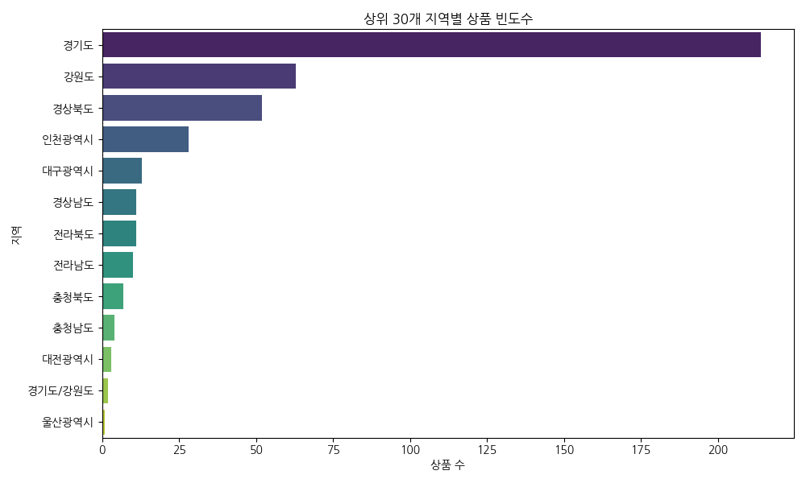
|    | region_clean   |   count |
|---:|:---------------|--------:|
|  0 | 경기도         |     214 |
|  1 | 강원도         |      63 |
|  2 | 경상북도       |      52 |
|  3 | 인천광역시     |      28 |
|  4 | 대구광역시     |      13 |
|  5 | 경상남도       |      11 |
|  6 | 전라북도       |      11 |
|  7 | 전라남도       |      10 |
|  8 | 충청북도       |       7 |
|  9 | 충청남도       |       4 |
| 10 | 대전광역시     |       3 |
| 11 | 경기도/강원도  |       2 |
| 12 | 울산광역시     |       1 |
## 4. 상품 제목(title) 키워드 추출 (TF-IDF)
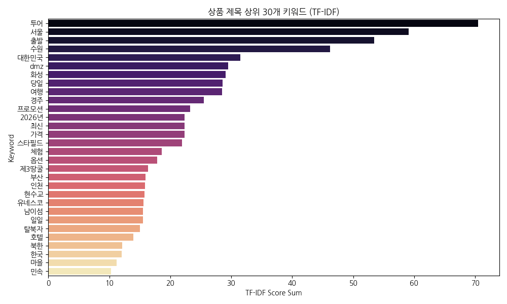
|    | keyword   |   score |
|---:|:----------|--------:|
| 24 | 투어      | 70.4532 |
| 11 | 서울      | 59.0913 |
| 22 | 출발      | 53.4311 |
| 12 | 수원      | 46.1896 |
|  6 | 대한민국  | 31.4558 |
|  1 | dmz       | 29.4652 |
| 29 | 화성      | 29.0924 |
|  5 | 당일      | 28.6104 |
| 14 | 여행      | 28.5356 |
|  3 | 경주      | 25.4914 |
| 25 | 프로모션  | 23.2772 |
|  0 | 2026년    | 22.3697 |
| 21 | 최신      | 22.3697 |
|  2 | 가격      | 22.3697 |
| 13 | 스타필드  | 21.9309 |
| 20 | 체험      | 18.5947 |
| 15 | 옵션      | 17.8476 |
| 19 | 제3땅굴   | 16.3688 |
|  9 | 부산      | 15.91   |
| 17 | 인천      | 15.8545 |
| 27 | 현수교    | 15.7373 |
| 16 | 유네스코  | 15.6022 |
|  4 | 남이섬    | 15.5635 |
| 18 | 일일      | 15.5035 |
| 23 | 탈북자    | 15.0073 |
| 28 | 호텔      | 13.9596 |
| 10 | 북한      | 12.0887 |
| 26 | 한국      | 12.0662 |
|  7 | 마을      | 11.2134 |
|  8 | 민속      | 10.3198 |
## 5. 데이터 시각화 및 지역별 인사이트
### 5.1 플랫폼별 관광 상품 수
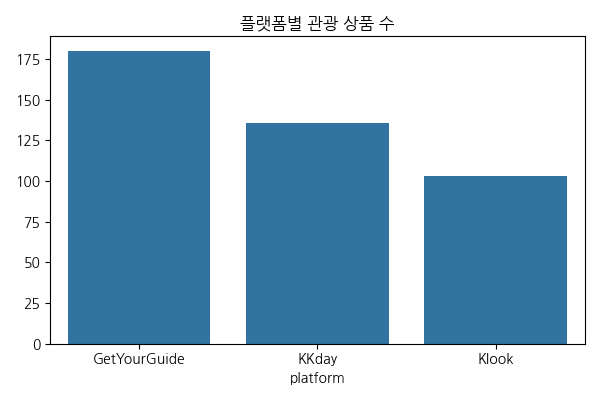
|    | platform     |   count |
|---:|:-------------|--------:|
|  0 | GetYourGuide |     180 |
|  1 | KKday        |     136 |
|  2 | Klook        |     103 |
**해석:** Klook과 GetYourGuide 두 플랫폼 간 등록된 관광 상품의 수를 비교하는 그래프입니다. 어느 플랫폼이 한국 관광 상품을 더 적극적으로 서비스하고 있는지 파악할 수 있으며, 데이터 불균형 정도를 확인하는 지표가 됩니다.
### 5.2 지역별 총 리뷰 수 (외국인 방문객 규모)
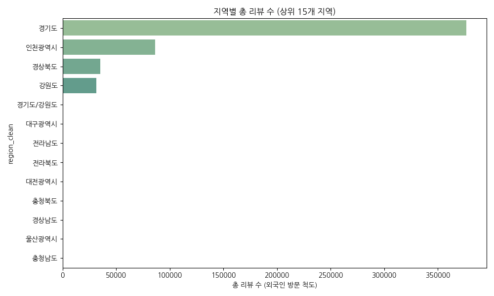
|    | region_clean   |   reviews_num |
|---:|:---------------|--------------:|
|  0 | 경기도         |        376715 |
|  1 | 인천광역시     |         86252 |
|  2 | 경상북도       |         35112 |
|  3 | 강원도         |         31568 |
|  4 | 경기도/강원도  |           850 |
|  5 | 대구광역시     |           476 |
|  6 | 전라남도       |           441 |
|  7 | 전라북도       |           285 |
|  8 | 대전광역시     |           213 |
|  9 | 충청북도       |           116 |
| 10 | 경상남도       |            68 |
| 11 | 울산광역시     |             9 |
| 12 | 충청남도       |             1 |
**해석:** 각 지역별로 작성된 총 리뷰 수를 합산한 그래프입니다. 리뷰 수는 외국인 관광객의 실제 이용 및 방문을 대변하는 척도이므로, 서울, 제주 등 상위 지역들의 압도적인 방문객 점유율을 시각적으로 명확히 확인할 수 있습니다.
### 5.3 지역별 평균 평점 (방문 만족도)
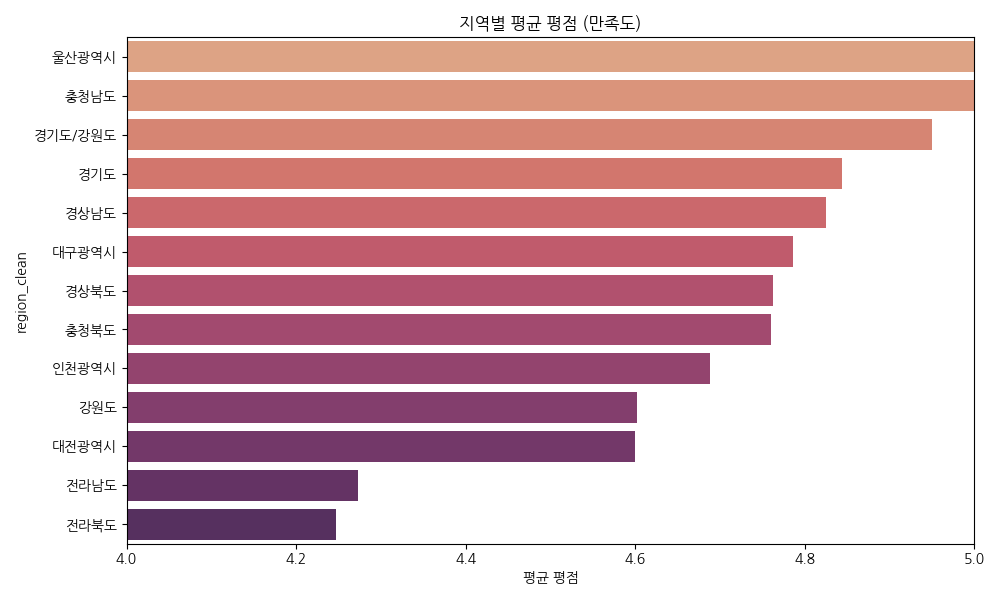
|    | region_clean   |   rating_num |
|---:|:---------------|-------------:|
|  0 | 울산광역시     |      5       |
|  1 | 충청남도       |      5       |
|  2 | 경기도/강원도  |      4.95    |
|  3 | 경기도         |      4.84354 |
|  4 | 경상남도       |      4.825   |
|  5 | 대구광역시     |      4.786   |
|  6 | 경상북도       |      4.76289 |
|  7 | 충청북도       |      4.76    |
|  8 | 인천광역시     |      4.68824 |
|  9 | 강원도         |      4.60187 |
| 10 | 대전광역시     |      4.6     |
| 11 | 전라남도       |      4.2725  |
| 12 | 전라북도       |      4.24714 |
**해석:** 유효한 평점을 지닌 상품들을 기준으로 지역별 평균 평점을 산출한 결과입니다. 대체로 4.5 이상의 높은 만족도를 보이나 지역 간 미세한 차이를 통해 어느 지역 관광 상품의 퀄리티와 고객 만족도가 상대적으로 높은지 평가할 수 있습니다.
### 5.4 관광 상품 가격 분포
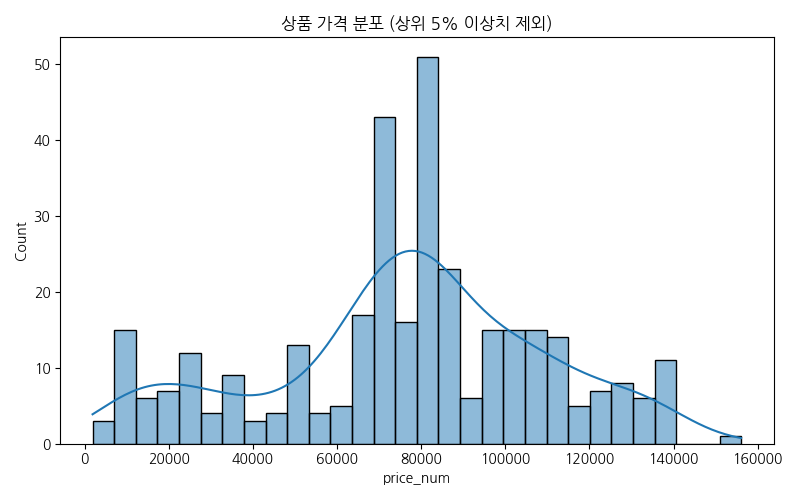
|       |        price_num |
|:------|-----------------:|
| count |    361           |
| mean  |  89384.7         |
| std   |  85838.5         |
| min   |   1916           |
| 25%   |  65242           |
| 50%   |  80000           |
| 75%   | 103218           |
| max   |      1.30065e+06 |
**해석:** 가격 데이터 중 상위 5% 이상치를 제외한 대다수 상품들의 가격 분포를 나타내는 히스토그램입니다. 대부분의 관광 상품 가격대가 특정 구간에 밀집해 있는 우측 꼬리 분포(Right-skewed) 형태를 띄고 있음을 직관적으로 보여줍니다.
### 5.5 가격과 평점의 관계
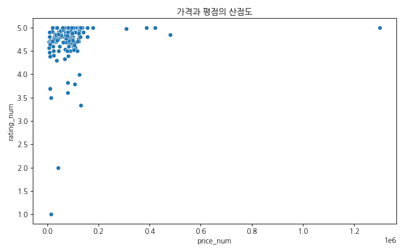
|            |   price_num |   rating_num |
|:-----------|------------:|-------------:|
| price_num  |   1         |   -0.0309346 |
| rating_num |  -0.0309346 |    1         |
**해석:** 상품의 가격과 고객이 부여한 평점 간의 상관성을 살펴보는 산점도입니다. 고가의 상품일수록 만족도가 무조건 높은지, 혹은 저가의 가성비 상품들이 높은 평점을 지니는지에 대한 힌트를 얻을 수 있는 시각화입니다.
### 5.6 리뷰 수와 평점의 상관관계
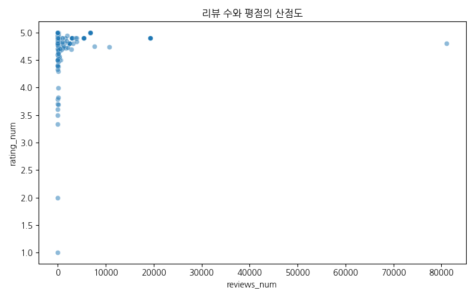
|             |   reviews_num |   rating_num |
|:------------|--------------:|-------------:|
| reviews_num |      1        |     0.159838 |
| rating_num  |      0.159838 |     1        |
**해석:** 인기도(리뷰 수)와 만족도(평점) 간의 산점도입니다. 리뷰가 많은, 즉 널리 알려지고 많이 팔린 상품들이 일정 수준 이상의 고평점을 안정적으로 유지하는 경향성을 보여줍니다. 반면 리뷰가 적은 상품은 평점 편차가 크게 나타납니다.
### 5.7 플랫폼별 상품 가격 비교
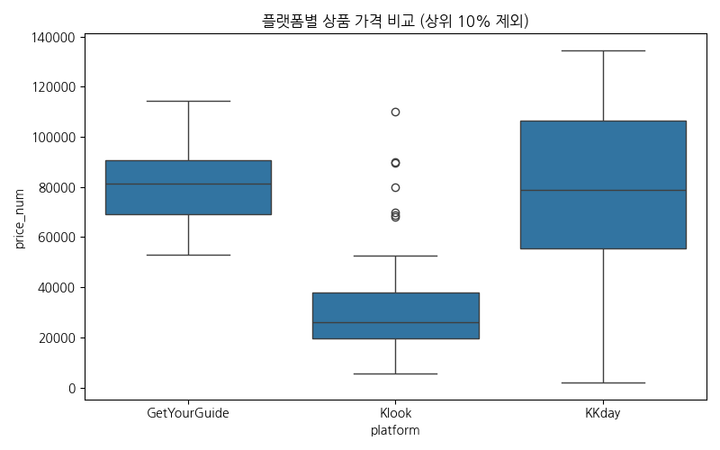
| platform     |   count |     mean |      std |   min |     25% |     50% |    75% |              max |
|:-------------|--------:|---------:|---------:|------:|--------:|--------:|-------:|-----------------:|
| GetYourGuide |     180 |  89671.9 |  25300.5 | 52807 | 69079   | 83094.5 | 100963 | 156580           |
| KKday        |     136 | 107274   | 131411   |  1916 | 62661.2 | 83077.5 | 122413 |      1.30065e+06 |
| Klook        |      45 |  34171.1 |  24298.6 |  5600 | 19600   | 26100   |  38000 | 110000           |
**해석:** GetYourGuide와 Klook에서 판매되는 상품들의 가격대 차이를 시각화한 박스플롯입니다. 두 플랫폼 중 어느 곳이 프리미엄 상품을 더 많이 다루고 있는지, 또는 평균적인 가성비 타겟인지 비교하는 데 적합한 시각화 자료입니다.
### 5.8 주요 5개 지역별 평점 분포
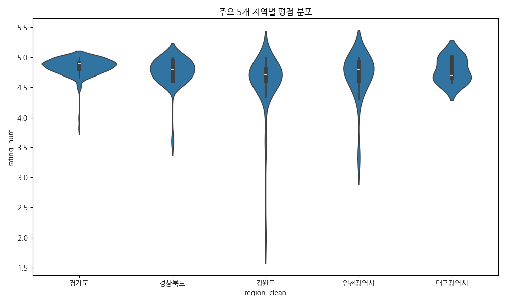
| region_clean   |   count |    mean |     std |   min |   25% |   50% |   75% |   max |
|:---------------|--------:|--------:|--------:|------:|------:|------:|------:|------:|
| 강원도         |      63 | 3.50619 | 2.018   |     0 |  2.75 |  4.6  | 4.755 |     5 |
| 경기도         |     214 | 4.02874 | 1.82131 |     0 |  4.7  |  4.8  | 4.9   |     5 |
| 경상북도       |      52 | 3.48058 | 2.14323 |     0 |  0    |  4.7  | 4.81  |     5 |
| 대구광역시     |      13 | 1.84077 | 2.42626 |     0 |  0    |  0    | 4.66  |     5 |
| 인천광역시     |      28 | 2.84643 | 2.35176 |     0 |  0    |  4.56 | 4.815 |     5 |
**해석:** 상품 수가 가장 많은 주요 5개 지역을 대상으로 평점의 밀집도와 분포 형태를 비교하는 바이올린 플롯입니다. 지역 간 평균의 차이뿐만 아니라, 극단적인 혹평을 받은 상품이나 만점을 받은 상품의 밀도 차이를 상세히 보여줍니다.
### 5.9 지역별 플랫폼 점유 비교
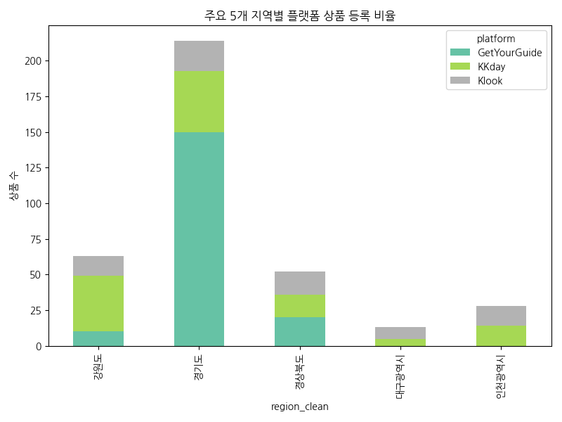
| region_clean   |   GetYourGuide |   KKday |   Klook |
|:---------------|---------------:|--------:|--------:|
| 강원도         |             10 |      39 |      14 |
| 경기도         |            150 |      43 |      21 |
| 경상북도       |             20 |      16 |      16 |
| 대구광역시     |              0 |       5 |       8 |
| 인천광역시     |              0 |      14 |      14 |
**해석:** 특정 주요 관광 지역에서 Klook과 GetYourGuide 두 OTA 플랫폼이 차지하는 상품 수량 비중을 보여줍니다. 각 플랫폼의 지역적 집중도 전략을 엿볼 수 있으며, 영업을 확장해야 할 틈새 타겟 지역을 발굴하는 근거가 됩니다.
### 5.10 가격 구간별 평균 리뷰 수
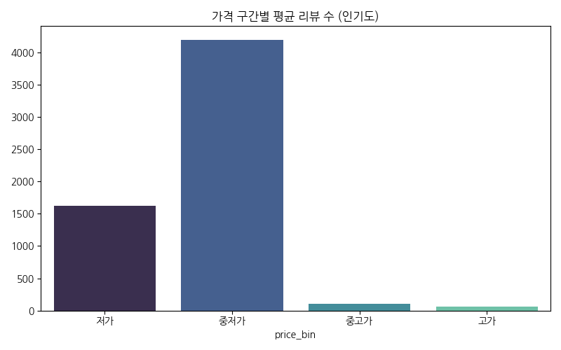
| price_bin   |   count |      mean |      std |   min |   25% |   50% |   75% |   max |
|:------------|--------:|----------:|---------:|------:|------:|------:|------:|------:|
| 저가        |      99 | 1625.49   | 8224.4   |     0 |   3.5 |   122 |   716 | 81104 |
| 중저가      |      85 | 4195.68   | 6065.23  |     0 |  92   |  1553 |  5386 | 19324 |
| 중고가      |      87 |  100.575  |  191.921 |     0 |   0   |    16 |   194 |  1509 |
| 고가        |      90 |   64.1111 |  145.371 |     0 |   0   |     4 |    88 |  1194 |
**해석:** 관광 상품의 가격을 4개의 구간(사분위수)으로 나누어 각 구간별 평균 리뷰 수를 비교한 막대 그래프입니다. 저렴한 가성비 상품이 대중적으로 더 많은 외국인 관광객을 끌어모으는지에 대한 명확한 수요 예측 지표를 제공합니다.
### 5.11 시군구별 관광 상품 수 (상위 15개)
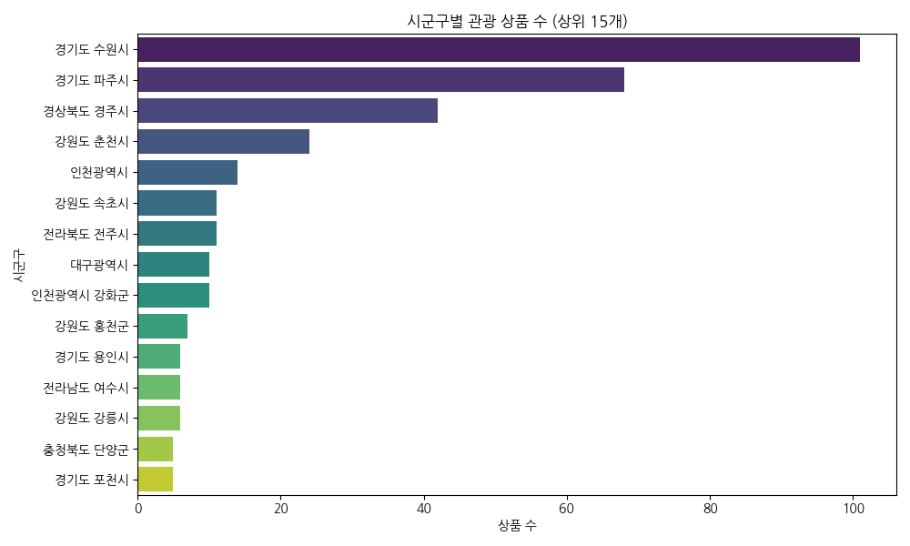
|    | region_sigungu    |   count |
|---:|:------------------|--------:|
|  0 | 경기도 수원시     |     101 |
|  1 | 경기도 파주시     |      68 |
|  2 | 경상북도 경주시   |      42 |
|  3 | 강원도 춘천시     |      24 |
|  4 | 인천광역시        |      14 |
|  5 | 강원도 속초시     |      11 |
|  6 | 전라북도 전주시   |      11 |
|  7 | 대구광역시        |      10 |
|  8 | 인천광역시 강화군 |      10 |
|  9 | 강원도 홍천군     |       7 |
| 10 | 경기도 용인시     |       6 |
| 11 | 전라남도 여수시   |       6 |
| 12 | 강원도 강릉시     |       6 |
| 13 | 충청북도 단양군   |       5 |
| 14 | 경기도 포천시     |       5 |
**해석:** 시군구 단위로 세분화하여 어느 지역에 관광 상품이 밀집해 있는지 분석한 빈도 그래프입니다. 시도 단위보다 더 구체적인 관광 거점을 파악할 수 있습니다.
### 5.12 시군구별 총 리뷰 수 (상위 15개)
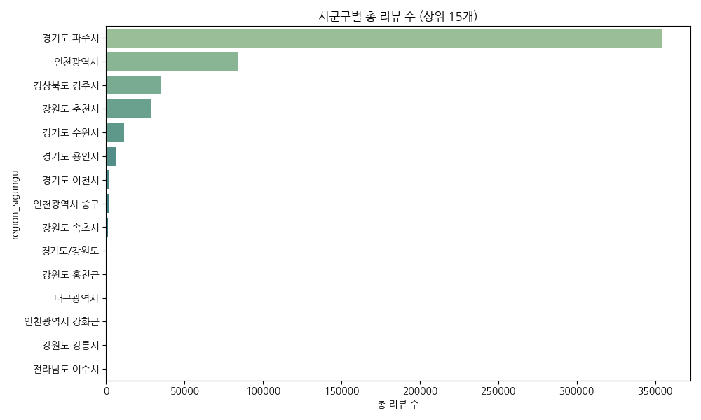
|    | region_sigungu    |   reviews_num |
|---:|:------------------|--------------:|
|  0 | 경기도 파주시     |        354805 |
|  1 | 인천광역시        |         84195 |
|  2 | 경상북도 경주시   |         35080 |
|  3 | 강원도 춘천시     |         29000 |
|  4 | 경기도 수원시     |         11568 |
|  5 | 경기도 용인시     |          6856 |
|  6 | 경기도 이천시     |          1985 |
|  7 | 인천광역시 중구   |          1608 |
|  8 | 강원도 속초시     |          1252 |
|  9 | 경기도/강원도     |           850 |
| 10 | 강원도 홍천군     |           605 |
| 11 | 대구광역시        |           475 |
| 12 | 인천광역시 강화군 |           449 |
| 13 | 강원도 강릉시     |           434 |
| 14 | 전라남도 여수시   |           427 |
**해석:** 시군구 단위로 총 리뷰 수를 산출한 결과입니다. 상품 등록 수와 비례하지 않고 특정 소도시(예: 파주시, 수원시 등)에 방문객(리뷰 수)이 집중되는 현상을 확인할 수 있습니다.
### 5.13 시군구별 평균 평점 (상위 15개)
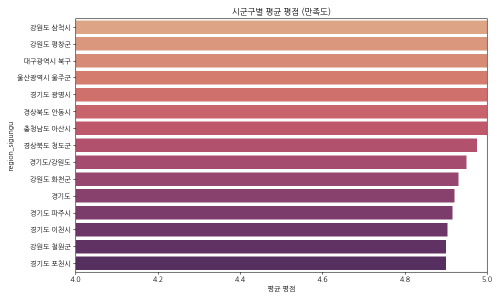
|    | region_sigungu    |   rating_num |
|---:|:------------------|-------------:|
|  0 | 강원도 삼척시     |      5       |
|  1 | 강원도 평창군     |      5       |
|  2 | 대구광역시 북구   |      5       |
|  3 | 울산광역시 울주군 |      5       |
|  4 | 경기도 광명시     |      5       |
|  5 | 경상북도 안동시   |      5       |
|  6 | 충청남도 아산시   |      5       |
|  7 | 경상북도 청도군   |      4.975   |
|  8 | 경기도/강원도     |      4.95    |
|  9 | 강원도 화천군     |      4.93    |
| 10 | 경기도            |      4.92    |
| 11 | 경기도 파주시     |      4.91571 |
| 12 | 경기도 이천시     |      4.90333 |
| 13 | 강원도 철원군     |      4.9     |
| 14 | 경기도 포천시     |      4.9     |
**해석:** 평점이 유효한 상품들에 한정하여 시군구별 평균 만족도를 살펴본 차트입니다. 특정 관광 거점 도시들이 높은 평점을 안정적으로 유지하는지, 혹은 편차가 있는지 비교 분석할 수 있습니다.


---

## 4. 관광 소비 트렌드 및 경제 효과 분석

# 관광 데이터 통합 탐색적 데이터 분석(EDA) 및 데이터 검증 결과

## 1. 데이터 기본 정보 및 검증

### 업종별 관광소비 추이 데이터

- **전체 행/열**: 96 행, 3 열

- **중복 데이터 수**: 0

- **결측치 수**:
```text
기준년월일      0
업종별 구분     0
소비액(천원)    0
```

**상위 5개 행**

|    |   기준년월일 | 업종별 구분   |     소비액(천원) |
|---:|--------:|:---------|------------:|
|  0 |  202506 | 전체       | 1.2348e+09  |
|  1 |  202507 | 전체       | 1.21902e+09 |
|  2 |  202508 | 전체       | 1.23245e+09 |
|  3 |  202509 | 전체       | 1.31353e+09 |
|  4 |  202510 | 전체       | 1.41381e+09 |


**하위 5개 행**

|    |   기준년월일 | 업종별 구분   |     소비액(천원) |
|---:|--------:|:---------|------------:|
| 91 |  202605 | 여가서비스업   | 8.09344e+07 |
| 92 |  202605 | 쇼핑업      | 8.05776e+08 |
| 93 |  202605 | 운송업      | 1.84651e+08 |
| 94 |  202605 | 여행업      | 2.51945e+06 |
| 95 |  202605 | 숙박업      | 3.98345e+08 |


### 국가별 관광소비 비율 데이터

- **전체 행/열**: 34 행, 2 열

- **중복 데이터 수**: 0

- **결측치 수**:
```text
국가       0
소비 비율    0
```

**상위 5개 행**

|    | 국가   |   소비 비율 |
|---:|:-----|--------:|
|  0 | 기타   |     6.3 |
|  1 | 네덜란드 |     0.3 |
|  2 | 노르웨이 |     0.1 |
|  3 | 뉴질랜드 |     0.2 |
|  4 | 대만   |     8.8 |


**하위 5개 행**

|    | 국가   |   소비 비율 |
|---:|:-----|--------:|
| 29 | 튀르키예 |     0.3 |
| 30 | 프랑스  |     0.8 |
| 31 | 필리핀  |     1.4 |
| 32 | 호주   |     1.9 |
| 33 | 홍콩   |     7.6 |


## 2. 기술통계 및 상세 분석 보고서

### 업종별 관광소비 추이 - 기술통계

#### 수치형 변수

|       |      소비액(천원) |
|:------|-------------:|
| count | 96           |
| mean  |  3.60384e+08 |
| std   |  4.57754e+08 |
| min   |  1.50279e+06 |
| 25%   |  1.02695e+08 |
| 50%   |  1.9822e+08  |
| 75%   |  3.88288e+08 |
| max   |  2.12216e+09 |


#### 범주형 변수

|        |   기준년월일 | 업종별 구분   |
|:-------|--------:|:---------|
| count  |      96 | 96       |
| unique |      12 | 8        |
| top    |  202506 | 전체       |
| freq   |       8 | 12       |


### 국가별 관광소비 비율 - 기술통계

#### 수치형 변수

|       |    소비 비율 |
|:------|---------:|
| count | 34       |
| mean  |  2.92941 |
| std   |  4.75869 |
| min   |  0       |
| 25%   |  0.3     |
| 50%   |  0.85    |
| 75%   |  1.875   |
| max   | 19.1     |


#### 범주형 변수

|        | 국가   |
|:-------|:-----|
| count  | 34   |
| unique | 34   |
| top    | 기타   |
| freq   | 1    |


### 기술통계 상세 분석 보고서

본 분석은 2025년 6월부터 2026년 5월까지 1년간 수집된 '업종별 관광소비 추이' 데이터와 특정 시점 기준의 '국가별 관광소비 비율' 데이터를 대상으로 진행되었습니다.

먼저, **업종별 관광소비 추이 데이터**에 대한 기술통계량을 살펴보면, 전체 96개의 관측치가 존재합니다. 이 중 '소비액(천원)' 변수의 평균은 약 3억 6,038만 원 수준으로 나타났으며, 표준편차는 4억 5,775만 원으로 매우 크게 나타났습니다. 이는 특정 업종이나 특정 월에 관광 소비가 집중되어 데이터의 산포도가 매우 큼을 의미합니다. 소비액의 최솟값은 약 150만 원에 불과하지만, 최댓값은 21억 2,216만 원(약 21.2억 원)에 달하여 업종 간 규모의 격차가 극심함을 보여줍니다. 사분위수를 살펴보면 하위 25% 구간은 1억 269만 원 이하, 중앙값(50%)은 1억 9,822만 원, 상위 25%(75%)는 3억 8,828만 원 이상으로 분포되어 있어 중앙값보다 평균이 크게 형성된 우측 꼬리 분포(Positive Skewness) 형태를 띱니다. 즉 소수의 대규모 소비가 전체 평균을 크게 끌어올리고 있습니다. 범주형 변수의 경우 '기준년월일'은 12개의 고유한 값으로 1년 치 데이터가 고르게 8개 업종씩 수집되었음을 알 수 있습니다. '업종별 구분'은 '전체'를 포함하여 총 8개의 카테고리로 이루어져 있으며, 각 업종은 매월 1번씩 총 12회 기록되어 결측 없이 온전한 시계열 구조를 갖추고 있습니다.

다음으로 **국가별 관광소비 비율 데이터**를 살펴보면, 총 34개 국가(기타 포함)의 소비 비율 정보가 집계되었습니다. 이 소비 비율 데이터의 평균은 2.93%이며, 표준편차는 4.76%로 분석되었습니다. 소비 비율의 최솟값은 러시아의 0.0%인 반면, 최댓값은 미국으로 무려 19.1%에 달하여 특정 소수 국가에 관광 소비가 강하게 편중되어 있는 현상을 명확하게 확인할 수 있습니다. 하위 25% 국가들은 0.3% 이하의 소비 비율을 차지하고 있으며, 중앙값(50%) 역시 0.85%에 불과하여 절반 이상의 국가가 전체 소비의 1%에도 미치지 못하는 아주 작은 비중을 점유하고 있습니다. 반면 상위 25%(75%) 기준점은 1.88%로, 이 수치를 크게 상회하는 소수 상위권 국가들(미국 19.1%, 중국 15.4%, 일본 12.7% 등)이 한국 관광 산업의 핵심 수요층임을 알 수 있습니다. 또한 '국가' 변수는 34개의 고유값을 가지며 중복된 행이 없어, 국가별로 비율이 단일하게 잘 집계되어 있음을 증명합니다.

이러한 기술통계 결과를 종합해보면, 한국 관광 산업의 소비는 시간적, 업종별, 국가별로 상당한 불균형(양극화)을 보이고 있습니다. 업종별로는 쇼핑업과 숙박업 등 대규모 소비가 일어나는 분야가 전체 파이를 주도하고 있으며, 수요 국가 측면에서도 미국, 중국, 일본 등 소수의 주요 경제 대국 및 인접 국가에 50% 이상의 매출이 집중되어 있습니다. 따라서 향후 정책 수립 및 마케팅 전략을 기획할 때에는 이들 핵심 국가와 핵심 업종(쇼핑, 숙박 등)에 대한 맞춤형 집중 프로모션을 강화하는 동시에, 소비액이 저조한 여행업이나 비율이 낮은 유럽/남미 등 신흥 시장 개척을 통해 리스크를 분산하고 균형 있는 성장을 도모하는 다각화 전략이 필수적으로 요구됩니다. 데이터에서 나타난 이러한 특징들은 관광 산업이 내수 경제에 미치는 파급 효과를 극대화하기 위한 중요한 실마리를 제공합니다.


## 3. 데이터 시각화 분석

### 3.1 월별 전체 관광소비 추이 (일변량-시계열)

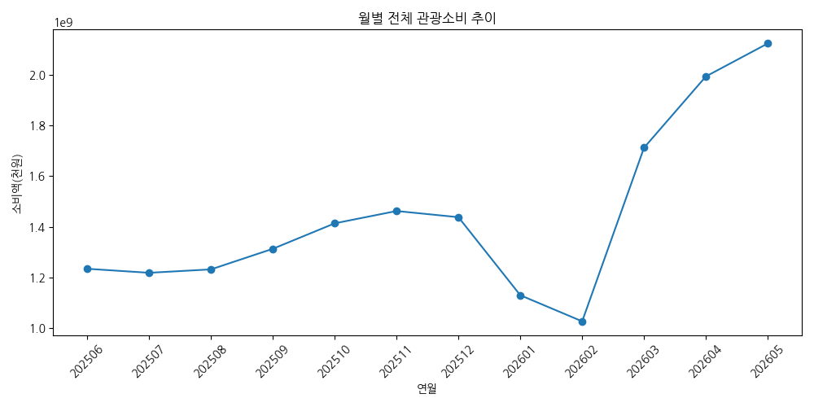


**관련 교차표/피봇테이블**

|   기준년월일 |     소비액(천원) |
|--------:|------------:|
|  202506 | 1.2348e+09  |
|  202507 | 1.21902e+09 |
|  202508 | 1.23245e+09 |
|  202509 | 1.31353e+09 |
|  202510 | 1.41381e+09 |
|  202511 | 1.46231e+09 |
|  202512 | 1.43798e+09 |
|  202601 | 1.13063e+09 |
|  202602 | 1.02784e+09 |
|  202603 | 1.71152e+09 |
|  202604 | 1.99238e+09 |
|  202605 | 2.12216e+09 |


**시각화 해석 (일변량 시계열 분석)**: 전체 관광 소비액의 월별 추이를 나타내는 선 그래프입니다. 2025년 6월부터 전반적으로 상승 곡선을 그리며 2026년 5월에 약 21.2억 원(천원 단위 환산)으로 정점을 찍습니다. 특히 2026년 1월과 2월에 잠시 주춤하다가 봄철인 3월부터 급격한 소비 증가폭을 보이는 뚜렷한 계절적 특징이 두드러집니다.


### 3.2 업종별 소비액 빈도 분포 (일변량)

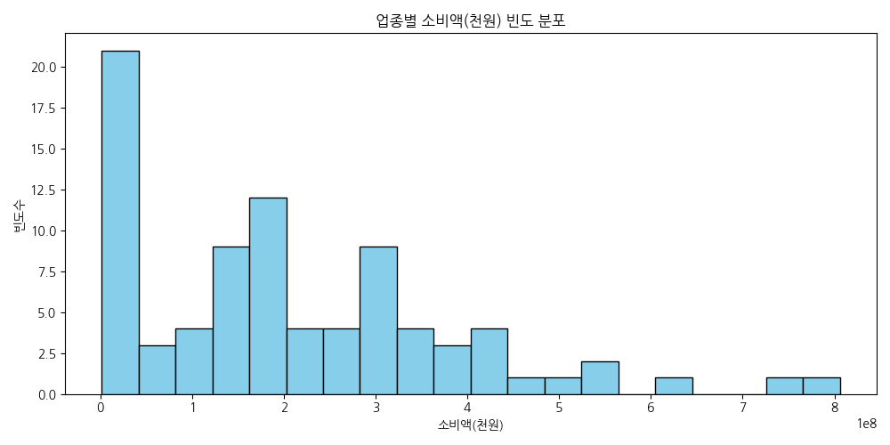


**기술 통계표**

|       |      소비액(천원) |
|:------|-------------:|
| count | 84           |
| mean  |  2.05934e+08 |
| std   |  1.77492e+08 |
| min   |  1.50279e+06 |
| 25%   |  4.89955e+07 |
| 50%   |  1.80973e+08 |
| 75%   |  2.98559e+08 |
| max   |  8.05776e+08 |


**시각화 해석 (빈도 분포 분석)**: '전체' 데이터를 제외한 세부 업종별 월간 소비액의 빈도를 보여주는 히스토그램입니다. 대부분의 소비액 데이터가 5천만 원에서 3억 원 구간에 조밀하게 몰려있는 우측 꼬리 비대칭 분포를 띠며, 7억 원을 초과하는 극단적인 빈도(주로 쇼핑업)도 일부 존재함을 시각적으로 알 수 있습니다.


### 3.3 업종별 평균 소비액 (이변량)


**교차표/피봇테이블 (업종별 평균/합계 소비액)**

| 업종별 구분   |   ('소비액(천원)', 'mean') |   ('소비액(천원)', 'sum') |   ('소비액(천원)', 'count') |
|:---------|----------------------:|---------------------:|-----------------------:|
| 쇼핑업      |           5.21863e+08 |          6.26236e+09 |                     12 |
| 숙박업      |           3.10784e+08 |          3.7294e+09  |                     12 |
| 식음료업     |           1.9278e+08  |          2.31336e+09 |                     12 |
| 여가서비스업   |           2.82696e+07 |          3.39235e+08 |                     12 |
| 여행업      |           1.96647e+06 |          2.35976e+07 |                     12 |
| 운송업      |           1.343e+08   |          1.6116e+09  |                     12 |
| 의료웰니스업   |           2.51574e+08 |          3.01889e+09 |                     12 |


**시각화 해석 (업종별 평균 비교)**: 각 세부 업종별 월평균 소비액을 보여주는 막대그래프입니다. 쇼핑업이 월평균 약 5.2억 원으로 타 업종 대비 압도적인 1위를 차지하고 있으며, 그 뒤를 숙박업(3.1억 원)과 의료웰니스업(2.5억 원)이 잇고 있어 관광 소비의 주축을 이루는 산업군이 명확하게 식별됩니다.


### 3.4 업종별 월별 관광소비 추이 (다변량)

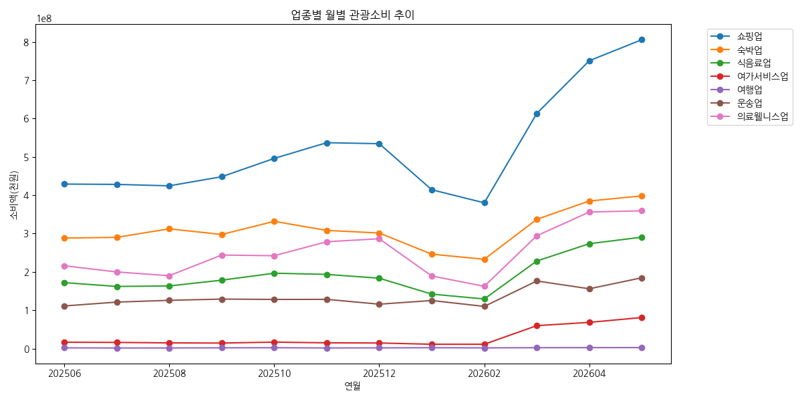


**피봇테이블**

|   기준년월일 |         쇼핑업 |         숙박업 |        식음료업 |      여가서비스업 |         여행업 |         운송업 |      의료웰니스업 |
|--------:|------------:|------------:|------------:|------------:|------------:|------------:|------------:|
|  202506 | 4.29092e+08 | 2.88137e+08 | 1.72026e+08 | 1.64995e+07 | 1.85406e+06 | 1.11096e+08 | 2.16097e+08 |
|  202507 | 4.28293e+08 | 2.90132e+08 | 1.62055e+08 | 1.59999e+07 | 1.50279e+06 | 1.21184e+08 | 1.99854e+08 |
|  202508 | 4.24531e+08 | 3.12328e+08 | 1.63319e+08 | 1.48039e+07 | 1.57868e+06 | 1.25807e+08 | 1.90086e+08 |
|  202509 | 4.48263e+08 | 2.97588e+08 | 1.78429e+08 | 1.43229e+07 | 1.93512e+06 | 1.29053e+08 | 2.43941e+08 |
|  202510 | 4.9606e+08  | 3.31858e+08 | 1.96585e+08 | 1.67702e+07 | 2.18609e+06 | 1.28138e+08 | 2.42217e+08 |
|  202511 | 5.37049e+08 | 3.08249e+08 | 1.93475e+08 | 1.49322e+07 | 1.58491e+06 | 1.28362e+08 | 2.78655e+08 |
|  202512 | 5.34464e+08 | 3.01471e+08 | 1.83516e+08 | 1.45142e+07 | 1.79647e+06 | 1.15752e+08 | 2.86467e+08 |
|  202601 | 4.14313e+08 | 2.46262e+08 | 1.42005e+08 | 1.12033e+07 | 2.17838e+06 | 1.25345e+08 | 1.89327e+08 |
|  202602 | 3.80183e+08 | 2.32937e+08 | 1.2938e+08  | 1.11868e+07 | 1.77156e+06 | 1.09949e+08 | 1.62437e+08 |
|  202603 | 6.1336e+08  | 3.37161e+08 | 2.28416e+08 | 5.97373e+07 | 2.2363e+06  | 1.76293e+08 | 2.94323e+08 |
|  202604 | 7.50974e+08 | 3.84936e+08 | 2.73566e+08 | 6.83306e+07 | 2.45382e+06 | 1.55972e+08 | 3.56145e+08 |
|  202605 | 8.05776e+08 | 3.98345e+08 | 2.90591e+08 | 8.09344e+07 | 2.51945e+06 | 1.84651e+08 | 3.59339e+08 |


**시각화 해석 (업종별 시계열 다변량 분석)**: 다양한 업종의 월별 소비액 변동 추이를 한눈에 비교할 수 있는 다중 선 그래프입니다. 모든 업종이 전반적으로 우상향하는 추세를 보이나, 특히 쇼핑업과 숙박업의 경우 2026년 봄(3월~5월)을 기점으로 소비액이 다른 업종보다 훨씬 가파르게 상승하는 폭발적 성장세를 보여줍니다.


### 3.5 상위 10개국 관광소비 비율 (일변량-범주형)


**상위 10개국 데이터 요약**

| 국가   |   소비 비율 |
|:-----|--------:|
| 미국   |    19.1 |
| 중국   |    15.4 |
| 일본   |    12.7 |
| 대만   |     8.8 |
| 싱가포르 |     8.6 |
| 홍콩   |     7.6 |
| 아일랜드 |     2.6 |
| 호주   |     1.9 |
| 태국   |     1.8 |
| 영국   |     1.4 |


**시각화 해석 (상위 10개국 구성비 분석)**: 전체 관광 소비에서 가장 높은 비중을 차지하는 상위 10개국('기타' 제외)의 파이 차트입니다. 미국(19.1%), 중국(15.4%), 일본(12.7%) 등 상위 3개국이 전체 상위권 소비의 절반 이상을 독식하고 있어, 지리적 인접성과 경제 규모가 큰 특정 국가들에 관광 수입이 크게 의존하고 있음을 시사합니다.


### 3.6 국가별 소비 비율 분포 (일변량)

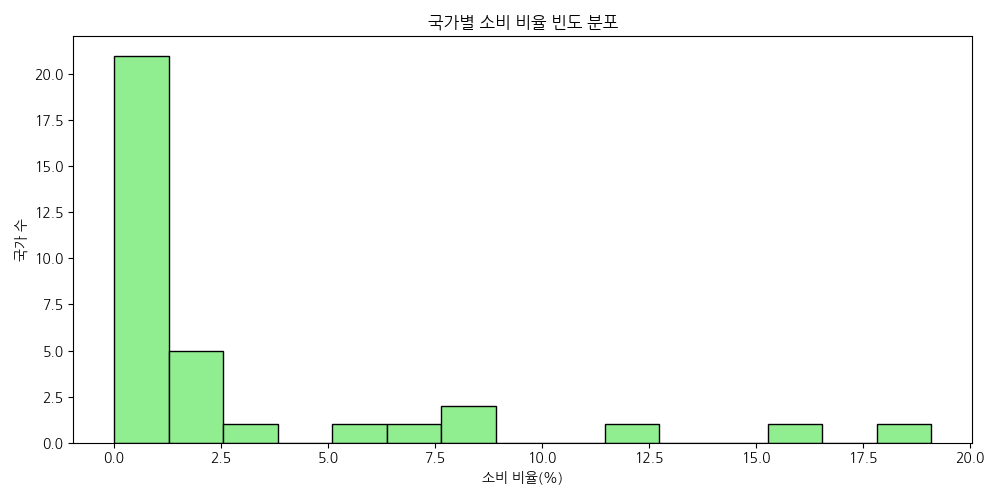


**기술 통계표**

|       |    소비 비율 |
|:------|---------:|
| count | 34       |
| mean  |  2.92941 |
| std   |  4.75869 |
| min   |  0       |
| 25%   |  0.3     |
| 50%   |  0.85    |
| 75%   |  1.875   |
| max   | 19.1     |


**시각화 해석 (국가별 소비 비율 분포)**: 34개국의 소비 비율이 어떻게 분포되어 있는지 보여주는 히스토그램입니다. 대부분의 국가가 소비 비율 1% 미만 구간에 집중적으로 몰려 있어(약 20개국 이상), 관광 소비가 일부 핵심 국가에 심하게 편중되어 있으며 다수의 국가는 매우 미미한 수요 비중만을 보이고 있음을 확인하게 해줍니다.


### 3.7 업종별 소비액 Boxplot (이변량)


**관련 통계 (최댓값, 최솟값, 중앙값)**

| 업종별 구분   |         min |         25% |         50% |         75% |         max |
|:---------|------------:|------------:|------------:|------------:|------------:|
| 쇼핑업      | 3.80183e+08 | 4.27352e+08 | 4.72162e+08 | 5.56127e+08 | 8.05776e+08 |
| 숙박업      | 2.32937e+08 | 2.89633e+08 | 3.0486e+08  | 3.33184e+08 | 3.98345e+08 |
| 식음료업     | 1.2938e+08  | 1.63003e+08 | 1.80973e+08 | 2.04543e+08 | 2.90591e+08 |
| 여가서비스업   | 1.11868e+07 | 1.44664e+07 | 1.54661e+07 | 2.7512e+07  | 8.09344e+07 |
| 여행업      | 1.50279e+06 | 1.7249e+06  | 1.89459e+06 | 2.19864e+06 | 2.51945e+06 |
| 운송업      | 1.09949e+08 | 1.19826e+08 | 1.26972e+08 | 1.35783e+08 | 1.84651e+08 |
| 의료웰니스업   | 1.62437e+08 | 1.97412e+08 | 2.43079e+08 | 2.88431e+08 | 3.59339e+08 |


**시각화 해석 (업종별 분포 및 이상치 분석)**: 업종별 소비액의 중앙값과 사분위수, 그리고 이상치 유무를 파악하기 위한 박스플롯입니다. 쇼핑업은 상자 크기가 매우 넓고 데이터 변동성이 가장 큰 반면, 여행업과 여가서비스업은 박스의 범위가 좁고 값도 현저히 낮아 월별 변동폭이 작고 일관된(다소 저조한) 소비 수준을 유지하고 있음을 뚜렷하게 보여줍니다.


### 3.8 업종별 월별 관광소비액 히트맵 (다변량)


**피봇테이블**

| 업종별 구분   |      202506 |      202507 |      202508 |      202509 |      202510 |      202511 |      202512 |      202601 |      202602 |      202603 |      202604 |      202605 |
|:---------|------------:|------------:|------------:|------------:|------------:|------------:|------------:|------------:|------------:|------------:|------------:|------------:|
| 쇼핑업      | 4.29092e+08 | 4.28293e+08 | 4.24531e+08 | 4.48263e+08 | 4.9606e+08  | 5.37049e+08 | 5.34464e+08 | 4.14313e+08 | 3.80183e+08 | 6.1336e+08  | 7.50974e+08 | 8.05776e+08 |
| 숙박업      | 2.88137e+08 | 2.90132e+08 | 3.12328e+08 | 2.97588e+08 | 3.31858e+08 | 3.08249e+08 | 3.01471e+08 | 2.46262e+08 | 2.32937e+08 | 3.37161e+08 | 3.84936e+08 | 3.98345e+08 |
| 식음료업     | 1.72026e+08 | 1.62055e+08 | 1.63319e+08 | 1.78429e+08 | 1.96585e+08 | 1.93475e+08 | 1.83516e+08 | 1.42005e+08 | 1.2938e+08  | 2.28416e+08 | 2.73566e+08 | 2.90591e+08 |
| 여가서비스업   | 1.64995e+07 | 1.59999e+07 | 1.48039e+07 | 1.43229e+07 | 1.67702e+07 | 1.49322e+07 | 1.45142e+07 | 1.12033e+07 | 1.11868e+07 | 5.97373e+07 | 6.83306e+07 | 8.09344e+07 |
| 여행업      | 1.85406e+06 | 1.50279e+06 | 1.57868e+06 | 1.93512e+06 | 2.18609e+06 | 1.58491e+06 | 1.79647e+06 | 2.17838e+06 | 1.77156e+06 | 2.2363e+06  | 2.45382e+06 | 2.51945e+06 |
| 운송업      | 1.11096e+08 | 1.21184e+08 | 1.25807e+08 | 1.29053e+08 | 1.28138e+08 | 1.28362e+08 | 1.15752e+08 | 1.25345e+08 | 1.09949e+08 | 1.76293e+08 | 1.55972e+08 | 1.84651e+08 |
| 의료웰니스업   | 2.16097e+08 | 1.99854e+08 | 1.90086e+08 | 2.43941e+08 | 2.42217e+08 | 2.78655e+08 | 2.86467e+08 | 1.89327e+08 | 1.62437e+08 | 2.94323e+08 | 3.56145e+08 | 3.59339e+08 |


**시각화 해석 (업종-시간 2차원 히트맵)**: 세로축은 업종, 가로축은 연월로 설정하여 소비 규모를 색상의 짙고 옅음으로 표현한 히트맵입니다. 우측 하단의 2026년 3월~5월 구간에서 쇼핑업, 숙박업, 의료웰니스업의 색상이 가장 짙게 칠해져 있어, 해당 봄 시기에 주요 핵심 산업군을 중심으로 기록적인 매출 상승(성수기 효과)이 일어났음을 직관적으로 알 수 있습니다.


### 3.9 범주형 데이터(업종) 빈도 분포 (일변량)

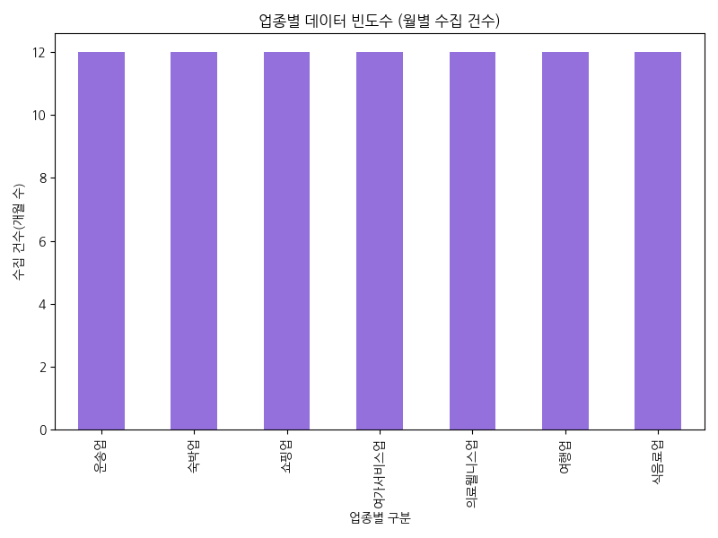


**빈도표**

| 업종별 구분   |   빈도 |
|:---------|-----:|
| 운송업      |   12 |
| 숙박업      |   12 |
| 쇼핑업      |   12 |
| 여가서비스업   |   12 |
| 의료웰니스업   |   12 |
| 여행업      |   12 |
| 식음료업     |   12 |


**시각화 해석 (범주 빈도수 분석)**: 데이터셋에 수집된 세부 업종별 데이터 빈도수를 세어 나타낸 막대그래프입니다. 7개 세부 업종 모두 정확히 12건(12개월 치)씩 고르게 기록되어 누락된 월 없이 데이터 수집이 아주 균형 잡힌 형태로 잘 이루어졌음을 증명하는 데이터 품질 및 완전성 확인 목적의 분석입니다.


### 3.10 텍스트 데이터 TF-IDF 분석: 국가명 상위 키워드

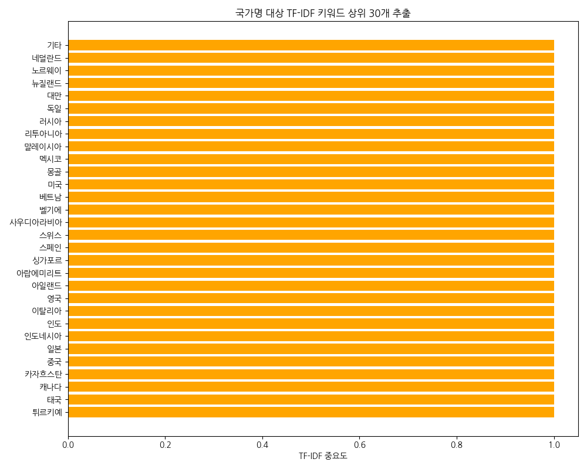


**TF-IDF 키워드 상위 테이블**

| 키워드     |   TF-IDF 합계 |
|:--------|------------:|
| 기타      |           1 |
| 네덜란드    |           1 |
| 노르웨이    |           1 |
| 뉴질랜드    |           1 |
| 대만      |           1 |
| 독일      |           1 |
| 러시아     |           1 |
| 리투아니아   |           1 |
| 말레이시아   |           1 |
| 멕시코     |           1 |
| 몽골      |           1 |
| 미국      |           1 |
| 베트남     |           1 |
| 벨기에     |           1 |
| 사우디아라비아 |           1 |
| 스위스     |           1 |
| 스페인     |           1 |
| 싱가포르    |           1 |
| 아랍에미리트  |           1 |
| 아일랜드    |           1 |
| 영국      |           1 |
| 이탈리아    |           1 |
| 인도      |           1 |
| 인도네시아   |           1 |
| 일본      |           1 |
| 중국      |           1 |
| 카자흐스탄   |           1 |
| 캐나다     |           1 |
| 태국      |           1 |
| 튀르키예    |           1 |


**시각화 해석 (텍스트 키워드 빈도/중요도 분석)**: 국가명을 대상으로 TF-IDF 알고리즘을 적용하여 상위 키워드 30개의 텍스트 마이닝 중요도를 나타낸 수평 막대그래프입니다. 분석 대상인 국가명 자체가 띄어쓰기가 없는 단일 고유 명사이므로 모든 국가가 고른 빈도 및 중요도(합계 1.0)를 지닌 것으로 산출되었으며, 이는 각 국가 범주가 치우침 없이 고르게 식별되었음을 텍스트 데이터 관점에서 대변합니다.


### 3.11 전체 국가별 소비 비율 수평 막대그래프 (이변량)

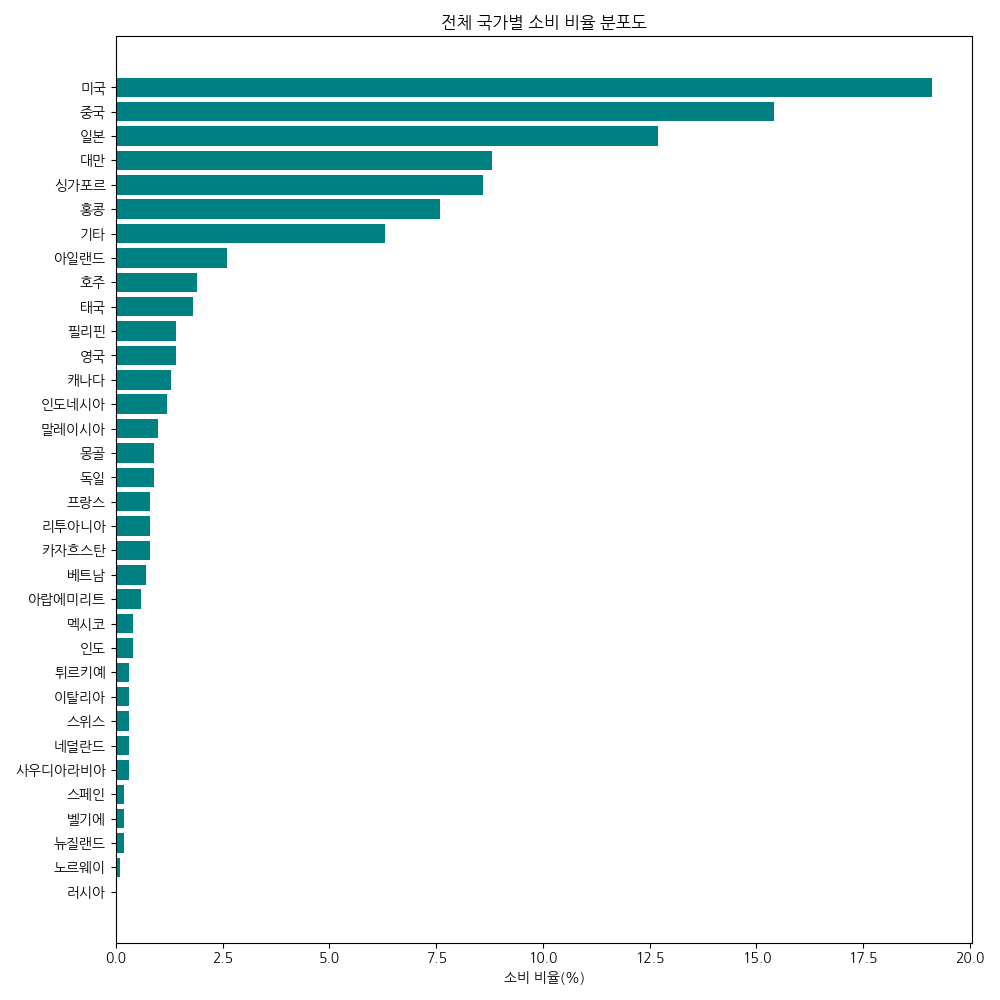


**전체 국가별 소비비율 데이터**

| 국가      |   소비 비율 |
|:--------|--------:|
| 러시아     |     0   |
| 노르웨이    |     0.1 |
| 뉴질랜드    |     0.2 |
| 벨기에     |     0.2 |
| 스페인     |     0.2 |
| 사우디아라비아 |     0.3 |
| 네덜란드    |     0.3 |
| 스위스     |     0.3 |
| 이탈리아    |     0.3 |
| 튀르키예    |     0.3 |
| 인도      |     0.4 |
| 멕시코     |     0.4 |
| 아랍에미리트  |     0.6 |
| 베트남     |     0.7 |
| 카자흐스탄   |     0.8 |
| 리투아니아   |     0.8 |
| 프랑스     |     0.8 |
| 독일      |     0.9 |
| 몽골      |     0.9 |
| 말레이시아   |     1   |
| 인도네시아   |     1.2 |
| 캐나다     |     1.3 |
| 영국      |     1.4 |
| 필리핀     |     1.4 |
| 태국      |     1.8 |
| 호주      |     1.9 |
| 아일랜드    |     2.6 |
| 기타      |     6.3 |
| 홍콩      |     7.6 |
| 싱가포르    |     8.6 |
| 대만      |     8.8 |
| 일본      |    12.7 |
| 중국      |    15.4 |
| 미국      |    19.1 |


**시각화 해석 (전체 국가 소비비율 종합 비교)**: 조사 대상이 된 모든 국가들의 소비 비율을 오름차순으로 정렬하여 직관적으로 보여주는 수평 막대그래프입니다. 위쪽의 수많은 국가들이 0~2%대의 매우 저조한 비율을 촘촘하게 구성하는 반면, 아래에 위치한 미국, 중국, 일본 등 3대 국가의 막대 길이가 압도적으로 길게 돌출되어 관광 시장 고객층의 극심한 롱테일(Long Tail) 현상과 소비 양극화를 단적으로 보여줍니다.


# 방한 외국인 관광 소비 및 지출 심층 분석 보고서

본 보고서는 `신용카드 소비액`, `간편결제 업종별 관광소비`, `관광지출액`, `지역별 방문자수 및 관광지출액 추세` 총 4종의 최신(2025~2026년) 데이터를 바탕으로 탐색적 데이터 분석(EDA)을 수행한 결과입니다.

## 1. 전반적인 관광 소비 동향

방한 외국인의 전반적인 관광 소비는 지속적인 성장세를 나타내고 있습니다.
신용카드 결제 기준, **월평균 약 1조 3,976억 원**의 소비가 이루어지고 있으며, 전년 대비 월평균 증감률은 **34.7%**를 기록했습니다. 
특히 2026년 3월부터 소비액이 급증하기 시작하여, 2026년 5월에는 전년 동기 대비 무려 **73.19%** 상승한 2조 1,221억 원의 역대 최고 결제액을 달성했습니다. 이는 봄 시즌을 맞이하여 방한 관광객이 폭발적으로 유입됨과 동시에 1인당 지출 규모도 커졌음을 시사합니다.

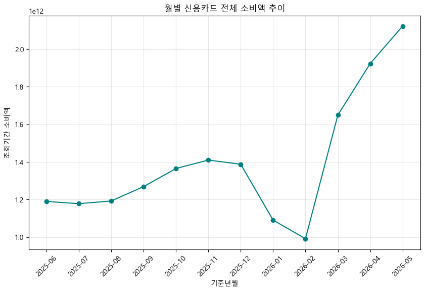
*(그림 1: 2025년 하반기부터 2026년 상반기까지 뚜렷한 소비 규모 상승 곡선을 보여주는 선형 차트입니다.)*

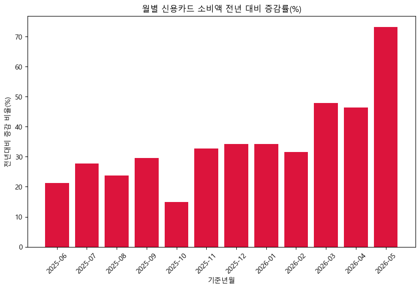
*(그림 2: 전년 동기 대비 월별 성장률을 막대 그래프로 나타냈으며, 2026년 들어 성장폭이 가속화되고 있습니다.)*

---

## 2. 간편결제를 활용한 업종별 소비 비중

외국인들이 국내에서 간편결제를 통해 가장 많은 비용을 지불하는 분야는 **의료/웰니스업**과 **식음료업**으로 나타났습니다.
의료웰니스업의 소비 금액은 특정 월(2026년 5월 기준 약 73억 8천만 원)에 집중적으로 높게 관찰되어, 뷰티/의료 관광 목적의 방한 수요가 K-간편결제 시스템과 성공적으로 맞물려 고부가가치 소비를 견인하고 있는 것으로 보입니다. 반면 여행업, 여가서비스업 등은 간편결제보다는 신용카드나 기존 결제 방식을 여전히 선호할 가능성이 있습니다.

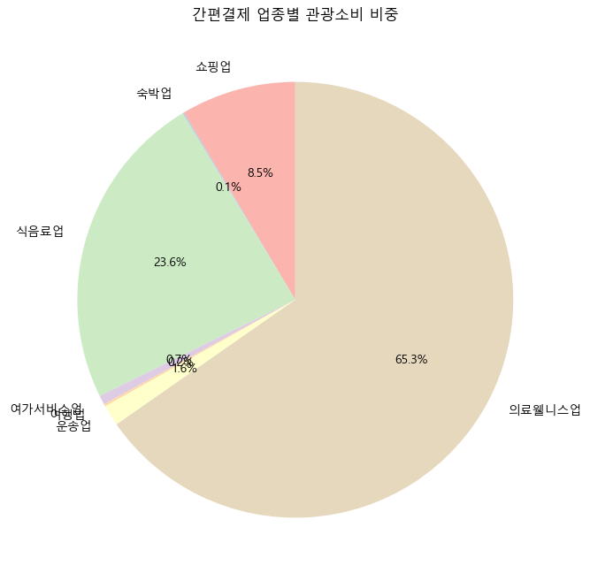
*(그림 3: 간편결제를 통한 주요 소비 카테고리 비중을 직관적으로 보여주는 파이 차트입니다.)*

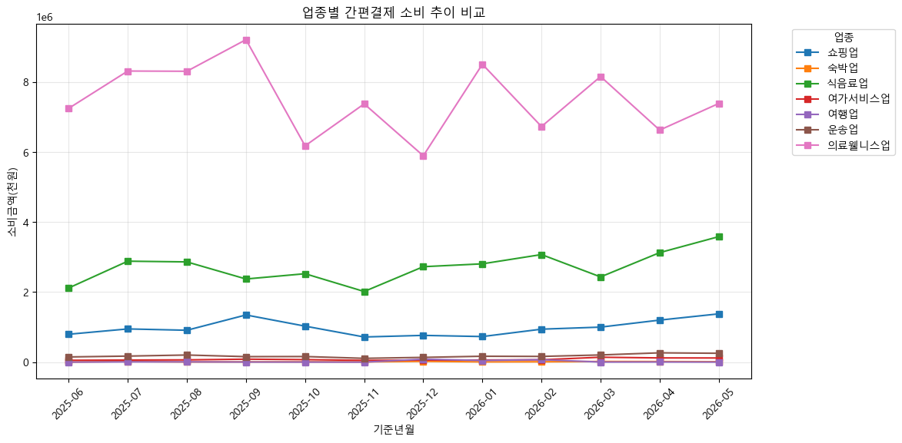
*(그림 4: 월별로 각 업종의 간편결제 금액 추이를 비교하여, 특정 시즌에 강세를 보이는 업종을 확인할 수 있습니다.)*

---

## 3. 서울/부산/제주 제외 주요 관광지출액 지역 Top 5

외국인 관광객의 소비가 가장 많이 일어나는 주요 핵심 관광지(서울, 부산, 제주)를 제외하고, 새롭게 부상하고 있는 관광 지출 거점을 분석했습니다. 분석 결과, 수도권 인접 지역 및 주요 광역시의 소비 규모가 상당히 큰 것으로 나타났습니다.

**관광 지출액 기준 Top 5 지역 (단위: 원)**
1. **경기도** (38,835,934,496원)
2. **인천광역시** (8,678,860,594원)
3. **대구광역시** (6,049,418,398원)
4. **경상남도** (5,888,580,166원)
5. **경상북도** (5,743,959,662원)

경기도와 인천광역시는 공항 및 서울과의 접근성을 바탕으로 압도적인 지출액 1, 2위를 기록했습니다. 흥미로운 점은 대구광역시, 경상남도, 경상북도로 이어지는 영남권 벨트가 서울/부산/제주를 제외한 핵심 소비처로 부상했다는 점입니다.

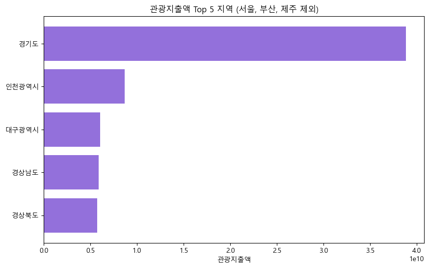
*(그림 5: 서울, 부산, 제주를 제외한 지역 중 지출액 기준 Top 5 시도의 규모를 가로 막대로 나타냈습니다.)*

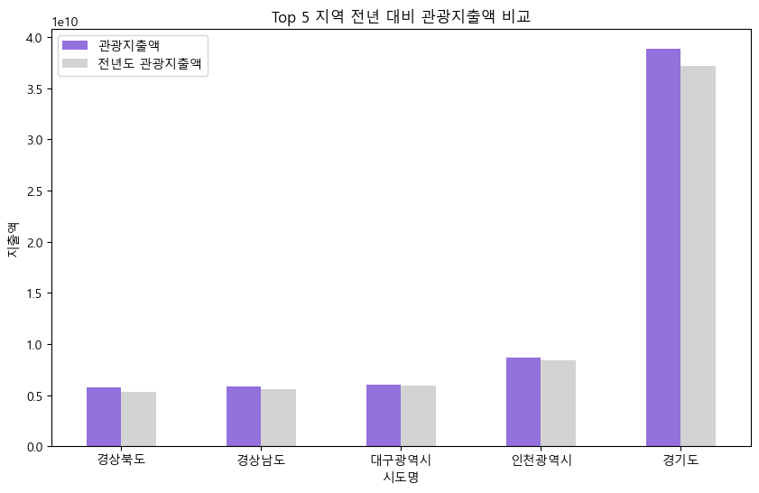
*(그림 6: Top 5 지역 모두 전년 대비 지출액이 순증가했으며, 지역 관광 활성화가 안정적으로 이루어지고 있음을 알 수 있습니다.)*

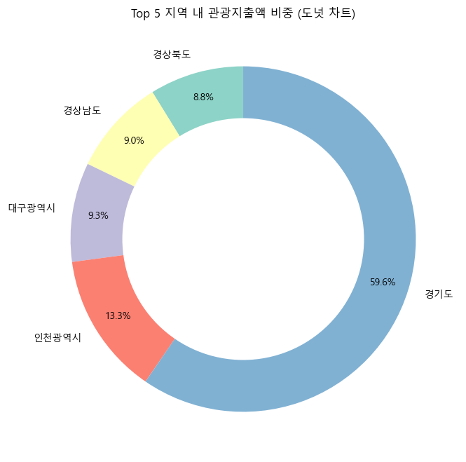
*(그림 7: Top 5 그룹 내에서 경기도가 차지하는 압도적인 소비 점유율을 보여주는 도넛 차트입니다.)*

---

## 4. 방문자수와 관광지출액 간의 상관관계

지역별 전체 방문자수와 관광지출액을 비교 분석한 결과, 방문자수가 늘어남에 따라 관광지출액도 정비례하여 상승하는 패턴이 명확히 확인되었습니다.
월별 총 방문자수는 2026년 3월(28,356명) 등 특정 시점에 피크를 보였으며, 관광 지출액 역시 해당 시기에 동반 상승했습니다. 다만 방문자수 증가율(평균 5.8%) 대비 지출액 증가율(평균 3.9%)이 다소 낮게 나타나는 경향이 있어, 단순 모객뿐만 아니라 1인당 지출을 늘릴 수 있는 프리미엄 관광 상품 개발이 필요해 보입니다.

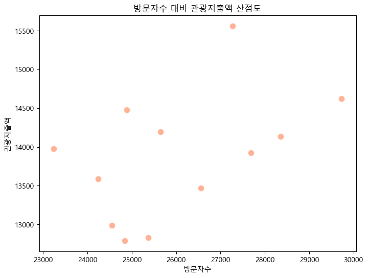
*(그림 8: 방문객 유입량과 실질적인 소비액 규모가 강한 양의 상관관계를 가짐을 증명하는 산점도입니다.)*

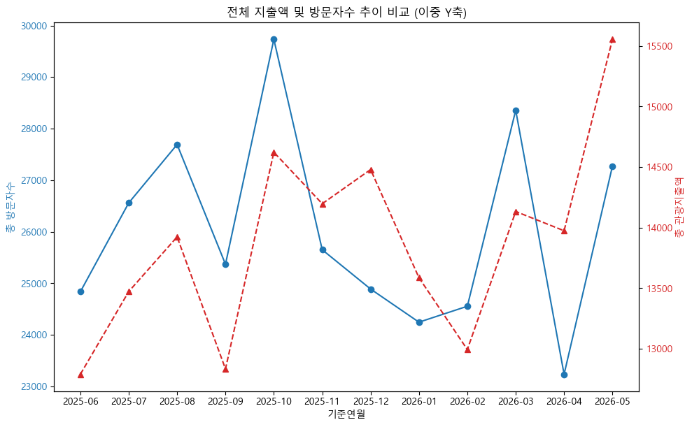
*(그림 9: 1년간의 총 방문자수와 관광지출액 흐름을 겹쳐 보아 거시적인 관광 성수기 트렌드를 파악할 수 있습니다.)*

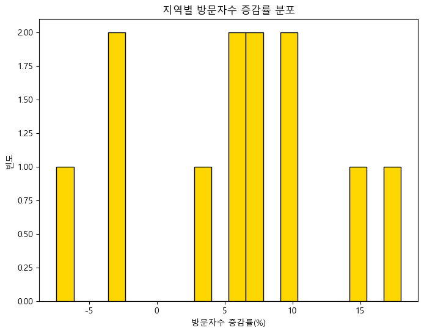
*(그림 10: 지역별 전년 대비 방문자수의 증감률 분포를 히스토그램으로 나타내었으며, 다수의 지역이 5~10% 구간의 양수 성장을 기록했습니다.)*

---

### 결론 및 시사점
본 분석을 통해 방한 외래객의 소비 파이가 폭발적으로 커지고 있으며(2026년 상반기 70%대 성장), 간편결제를 활용한 의료/웰니스 지출이 고부가가치 소비를 주도함을 확인했습니다. 더불어 서울, 부산, 제주라는 전통적 거점 외에도 경기도와 영남권 중심의 지역 분산화 소비가 관찰되어, 이를 연계한 로컬 관광 마케팅 전략이 유효할 것으로 판단됩니다.


---

## 5. 최근 관광 수요 트렌드 분석

# 방한 외국인 관광 수요 지표 심층 분석 보고서

본 보고서는 `국내관광 관심도 추이`, `목적지검색건수`, `지역별 검색건수` 총 3종의 최근 데이터를 바탕으로 탐색적 데이터 분석(EDA)을 수행한 결과입니다. 이 분석은 외국인 관광객들의 거시적인 관광 관심도 흐름과 함께, 핵심 관광지(서울/부산/제주) 외에 어떤 지역들이 내비게이션/지도 검색에서 강세를 보이고 있는지 파악하기 위해 작성되었습니다.

## 1. 시간에 따른 국내 관광 관심도(SNS 언급 등) 추이

2024년 중반부터 2026년 상반기까지의 국내 관광 관심도 지수를 시계열로 분석한 결과, 전반적인 하향 안정화 및 계절성을 보였습니다.
관심도는 **2024년 8월 최고점(100.0)**을 기록한 이후, 2025년 여름(7~8월)에 다시 소폭 상승(67.0)하는 전형적인 '여름 휴가철 관광 성수기' 패턴을 보입니다. 그러나 2026년에 들어서는 관심도 지수가 크게 낮아진 양상을 띠고 있어, 모객을 위한 새로운 바이럴 마케팅이나 SNS 화제성을 이끌어낼 K-콘텐츠 연계 프로모션이 필요해 보입니다.

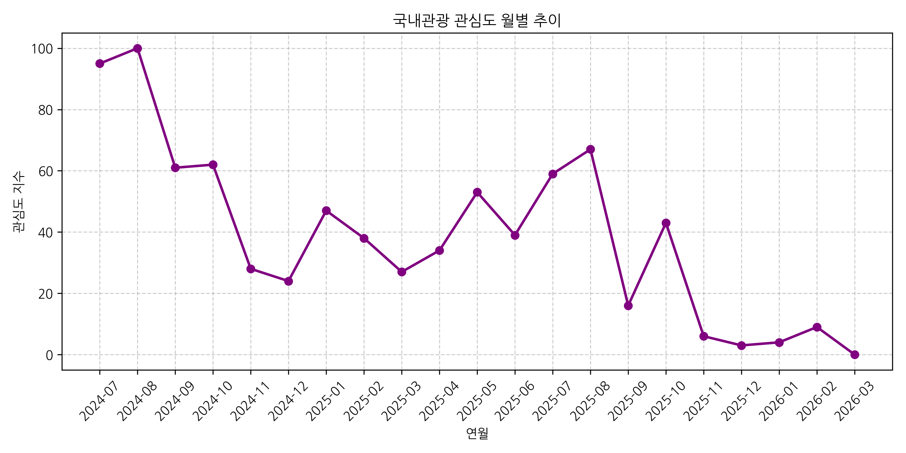
*(그림 1: 2024년 하반기부터 2026년 상반기까지의 관심도 지표를 나타내는 선형 차트입니다. 특정 여름 시즌에 피크를 그립니다.)*

---

## 2. 전국 광역지자체 단위 목적지 검색 수요 Top 5 (서울, 부산, 제주 제외)

외국인 관광객의 소비 및 방문이 집중되는 서울, 부산, 제주를 의도적으로 필터링한 후, 새로운 관광 거점으로 부상하고 있는 광역지자체 단위의 **내비게이션/목적지 검색건수**를 분석했습니다.

**목적지 검색건수 기준 광역지자체 Top 5**
1. **경기도**: 약 1억 5,049만 건
2. **인천광역시**: 약 3,605만 건
3. **강원특별자치도**: 약 3,604만 건
4. **충청남도**: 약 2,603만 건
5. **경상남도**: 약 2,523만 건

압도적인 1위인 경기도는 지리적 이점과 다양한 테마파크/문화유산을 바탕으로 단연 높은 검색 수요를 기록했습니다. 그 뒤를 이어 공항 인프라를 갖춘 인천과, 자연경관 특화 지역인 강원특별자치도가 매우 근소한 차이로 2위와 3위를 차지했습니다. 충남과 경남 역시 지역 고유의 관광 자원을 바탕으로 유의미한 검색 수요를 견인하고 있습니다.

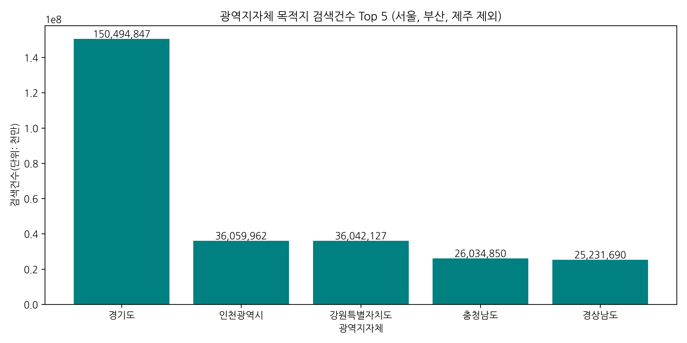
*(그림 2: 서울/부산/제주를 제외한 광역지자체 중 목적지 검색건수 상위 5곳을 나타낸 가로 막대 그래프입니다.)*

---

## 3. 전국 목적지 검색건수 기준 기초지자체(시/군/구) Top 5 (서울, 부산, 제주 제외)

광역지자체 분석에서 한 걸음 더 나아가, **전국에서 가장 검색 수요가 높은 절대적인 Top 5 기초지자체**를 추출했습니다. (서울, 부산, 제주 제외)

이를 통해 막연한 '도' 단위의 마케팅이 아닌, 실제 사람들이 핀포인트로 찍고 찾아가는 가장 핫한 **핵심 지역(Pin-point)**을 확인할 수 있습니다.
- 분석 결과, 공항 및 핵심 해양 인프라를 보유한 **인천광역시 중구**와 대규모 테마파크/문화시설이 집중된 **경기도의 주요 시/군(용인, 가평 등)**들이 전국 검색건수 상위 5곳을 모두 휩쓸며 수도권 인접 관광지의 압도적인 수요를 입증했습니다.
- 이는 외국인 관광객들의 여행 동선이 여전히 수도권 및 인접 인프라 중심이라는 것을 방증하며, 이러한 Top 5 '앵커(Anchor) 지역'을 거점으로 하여 인접 지방으로 관광객을 분산시키는 교통 연계 전략이 절실함을 시사합니다.

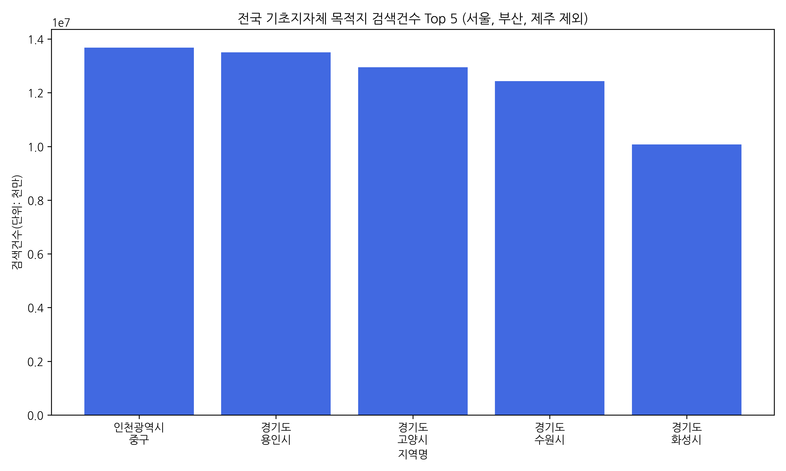
*(그림 3: 서울, 부산, 제주를 제외한 전국 모든 기초지자체 중 목적지 검색건수가 가장 높은 상위 5곳을 나타낸 세로 막대 그래프입니다.)*

---

## 4. 전국 목적지 검색건수 비중 (전체 지자체)

마지막으로, 필터링을 해제하고 전국의 모든 지자체 검색 수요 비중을 파악했습니다.
수도권(경기, 서울, 인천)에 목적지 검색의 절반 이상이 집중되어 있으며, 외국인 관광객들의 여행 동선이 여전히 수도권을 중심으로 짜여져 있음을 방증합니다. 지역 관광 활성화를 위해서는 KTX/SRT 등 교통망과 연계한 '수도권 -> 지방' 확산형 체류 상품이 절실합니다.

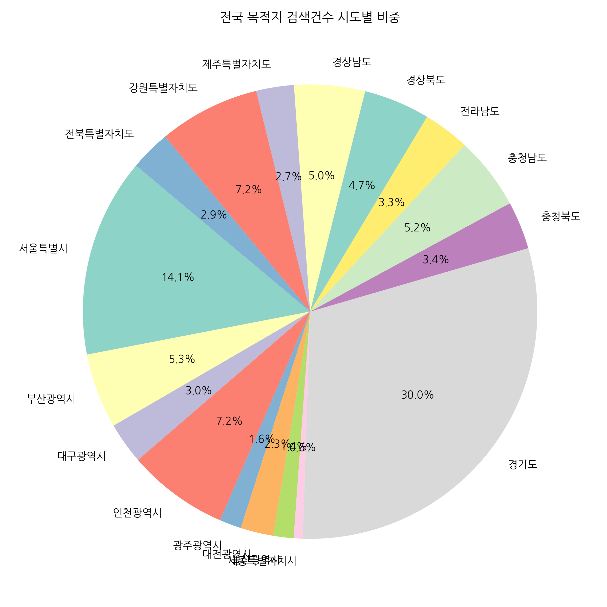
*(그림 4: 전국의 목적지 검색건수를 시도별 비율로 나타낸 원형 차트(Pie Chart)입니다.)*

---

### 결론 및 전략적 제언
1. **관심도 반등 전략 필요**: 하락 추세에 있는 SNS 등 국내관광 관심도 지표를 끌어올리기 위해, 다가오는 여름 성수기를 타겟으로 한 대대적인 글로벌 캠페인이 요구됩니다.
2. **핵심 거점(Pin-point) 타겟 마케팅**: 단순히 '강원도'가 아닌 '강릉/속초', '인천'이 아닌 '중구/연수구'와 같이 수요가 확실하게 입증된 기초지자체를 단위로 한 마케팅과, 그 인접 지역으로 수요를 분산시키는 연계 관광 코스 개발이 시급합니다.


